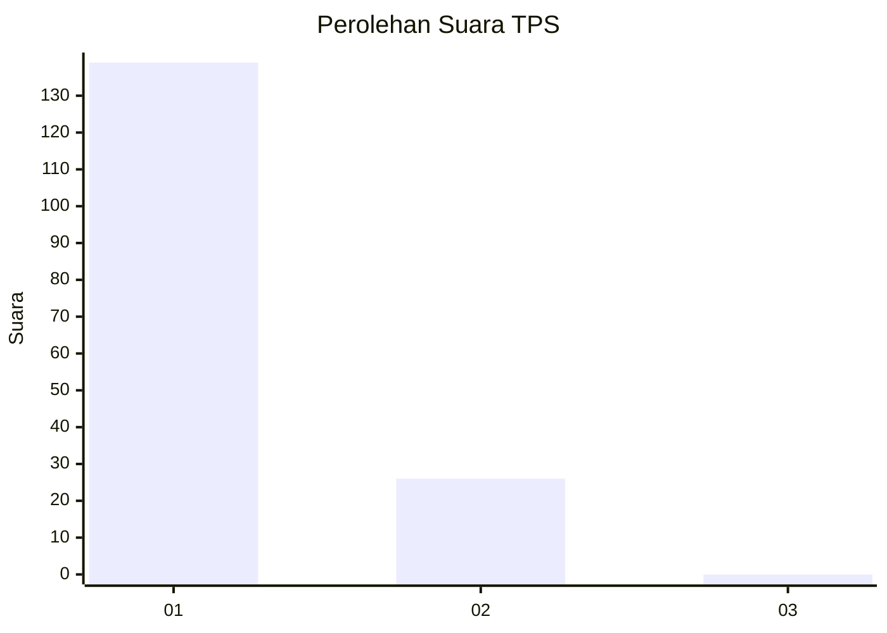
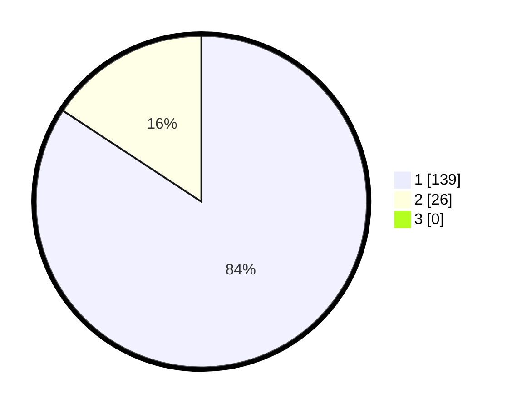

# Hasil

## Grafik

## Tabel

| No. | Nama Paslon    | Suara | Suara (raw) | Persentase |
|:--- |:-------------- | -----:| -----------:| ----------:|
| 1   | ANIES MUHAIMIN | 139   | [139][p-1]  | 84,24      |
| 2   | PRABOWO GIBRAN | 26    | [26][p-2]   | 15,76      |
| 3   | GANJAR MAHFUD  | 0     | [0][p-3]    | 0,00       |

[p-1]: https://github.com/gigit-pemilu/pemilu-2024/blob/main/pilpres/hitung-suara/sub/12-sumatera-utara/sub/13-mandailing-natal/sub/03-panyabungan-timur/sub/2003-hutaimbaru/sub/004-tps/sub/paslon-1.txt
[p-2]: https://github.com/gigit-pemilu/pemilu-2024/blob/main/pilpres/hitung-suara/sub/12-sumatera-utara/sub/13-mandailing-natal/sub/03-panyabungan-timur/sub/2003-hutaimbaru/sub/004-tps/sub/paslon-2.txt
[p-3]: https://github.com/gigit-pemilu/pemilu-2024/blob/main/pilpres/hitung-suara/sub/12-sumatera-utara/sub/13-mandailing-natal/sub/03-panyabungan-timur/sub/2003-hutaimbaru/sub/004-tps/sub/paslon-3.txt

## Foto C Plano

https://sirekap-obj-formc.kpu.go.id/08bd/pemilu/ppwp/12/13/03/20/03/1213032003004-20240215-131920--e956d4c8-1f9b-4f29-a12e-3ee3b0d85978.jpg

https://sirekap-obj-formc.kpu.go.id/08bd/pemilu/ppwp/12/13/03/20/03/1213032003004-20240215-132139--5c59ca33-ce9f-4a84-9725-ca89f6f7aa29.jpg

https://sirekap-obj-formc.kpu.go.id/08bd/pemilu/ppwp/12/13/03/20/03/1213032003004-20240215-132242--1932f6ef-0237-497a-9526-17510378b5d3.jpg

## Metadata

| Key        | Value               |
| ---------- | ------------------- |
| Time Stamp | 2024-02-17 01:00:00 |

