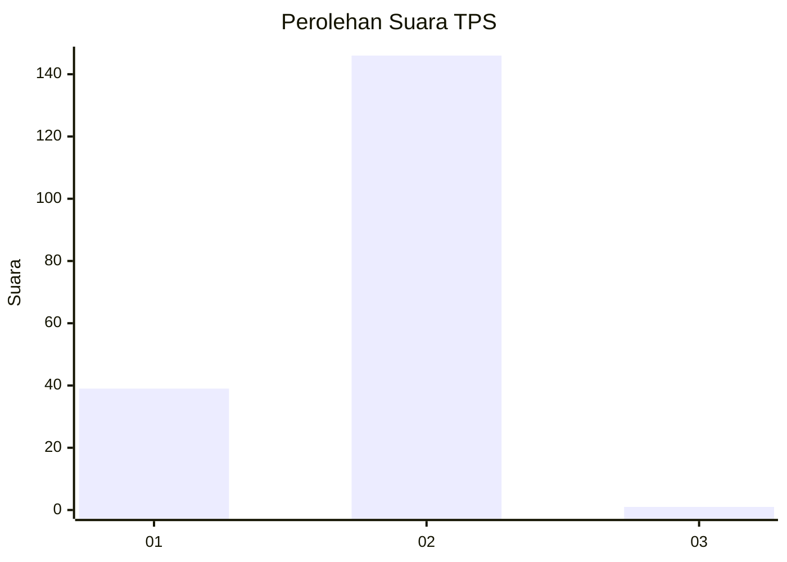
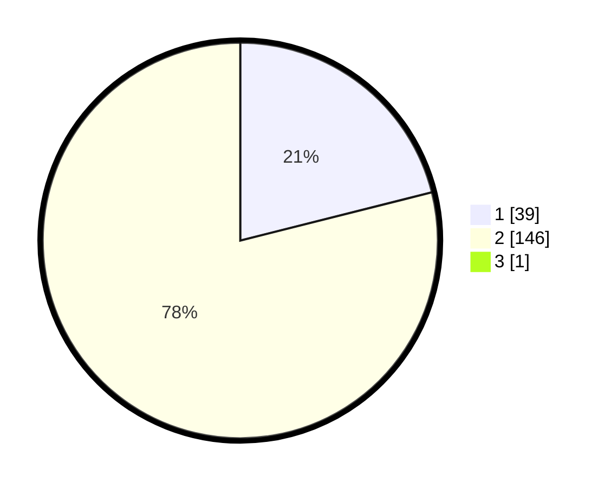

# Hasil

## Grafik

## Tabel

| No. | Nama Paslon    | Suara | Suara (raw) | Persentase |
|:--- |:-------------- | -----:| -----------:| ----------:|
| 1   | ANIES MUHAIMIN | 39    | [39][p-1]   | 20,97      |
| 2   | PRABOWO GIBRAN | 146   | [146][p-2]  | 78,49      |
| 3   | GANJAR MAHFUD  | 1     | [1][p-3]    | 0,54       |

[p-1]: https://github.com/gigit-pemilu/pemilu-2024/blob/main/pilpres/hitung-suara/sub/12-sumatera-utara/sub/13-mandailing-natal/sub/03-panyabungan-timur/sub/2004-huta-bangun/sub/002-tps/sub/paslon-1.txt
[p-2]: https://github.com/gigit-pemilu/pemilu-2024/blob/main/pilpres/hitung-suara/sub/12-sumatera-utara/sub/13-mandailing-natal/sub/03-panyabungan-timur/sub/2004-huta-bangun/sub/002-tps/sub/paslon-2.txt
[p-3]: https://github.com/gigit-pemilu/pemilu-2024/blob/main/pilpres/hitung-suara/sub/12-sumatera-utara/sub/13-mandailing-natal/sub/03-panyabungan-timur/sub/2004-huta-bangun/sub/002-tps/sub/paslon-3.txt

## Foto C Plano

https://sirekap-obj-formc.kpu.go.id/684c/pemilu/ppwp/12/13/03/20/04/1213032004002-20240215-110236--63ffdef1-7723-4ce8-b84f-0cc5755a6729.jpg

https://sirekap-obj-formc.kpu.go.id/684c/pemilu/ppwp/12/13/03/20/04/1213032004002-20240215-110510--452e66c9-9a50-42ad-a1ce-f287afd677f5.jpg

https://sirekap-obj-formc.kpu.go.id/684c/pemilu/ppwp/12/13/03/20/04/1213032004002-20240215-110642--ea638b85-2490-481f-b998-4899c64f3f7f.jpg

## Metadata

| Key        | Value               |
| ---------- | ------------------- |
| Time Stamp | 2024-02-17 01:00:00 |

