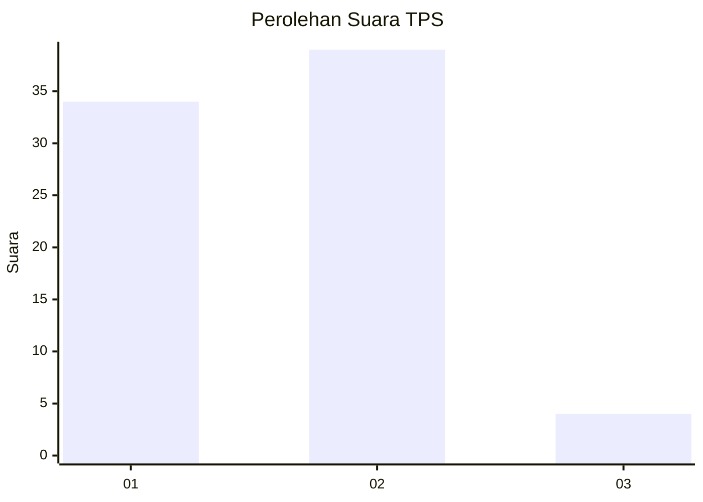
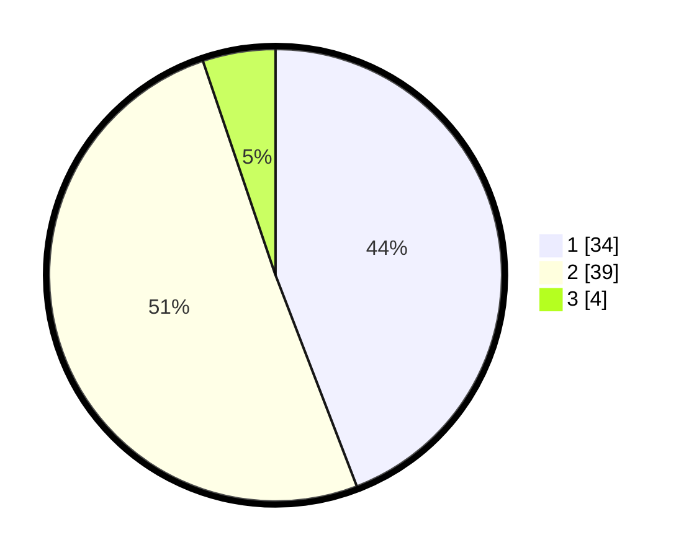

# Hasil

## Grafik

## Tabel

| No. | Nama Paslon    | Suara | Suara (raw) | Persentase |
|:--- |:-------------- | -----:| -----------:| ----------:|
| 1   | ANIES MUHAIMIN | 34    | [34][p-1]   | 44,16      |
| 2   | PRABOWO GIBRAN | 39    | [39][p-2]   | 50,65      |
| 3   | GANJAR MAHFUD  | 4     | [4][p-3]    | 5,19       |

[p-1]: https://github.com/gigit-pemilu/pemilu-2024/blob/main/pilpres/hitung-suara/sub/12-sumatera-utara/sub/13-mandailing-natal/sub/03-panyabungan-timur/sub/2014-banjar-lancat/sub/001-tps/sub/paslon-1.txt
[p-2]: https://github.com/gigit-pemilu/pemilu-2024/blob/main/pilpres/hitung-suara/sub/12-sumatera-utara/sub/13-mandailing-natal/sub/03-panyabungan-timur/sub/2014-banjar-lancat/sub/001-tps/sub/paslon-2.txt
[p-3]: https://github.com/gigit-pemilu/pemilu-2024/blob/main/pilpres/hitung-suara/sub/12-sumatera-utara/sub/13-mandailing-natal/sub/03-panyabungan-timur/sub/2014-banjar-lancat/sub/001-tps/sub/paslon-3.txt

## Foto C Plano

https://sirekap-obj-formc.kpu.go.id/1b91/pemilu/ppwp/12/13/03/20/14/1213032014001-20240215-095435--8e56f6e1-2003-44fb-afd6-246ba1d57a46.jpg

https://sirekap-obj-formc.kpu.go.id/1b91/pemilu/ppwp/12/13/03/20/14/1213032014001-20240215-095613--f1f17ca8-29fe-4a53-8389-1c62b1abc9da.jpg

https://sirekap-obj-formc.kpu.go.id/1b91/pemilu/ppwp/12/13/03/20/14/1213032014001-20240215-095803--bc89a612-3939-4375-b91b-27fab672f7e2.jpg

## Metadata

| Key        | Value               |
| ---------- | ------------------- |
| Time Stamp | 2024-02-17 01:30:00 |

