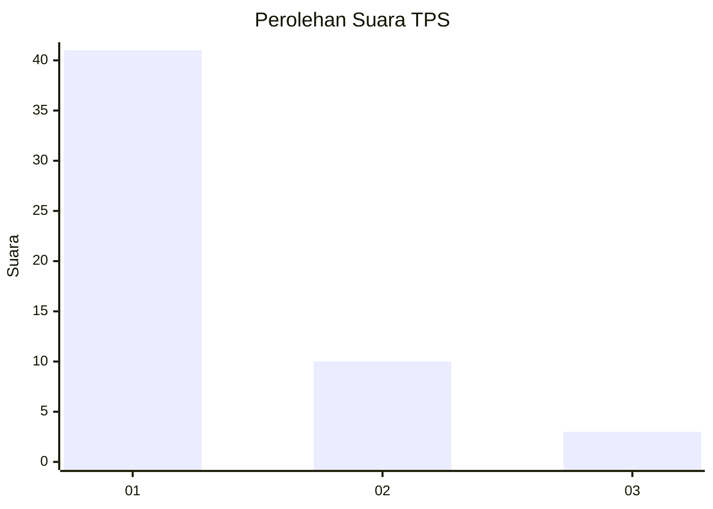
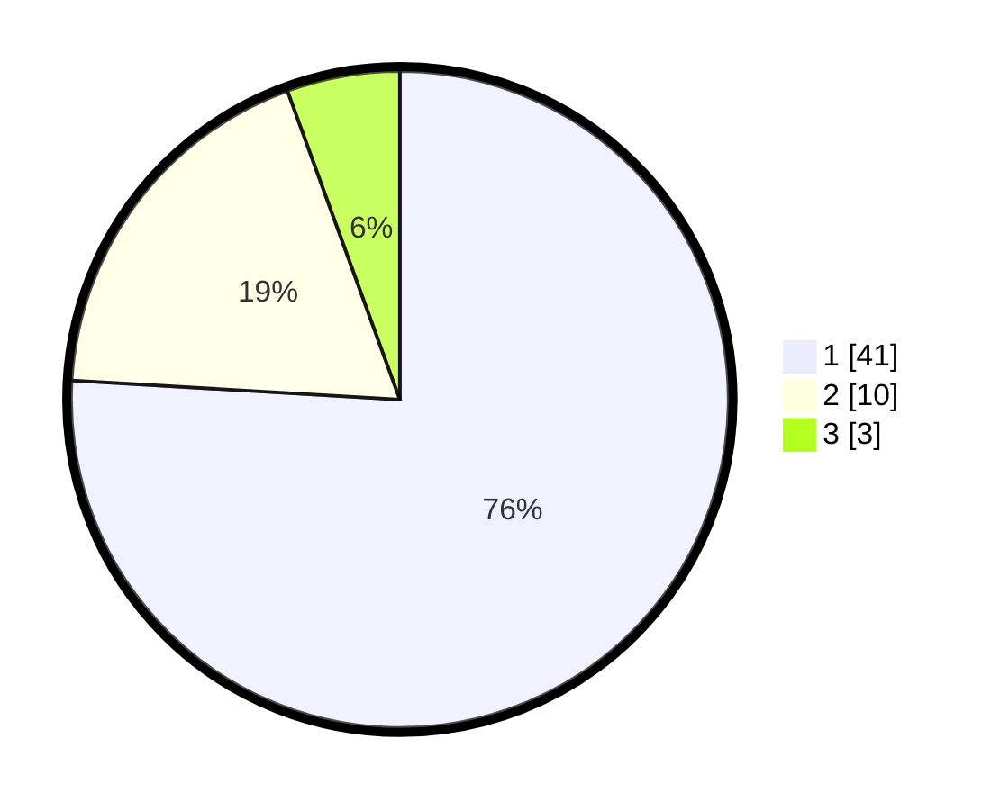

# Hasil

## Grafik

## Tabel

| No. | Nama Paslon    | Suara | Suara (raw) | Persentase |
|:--- |:-------------- | -----:| -----------:| ----------:|
| 1   | ANIES MUHAIMIN | 41    | [41][p-1]   | 75,93      |
| 2   | PRABOWO GIBRAN | 10    | [10][p-2]   | 18,52      |
| 3   | GANJAR MAHFUD  | 3     | [3][p-3]    | 5,56       |

[p-1]: https://github.com/gigit-pemilu/pemilu-2024/blob/main/pilpres/hitung-suara/sub/12-sumatera-utara/sub/13-mandailing-natal/sub/03-panyabungan-timur/sub/2014-banjar-lancat/sub/002-tps/sub/paslon-1.txt
[p-2]: https://github.com/gigit-pemilu/pemilu-2024/blob/main/pilpres/hitung-suara/sub/12-sumatera-utara/sub/13-mandailing-natal/sub/03-panyabungan-timur/sub/2014-banjar-lancat/sub/002-tps/sub/paslon-2.txt
[p-3]: https://github.com/gigit-pemilu/pemilu-2024/blob/main/pilpres/hitung-suara/sub/12-sumatera-utara/sub/13-mandailing-natal/sub/03-panyabungan-timur/sub/2014-banjar-lancat/sub/002-tps/sub/paslon-3.txt

## Foto C Plano

https://sirekap-obj-formc.kpu.go.id/a8b4/pemilu/ppwp/12/13/03/20/14/1213032014002-20240215-103500--29a93c7a-a208-4ef4-ac3c-30731277894f.jpg

https://sirekap-obj-formc.kpu.go.id/a8b4/pemilu/ppwp/12/13/03/20/14/1213032014002-20240215-103643--2f6718be-0d7e-4497-9c48-c796170cdfab.jpg

https://sirekap-obj-formc.kpu.go.id/a8b4/pemilu/ppwp/12/13/03/20/14/1213032014002-20240215-103728--54dd07ad-35ff-469b-9028-8e2e574812fd.jpg

## Metadata

| Key        | Value               |
| ---------- | ------------------- |
| Time Stamp | 2024-02-17 01:30:00 |

