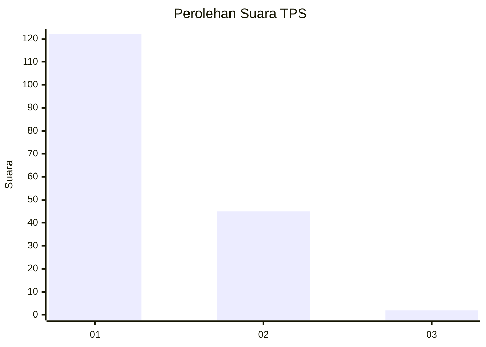
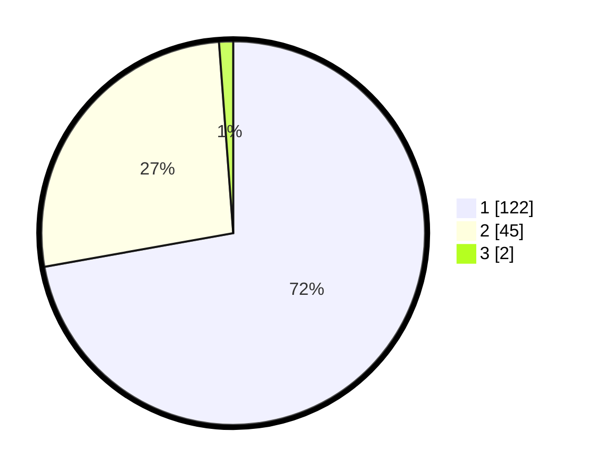

# Hasil

## Grafik

## Tabel

| No. | Nama Paslon    | Suara | Suara (raw) | Persentase |
|:--- |:-------------- | -----:| -----------:| ----------:|
| 1   | ANIES MUHAIMIN | 122   | [122][p-1]  | 72,19      |
| 2   | PRABOWO GIBRAN | 45    | [45][p-2]   | 26,63      |
| 3   | GANJAR MAHFUD  | 2     | [2][p-3]    | 1,18       |

[p-1]: https://github.com/gigit-pemilu/pemilu-2024-12-sumatera-utara/blob/main/pilpres/hitung-suara/sub/12-sumatera-utara/sub/13-mandailing-natal/sub/04-panyabungan-selatan/sub/2002-hutarimbaru/sub/002-tps/sub/paslon-1.txt
[p-2]: https://github.com/gigit-pemilu/pemilu-2024-12-sumatera-utara/blob/main/pilpres/hitung-suara/sub/12-sumatera-utara/sub/13-mandailing-natal/sub/04-panyabungan-selatan/sub/2002-hutarimbaru/sub/002-tps/sub/paslon-2.txt
[p-3]: https://github.com/gigit-pemilu/pemilu-2024-12-sumatera-utara/blob/main/pilpres/hitung-suara/sub/12-sumatera-utara/sub/13-mandailing-natal/sub/04-panyabungan-selatan/sub/2002-hutarimbaru/sub/002-tps/sub/paslon-3.txt

## Foto C Plano

https://sirekap-obj-formc.kpu.go.id/925d/pemilu/ppwp/12/13/04/20/02/1213042002002-20240218-161517--4f99fd75-f494-4214-9017-49020c816562.jpg

https://sirekap-obj-formc.kpu.go.id/925d/pemilu/ppwp/12/13/04/20/02/1213042002002-20240218-161728--1d95cbf3-f3db-4f14-a3b4-728a3bced743.jpg

https://sirekap-obj-formc.kpu.go.id/925d/pemilu/ppwp/12/13/04/20/02/1213042002002-20240218-162459--a89d7224-be71-496b-b2b5-9a5a077164b7.jpg

## Metadata

| Key        | Value               |
| ---------- | ------------------- |
| Time Stamp | 2024-02-25 17:00:00 |

