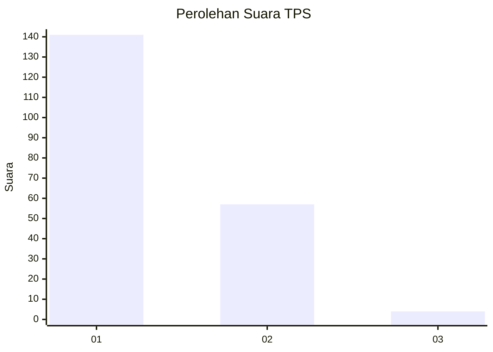
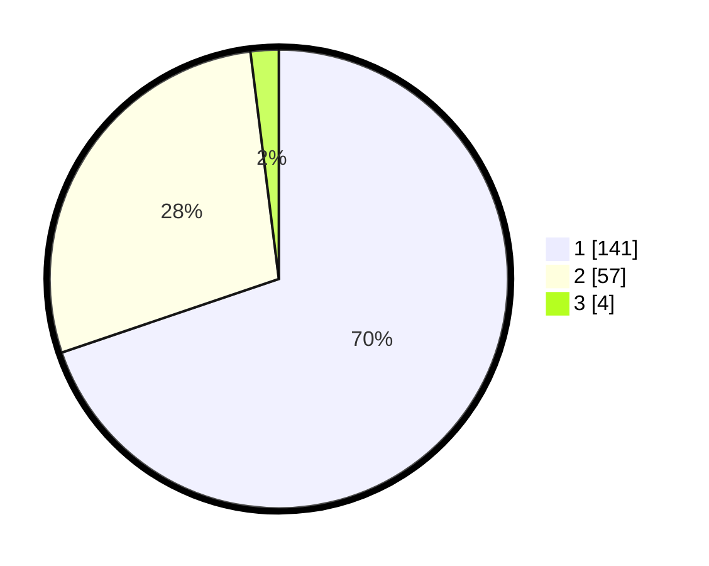

# Hasil

## Grafik

## Tabel

| No. | Nama Paslon    | Suara | Suara (raw) | Persentase |
|:--- |:-------------- | -----:| -----------:| ----------:|
| 1   | ANIES MUHAIMIN | 141   | [141][p-1]  | 69,80      |
| 2   | PRABOWO GIBRAN | 57    | [57][p-2]   | 28,22      |
| 3   | GANJAR MAHFUD  | 4     | [4][p-3]    | 1,98       |

[p-1]: https://github.com/gigit-pemilu/pemilu-2024/blob/main/pilpres/hitung-suara/sub/12-sumatera-utara/sub/13-mandailing-natal/sub/04-panyabungan-selatan/sub/2005-kayu-laut/sub/003-tps/sub/paslon-1.txt
[p-2]: https://github.com/gigit-pemilu/pemilu-2024/blob/main/pilpres/hitung-suara/sub/12-sumatera-utara/sub/13-mandailing-natal/sub/04-panyabungan-selatan/sub/2005-kayu-laut/sub/003-tps/sub/paslon-2.txt
[p-3]: https://github.com/gigit-pemilu/pemilu-2024/blob/main/pilpres/hitung-suara/sub/12-sumatera-utara/sub/13-mandailing-natal/sub/04-panyabungan-selatan/sub/2005-kayu-laut/sub/003-tps/sub/paslon-3.txt

## Foto C Plano

https://sirekap-obj-formc.kpu.go.id/b922/pemilu/ppwp/12/13/04/20/05/1213042005003-20240215-022504--a3d0ff4b-8b9e-4097-b71d-8ef1f316fdbc.jpg

https://sirekap-obj-formc.kpu.go.id/b922/pemilu/ppwp/12/13/04/20/05/1213042005003-20240215-022401--4162c570-9fc6-4640-88c7-32cfdb28320c.jpg

https://sirekap-obj-formc.kpu.go.id/b922/pemilu/ppwp/12/13/04/20/05/1213042005003-20240215-022607--6f58257e-658c-4739-9497-f16a91c3b7f0.jpg

## Metadata

| Key        | Value               |
| ---------- | ------------------- |
| Time Stamp | 2024-02-17 01:30:00 |

