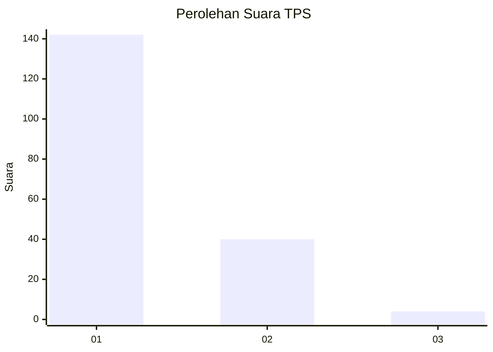
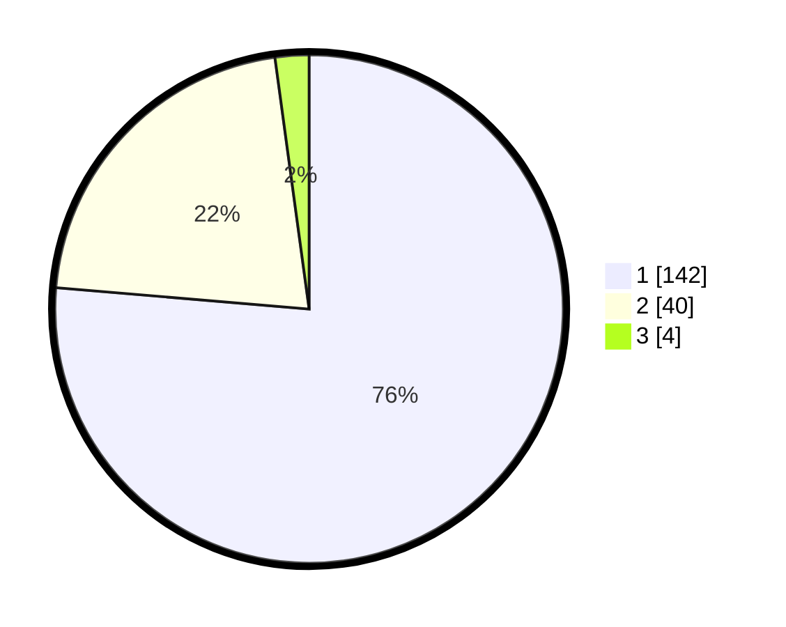

# Hasil

## Grafik

## Tabel

| No. | Nama Paslon    | Suara | Suara (raw) | Persentase |
|:--- |:-------------- | -----:| -----------:| ----------:|
| 1   | ANIES MUHAIMIN | 142   | [142][p-1]  | 76,34      |
| 2   | PRABOWO GIBRAN | 40    | [40][p-2]   | 21,51      |
| 3   | GANJAR MAHFUD  | 4     | [4][p-3]    | 2,15       |

[p-1]: https://github.com/gigit-pemilu/pemilu-2024/blob/main/pilpres/hitung-suara/sub/12-sumatera-utara/sub/13-mandailing-natal/sub/04-panyabungan-selatan/sub/2006-lumban-dolok/sub/001-tps/sub/paslon-1.txt
[p-2]: https://github.com/gigit-pemilu/pemilu-2024/blob/main/pilpres/hitung-suara/sub/12-sumatera-utara/sub/13-mandailing-natal/sub/04-panyabungan-selatan/sub/2006-lumban-dolok/sub/001-tps/sub/paslon-2.txt
[p-3]: https://github.com/gigit-pemilu/pemilu-2024/blob/main/pilpres/hitung-suara/sub/12-sumatera-utara/sub/13-mandailing-natal/sub/04-panyabungan-selatan/sub/2006-lumban-dolok/sub/001-tps/sub/paslon-3.txt

## Foto C Plano

https://sirekap-obj-formc.kpu.go.id/fbcc/pemilu/ppwp/12/13/04/20/06/1213042006001-20240215-164044--f3770b68-c6c5-4210-9a41-821db0ed5957.jpg

https://sirekap-obj-formc.kpu.go.id/fbcc/pemilu/ppwp/12/13/04/20/06/1213042006001-20240214-185655--fe7070fd-94d9-4f05-bfe7-5fb2e8e6889f.jpg

https://sirekap-obj-formc.kpu.go.id/fbcc/pemilu/ppwp/12/13/04/20/06/1213042006001-20240214-185921--965cb7ea-000d-4abb-bf44-5a2415845aff.jpg

## Metadata

| Key        | Value               |
| ---------- | ------------------- |
| Time Stamp | 2024-02-16 00:00:26 |

