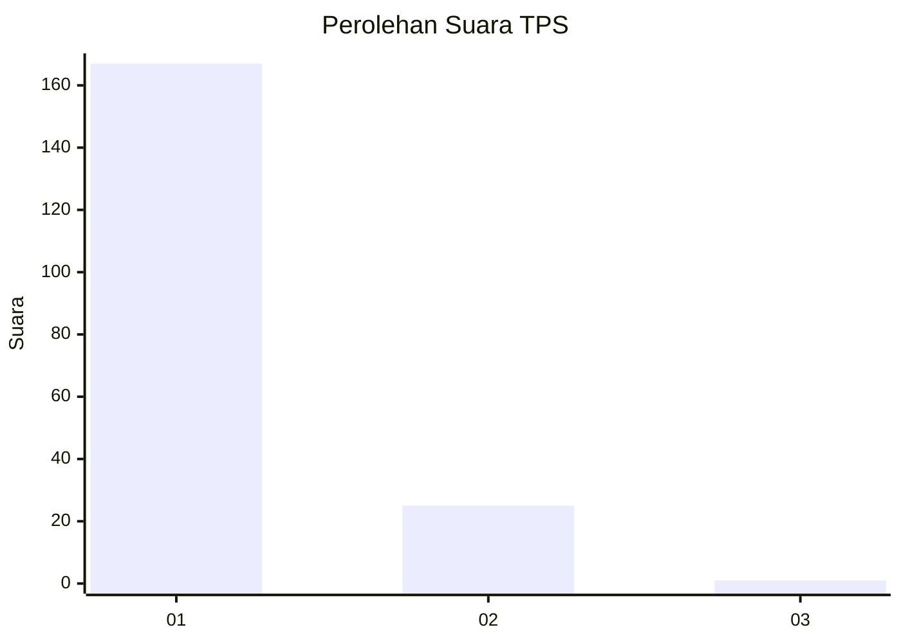
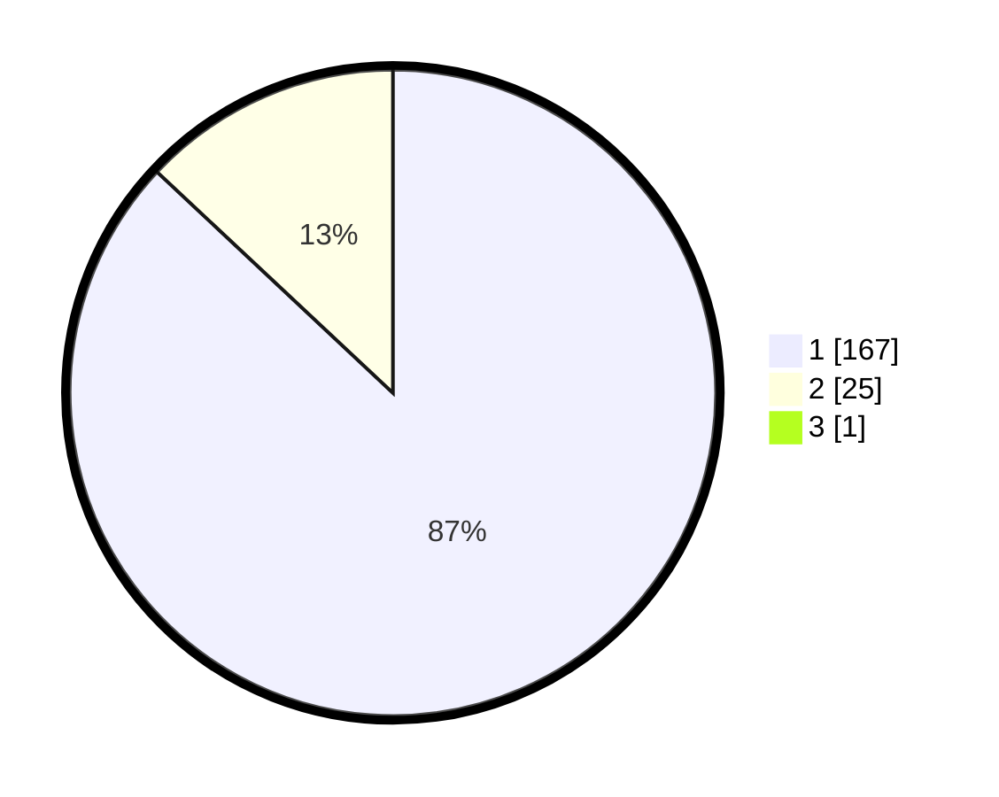

# Hasil

## Grafik

## Tabel

| No. | Nama Paslon    | Suara | Suara (raw) | Persentase |
|:--- |:-------------- | -----:| -----------:| ----------:|
| 1   | ANIES MUHAIMIN | 167   | [167][p-1]  | 86,53      |
| 2   | PRABOWO GIBRAN | 25    | [25][p-2]   | 12,95      |
| 3   | GANJAR MAHFUD  | 1     | [1][p-3]    | 0,52       |

[p-1]: https://github.com/gigit-pemilu/pemilu-2024/blob/main/pilpres/hitung-suara/sub/12-sumatera-utara/sub/13-mandailing-natal/sub/04-panyabungan-selatan/sub/2007-roburan-dolok/sub/004-tps/sub/paslon-1.txt
[p-2]: https://github.com/gigit-pemilu/pemilu-2024/blob/main/pilpres/hitung-suara/sub/12-sumatera-utara/sub/13-mandailing-natal/sub/04-panyabungan-selatan/sub/2007-roburan-dolok/sub/004-tps/sub/paslon-2.txt
[p-3]: https://github.com/gigit-pemilu/pemilu-2024/blob/main/pilpres/hitung-suara/sub/12-sumatera-utara/sub/13-mandailing-natal/sub/04-panyabungan-selatan/sub/2007-roburan-dolok/sub/004-tps/sub/paslon-3.txt

## Foto C Plano

https://sirekap-obj-formc.kpu.go.id/cec1/pemilu/ppwp/12/13/04/20/07/1213042007004-20240214-222025--06e6ed77-0763-4aa3-9ca1-23b3c5d71712.jpg

https://sirekap-obj-formc.kpu.go.id/cec1/pemilu/ppwp/12/13/04/20/07/1213042007004-20240219-215417--153a82e4-ddd4-41fd-91b2-b6049ec3f3ae.jpg

https://sirekap-obj-formc.kpu.go.id/cec1/pemilu/ppwp/12/13/04/20/07/1213042007004-20240219-215558--91187ee4-12d6-4f3e-856c-013ec48b5347.jpg

## Metadata

| Key        | Value               |
| ---------- | ------------------- |
| Time Stamp | 2024-02-25 16:00:00 |

