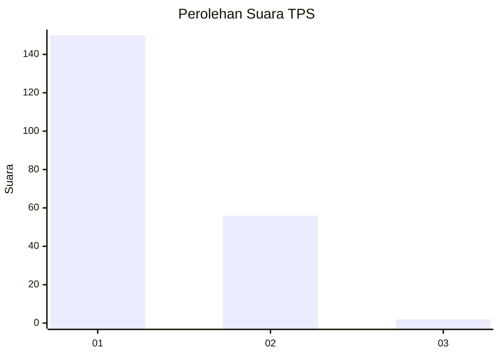
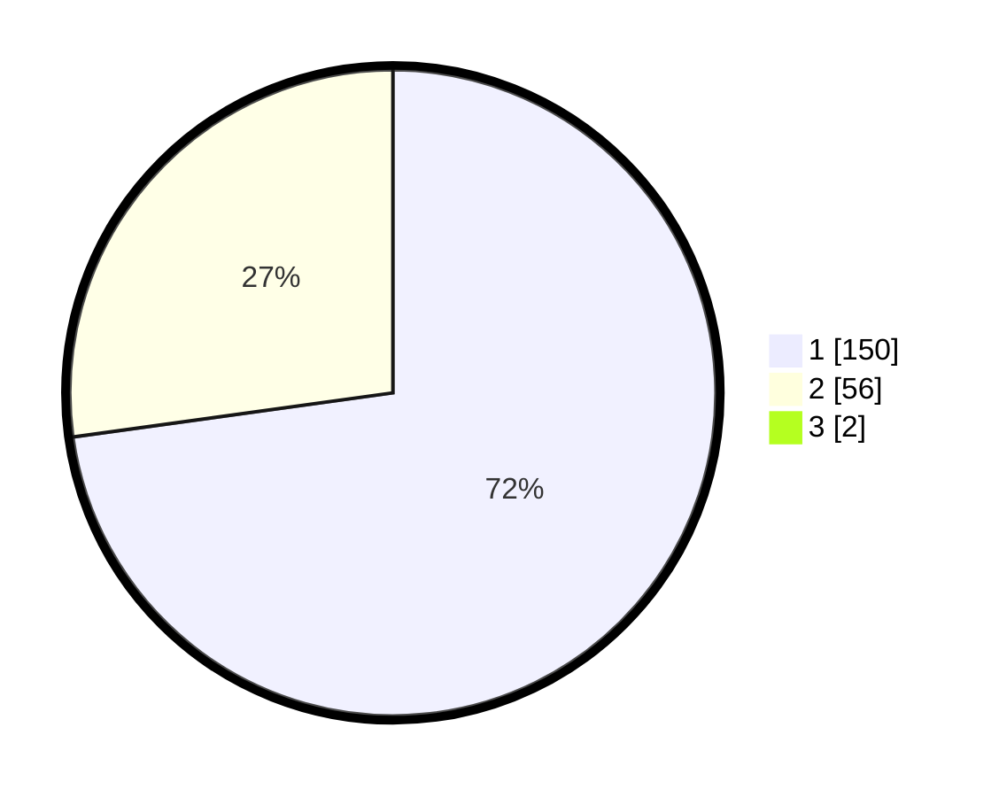

# Hasil

## Grafik

## Tabel

| No. | Nama Paslon    | Suara | Suara (raw) | Persentase |
|:--- |:-------------- | -----:| -----------:| ----------:|
| 1   | ANIES MUHAIMIN | 150   | [150][p-1]  | 72,12      |
| 2   | PRABOWO GIBRAN | 56    | [56][p-2]   | 26,92      |
| 3   | GANJAR MAHFUD  | 2     | [2][p-3]    | 0,96       |

[p-1]: https://github.com/gigit-pemilu/pemilu-2024-12-sumatera-utara/blob/main/pilpres/hitung-suara/sub/12-sumatera-utara/sub/13-mandailing-natal/sub/04-panyabungan-selatan/sub/2008-roburan-lombang/sub/006-tps/sub/paslon-1.txt
[p-2]: https://github.com/gigit-pemilu/pemilu-2024-12-sumatera-utara/blob/main/pilpres/hitung-suara/sub/12-sumatera-utara/sub/13-mandailing-natal/sub/04-panyabungan-selatan/sub/2008-roburan-lombang/sub/006-tps/sub/paslon-2.txt
[p-3]: https://github.com/gigit-pemilu/pemilu-2024-12-sumatera-utara/blob/main/pilpres/hitung-suara/sub/12-sumatera-utara/sub/13-mandailing-natal/sub/04-panyabungan-selatan/sub/2008-roburan-lombang/sub/006-tps/sub/paslon-3.txt

## Foto C Plano

https://sirekap-obj-formc.kpu.go.id/59f1/pemilu/ppwp/12/13/04/20/08/1213042008006-20240214-192817--3ae831b2-e790-4def-912b-7b56d7fbc853.jpg

https://sirekap-obj-formc.kpu.go.id/59f1/pemilu/ppwp/12/13/04/20/08/1213042008006-20240214-193243--30770e20-f8aa-48da-bb3f-2a10c4d17463.jpg

https://sirekap-obj-formc.kpu.go.id/59f1/pemilu/ppwp/12/13/04/20/08/1213042008006-20240214-193431--15804ef8-4936-4644-b2ef-e9c802c9f578.jpg

## Metadata

| Key        | Value               |
| ---------- | ------------------- |
| Time Stamp | 2024-02-16 00:00:26 |

