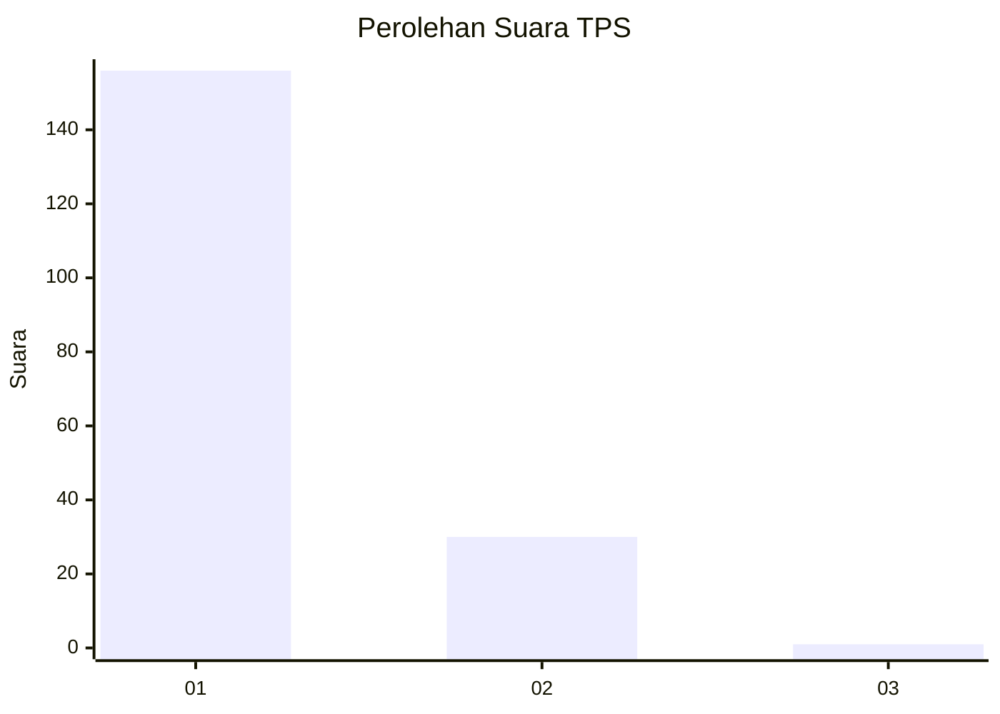
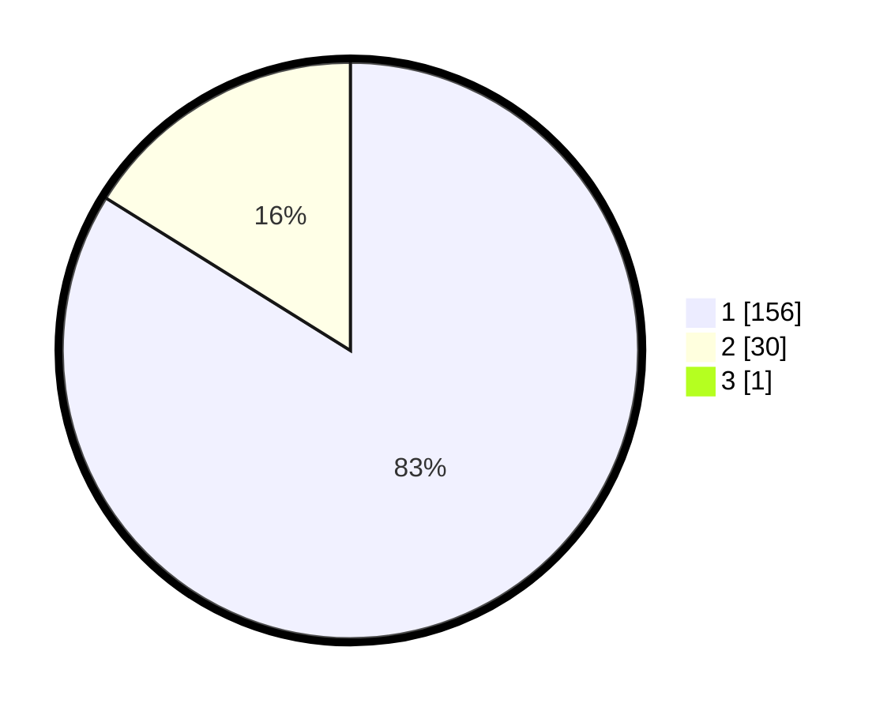

# Hasil

## Grafik

## Tabel

| No. | Nama Paslon    | Suara | Suara (raw) | Persentase |
|:--- |:-------------- | -----:| -----------:| ----------:|
| 1   | ANIES MUHAIMIN | 156   | [156][p-1]  | 83,42      |
| 2   | PRABOWO GIBRAN | 30    | [30][p-2]   | 16,04      |
| 3   | GANJAR MAHFUD  | 1     | [1][p-3]    | 0,53       |

[p-1]: https://github.com/gigit-pemilu/pemilu-2024/blob/main/pilpres/hitung-suara/sub/12-sumatera-utara/sub/13-mandailing-natal/sub/04-panyabungan-selatan/sub/2010-huta-raja/sub/002-tps/sub/paslon-1.txt
[p-2]: https://github.com/gigit-pemilu/pemilu-2024/blob/main/pilpres/hitung-suara/sub/12-sumatera-utara/sub/13-mandailing-natal/sub/04-panyabungan-selatan/sub/2010-huta-raja/sub/002-tps/sub/paslon-2.txt
[p-3]: https://github.com/gigit-pemilu/pemilu-2024/blob/main/pilpres/hitung-suara/sub/12-sumatera-utara/sub/13-mandailing-natal/sub/04-panyabungan-selatan/sub/2010-huta-raja/sub/002-tps/sub/paslon-3.txt

## Foto C Plano

https://sirekap-obj-formc.kpu.go.id/6761/pemilu/ppwp/12/13/04/20/10/1213042010002-20240219-000641--565d6280-d8cd-409e-8395-69142647ba85.jpg

https://sirekap-obj-formc.kpu.go.id/6761/pemilu/ppwp/12/13/04/20/10/1213042010002-20240219-000818--93ed27f4-b57d-4fa0-8ae9-5d389ebd89f9.jpg

https://sirekap-obj-formc.kpu.go.id/6761/pemilu/ppwp/12/13/04/20/10/1213042010002-20240219-001143--f8579dda-dbf4-4d2e-99a8-3f2f105c797e.jpg

## Metadata

| Key        | Value               |
| ---------- | ------------------- |
| Time Stamp | 2024-02-24 22:31:28 |

