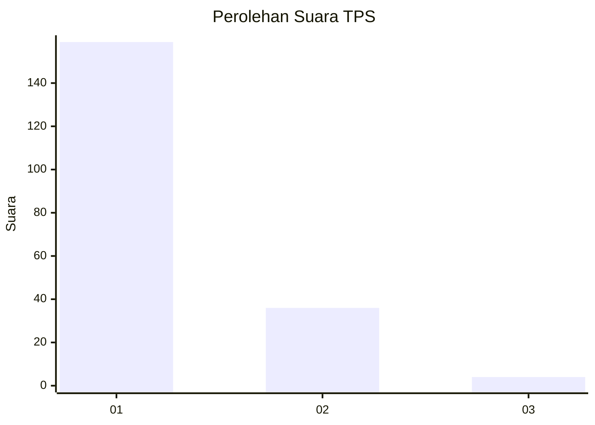
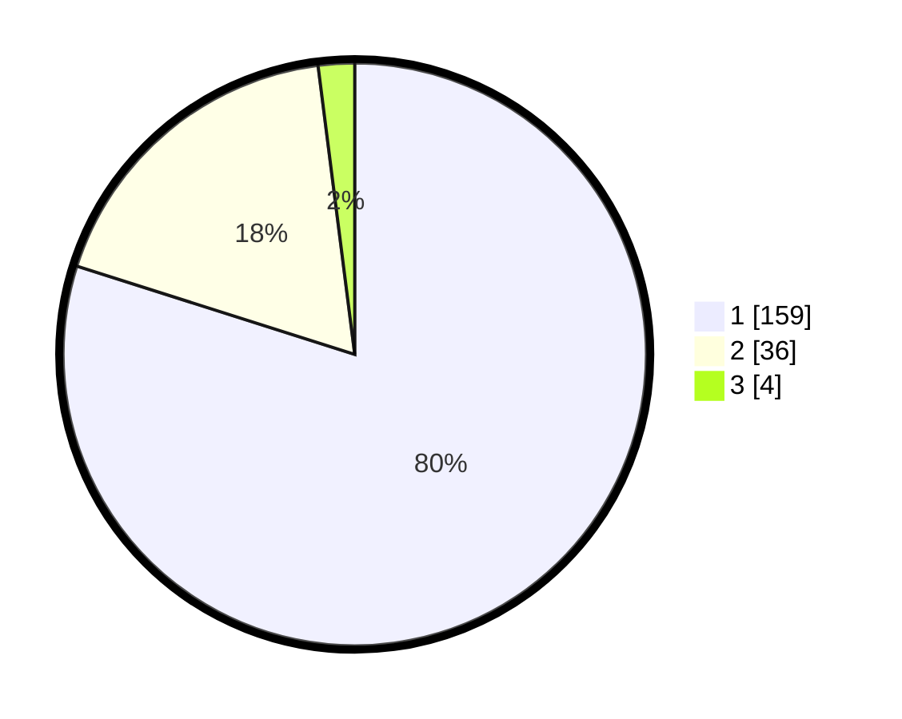

# Hasil

## Grafik

## Tabel

| No. | Nama Paslon    | Suara | Suara (raw) | Persentase |
|:--- |:-------------- | -----:| -----------:| ----------:|
| 1   | ANIES MUHAIMIN | 159   | [159][p-1]  | 79,90      |
| 2   | PRABOWO GIBRAN | 36    | [36][p-2]   | 18,09      |
| 3   | GANJAR MAHFUD  | 4     | [4][p-3]    | 2,01       |

[p-1]: https://github.com/gigit-pemilu/pemilu-2024-12-sumatera-utara/blob/main/pilpres/hitung-suara/sub/12-sumatera-utara/sub/13-mandailing-natal/sub/05-panyabungan-barat/sub/1006-longat/sub/004-tps/sub/paslon-1.txt
[p-2]: https://github.com/gigit-pemilu/pemilu-2024-12-sumatera-utara/blob/main/pilpres/hitung-suara/sub/12-sumatera-utara/sub/13-mandailing-natal/sub/05-panyabungan-barat/sub/1006-longat/sub/004-tps/sub/paslon-2.txt
[p-3]: https://github.com/gigit-pemilu/pemilu-2024-12-sumatera-utara/blob/main/pilpres/hitung-suara/sub/12-sumatera-utara/sub/13-mandailing-natal/sub/05-panyabungan-barat/sub/1006-longat/sub/004-tps/sub/paslon-3.txt

## Foto C Plano

https://sirekap-obj-formc.kpu.go.id/d697/pemilu/ppwp/12/13/05/10/06/1213051006004-20240214-200517--7898bec2-5983-40d3-9876-72e363dba36a.jpg

https://sirekap-obj-formc.kpu.go.id/d697/pemilu/ppwp/12/13/05/10/06/1213051006004-20240214-200615--504ba477-30d1-40cc-9db7-644ca08a0d14.jpg

https://sirekap-obj-formc.kpu.go.id/d697/pemilu/ppwp/12/13/05/10/06/1213051006004-20240214-200808--0a85fc32-f60b-4e37-9fb9-5fa40be4e507.jpg

## Metadata

| Key        | Value               |
| ---------- | ------------------- |
| Time Stamp | 2024-02-14 21:46:01 |

