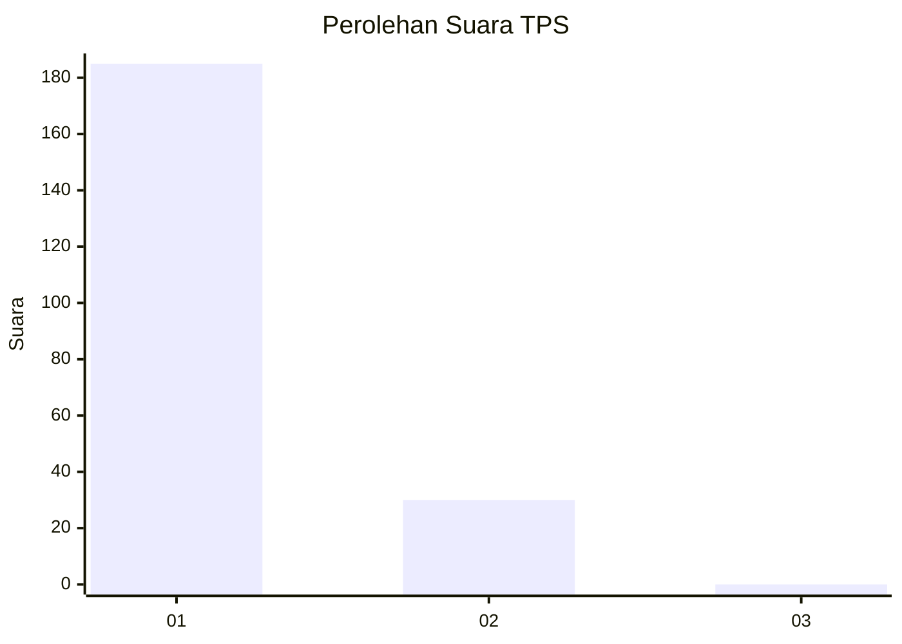
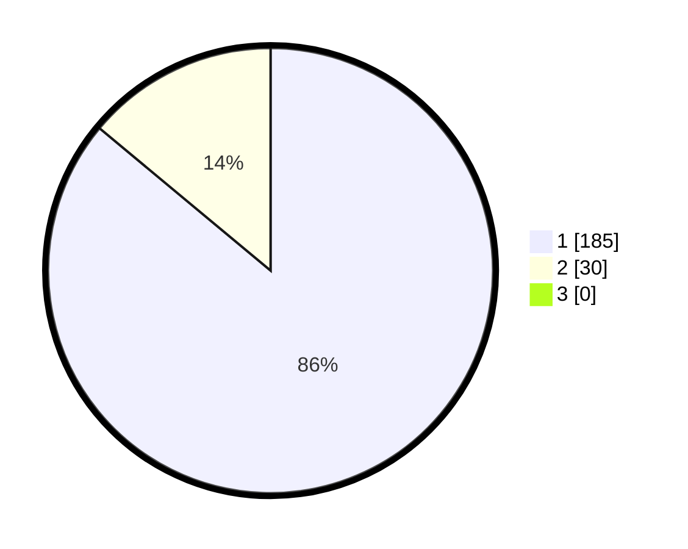

# Hasil

## Grafik

## Tabel

| No. | Nama Paslon    | Suara | Suara (raw) | Persentase |
|:--- |:-------------- | -----:| -----------:| ----------:|
| 1   | ANIES MUHAIMIN | 185   | [185][p-1]  | 86,05      |
| 2   | PRABOWO GIBRAN | 30    | [30][p-2]   | 13,95      |
| 3   | GANJAR MAHFUD  | 0     | [0][p-3]    | 0,00       |

[p-1]: https://github.com/gigit-pemilu/pemilu-2024/blob/main/pilpres/hitung-suara/sub/12-sumatera-utara/sub/13-mandailing-natal/sub/05-panyabungan-barat/sub/1006-longat/sub/005-tps/sub/paslon-1.txt
[p-2]: https://github.com/gigit-pemilu/pemilu-2024/blob/main/pilpres/hitung-suara/sub/12-sumatera-utara/sub/13-mandailing-natal/sub/05-panyabungan-barat/sub/1006-longat/sub/005-tps/sub/paslon-2.txt
[p-3]: https://github.com/gigit-pemilu/pemilu-2024/blob/main/pilpres/hitung-suara/sub/12-sumatera-utara/sub/13-mandailing-natal/sub/05-panyabungan-barat/sub/1006-longat/sub/005-tps/sub/paslon-3.txt

## Foto C Plano

https://sirekap-obj-formc.kpu.go.id/7f64/pemilu/ppwp/12/13/05/10/06/1213051006005-20240215-031025--5ebc6b4a-4484-4054-93df-21519b990bcf.jpg

https://sirekap-obj-formc.kpu.go.id/7f64/pemilu/ppwp/12/13/05/10/06/1213051006005-20240215-031241--6a743e9c-4a6c-49c4-9e89-e60b308ce9af.jpg

https://sirekap-obj-formc.kpu.go.id/7f64/pemilu/ppwp/12/13/05/10/06/1213051006005-20240215-031555--610e29b0-13ac-4c94-8a73-da47b883a171.jpg

## Metadata

| Key        | Value               |
| ---------- | ------------------- |
| Time Stamp | 2024-02-15 16:00:26 |

