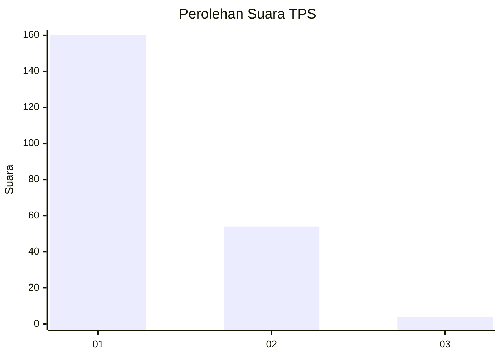
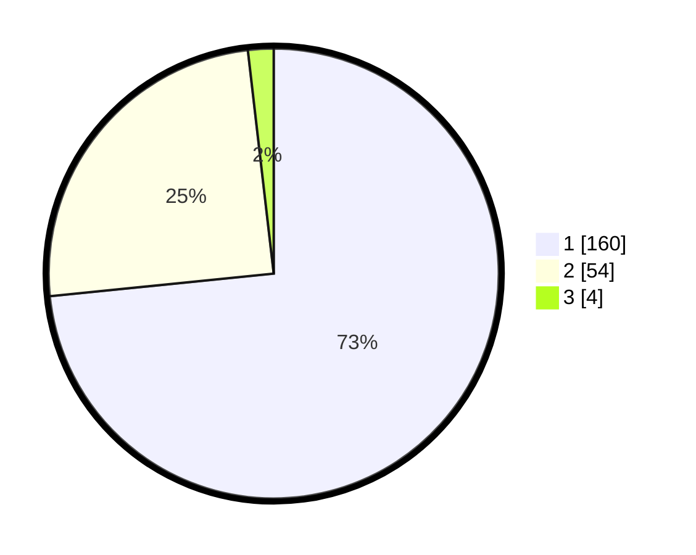

# Hasil

## Grafik

## Tabel

| No. | Nama Paslon    | Suara | Suara (raw) | Persentase |
|:--- |:-------------- | -----:| -----------:| ----------:|
| 1   | ANIES MUHAIMIN | 160   | [160][p-1]  | 73,39      |
| 2   | PRABOWO GIBRAN | 54    | [54][p-2]   | 24,77      |
| 3   | GANJAR MAHFUD  | 4     | [4][p-3]    | 1,83       |

[p-1]: https://github.com/gigit-pemilu/pemilu-2024/blob/main/pilpres/hitung-suara/sub/12-sumatera-utara/sub/13-mandailing-natal/sub/05-panyabungan-barat/sub/2004-huta-baringin/sub/002-tps/sub/paslon-1.txt
[p-2]: https://github.com/gigit-pemilu/pemilu-2024/blob/main/pilpres/hitung-suara/sub/12-sumatera-utara/sub/13-mandailing-natal/sub/05-panyabungan-barat/sub/2004-huta-baringin/sub/002-tps/sub/paslon-2.txt
[p-3]: https://github.com/gigit-pemilu/pemilu-2024/blob/main/pilpres/hitung-suara/sub/12-sumatera-utara/sub/13-mandailing-natal/sub/05-panyabungan-barat/sub/2004-huta-baringin/sub/002-tps/sub/paslon-3.txt

## Foto C Plano

https://sirekap-obj-formc.kpu.go.id/b257/pemilu/ppwp/12/13/05/20/04/1213052004002-20240215-022354--6cf96079-d033-4620-8882-0fd13fae6d71.jpg

https://sirekap-obj-formc.kpu.go.id/b257/pemilu/ppwp/12/13/05/20/04/1213052004002-20240215-022506--85e2a38b-5314-4150-9132-8d14b4776f12.jpg

https://sirekap-obj-formc.kpu.go.id/b257/pemilu/ppwp/12/13/05/20/04/1213052004002-20240215-022542--580133cf-a0a6-4ecc-8da7-628cda0acc72.jpg

## Metadata

| Key        | Value               |
| ---------- | ------------------- |
| Time Stamp | 2024-02-16 00:00:26 |

