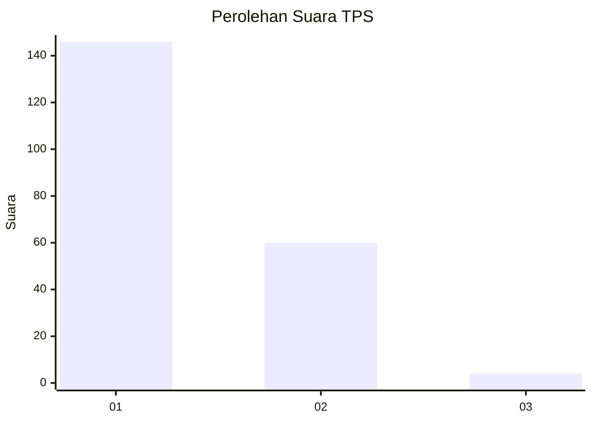
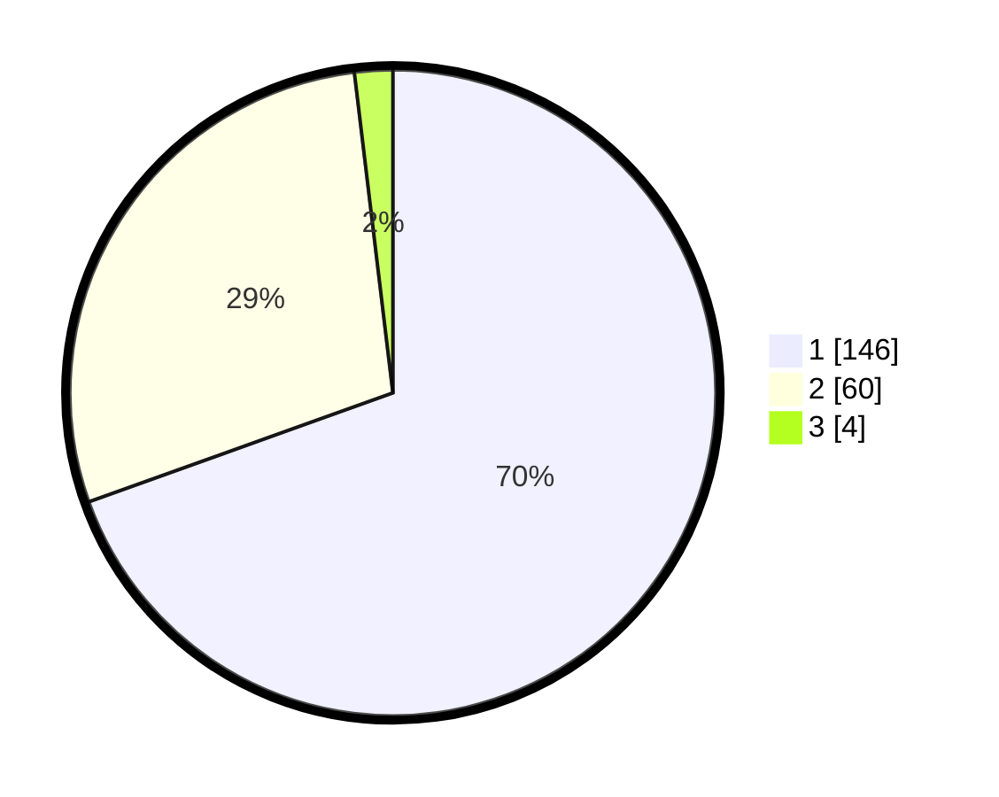

# Hasil

## Grafik

## Tabel

| No. | Nama Paslon    | Suara | Suara (raw) | Persentase |
|:--- |:-------------- | -----:| -----------:| ----------:|
| 1   | ANIES MUHAIMIN | 146   | [146][p-1]  | 69,52      |
| 2   | PRABOWO GIBRAN | 60    | [60][p-2]   | 28,57      |
| 3   | GANJAR MAHFUD  | 4     | [4][p-3]    | 1,90       |

[p-1]: https://github.com/gigit-pemilu/pemilu-2024/blob/main/pilpres/hitung-suara/sub/12-sumatera-utara/sub/13-mandailing-natal/sub/05-panyabungan-barat/sub/2004-huta-baringin/sub/003-tps/sub/paslon-1.txt
[p-2]: https://github.com/gigit-pemilu/pemilu-2024/blob/main/pilpres/hitung-suara/sub/12-sumatera-utara/sub/13-mandailing-natal/sub/05-panyabungan-barat/sub/2004-huta-baringin/sub/003-tps/sub/paslon-2.txt
[p-3]: https://github.com/gigit-pemilu/pemilu-2024/blob/main/pilpres/hitung-suara/sub/12-sumatera-utara/sub/13-mandailing-natal/sub/05-panyabungan-barat/sub/2004-huta-baringin/sub/003-tps/sub/paslon-3.txt

## Foto C Plano

https://sirekap-obj-formc.kpu.go.id/d538/pemilu/ppwp/12/13/05/20/04/1213052004003-20240215-004609--70f2c828-22cb-4025-b4e9-b37aef67a7fe.jpg

https://sirekap-obj-formc.kpu.go.id/d538/pemilu/ppwp/12/13/05/20/04/1213052004003-20240215-004729--e9b7ee94-22e9-4ace-aeae-e2a0159b2ca1.jpg

https://sirekap-obj-formc.kpu.go.id/d538/pemilu/ppwp/12/13/05/20/04/1213052004003-20240215-004829--31880d89-3162-4f09-a2bd-266b0c58e837.jpg

## Metadata

| Key        | Value               |
| ---------- | ------------------- |
| Time Stamp | 2024-02-17 01:00:00 |

