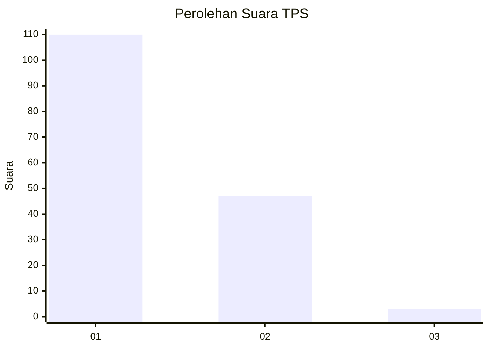
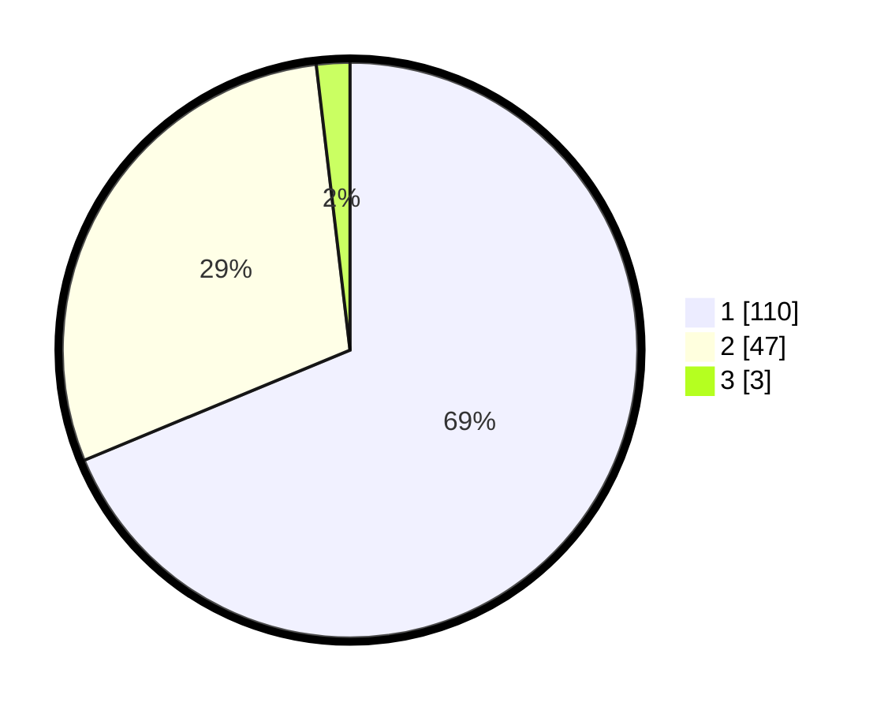

# Hasil

## Grafik

## Tabel

| No. | Nama Paslon    | Suara | Suara (raw) | Persentase |
|:--- |:-------------- | -----:| -----------:| ----------:|
| 1   | ANIES MUHAIMIN | 110   | [110][p-1]  | 68,75      |
| 2   | PRABOWO GIBRAN | 47    | [47][p-2]   | 29,38      |
| 3   | GANJAR MAHFUD  | 3     | [3][p-3]    | 1,88       |

[p-1]: https://github.com/gigit-pemilu/pemilu-2024/blob/main/pilpres/hitung-suara/sub/12-sumatera-utara/sub/13-mandailing-natal/sub/05-panyabungan-barat/sub/2005-huta-tonga-bb/sub/002-tps/sub/paslon-1.txt
[p-2]: https://github.com/gigit-pemilu/pemilu-2024/blob/main/pilpres/hitung-suara/sub/12-sumatera-utara/sub/13-mandailing-natal/sub/05-panyabungan-barat/sub/2005-huta-tonga-bb/sub/002-tps/sub/paslon-2.txt
[p-3]: https://github.com/gigit-pemilu/pemilu-2024/blob/main/pilpres/hitung-suara/sub/12-sumatera-utara/sub/13-mandailing-natal/sub/05-panyabungan-barat/sub/2005-huta-tonga-bb/sub/002-tps/sub/paslon-3.txt

## Foto C Plano

https://sirekap-obj-formc.kpu.go.id/e876/pemilu/ppwp/12/13/05/20/05/1213052005002-20240215-082743--d6377310-629c-4544-9061-0080369b942d.jpg

https://sirekap-obj-formc.kpu.go.id/e876/pemilu/ppwp/12/13/05/20/05/1213052005002-20240215-082543--b0fe049c-64c7-4ebf-b9c2-77740eaee951.jpg

https://sirekap-obj-formc.kpu.go.id/e876/pemilu/ppwp/12/13/05/20/05/1213052005002-20240215-082842--e4ab6718-79e1-4095-9ac6-0503587f5b27.jpg

## Metadata

| Key        | Value               |
| ---------- | ------------------- |
| Time Stamp | 2024-02-16 00:00:26 |

