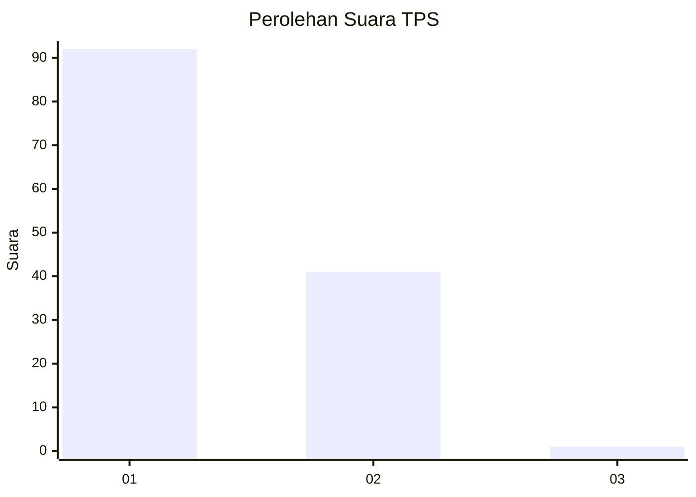
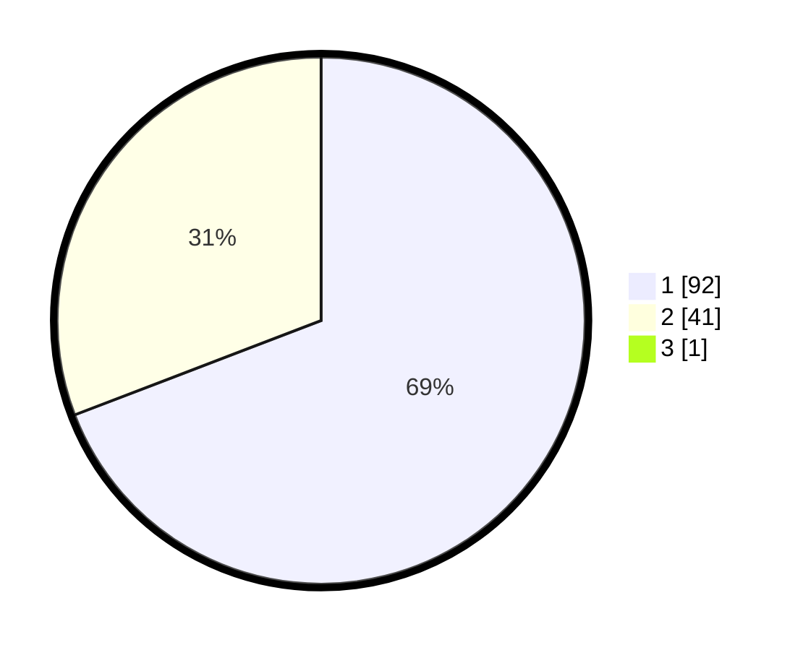

# Hasil

## Grafik

## Tabel

| No. | Nama Paslon    | Suara | Suara (raw) | Persentase |
|:--- |:-------------- | -----:| -----------:| ----------:|
| 1   | ANIES MUHAIMIN | 92    | [92][p-1]   | 68,66      |
| 2   | PRABOWO GIBRAN | 41    | [41][p-2]   | 30,60      |
| 3   | GANJAR MAHFUD  | 1     | [1][p-3]    | 0,75       |

[p-1]: https://github.com/gigit-pemilu/pemilu-2024-12-sumatera-utara/blob/main/pilpres/hitung-suara/sub/12-sumatera-utara/sub/13-mandailing-natal/sub/05-panyabungan-barat/sub/2005-huta-tonga-bb/sub/003-tps/sub/paslon-1.txt
[p-2]: https://github.com/gigit-pemilu/pemilu-2024-12-sumatera-utara/blob/main/pilpres/hitung-suara/sub/12-sumatera-utara/sub/13-mandailing-natal/sub/05-panyabungan-barat/sub/2005-huta-tonga-bb/sub/003-tps/sub/paslon-2.txt
[p-3]: https://github.com/gigit-pemilu/pemilu-2024-12-sumatera-utara/blob/main/pilpres/hitung-suara/sub/12-sumatera-utara/sub/13-mandailing-natal/sub/05-panyabungan-barat/sub/2005-huta-tonga-bb/sub/003-tps/sub/paslon-3.txt

## Foto C Plano

https://sirekap-obj-formc.kpu.go.id/86f8/pemilu/ppwp/12/13/05/20/05/1213052005003-20240215-105724--1c88c739-c528-481b-8460-ac94fa42e251.jpg

https://sirekap-obj-formc.kpu.go.id/86f8/pemilu/ppwp/12/13/05/20/05/1213052005003-20240215-105940--0ac856a4-4e46-470c-aa89-209f2ca715c8.jpg

https://sirekap-obj-formc.kpu.go.id/86f8/pemilu/ppwp/12/13/05/20/05/1213052005003-20240215-110353--fd9d883a-6d8e-402c-b080-259b746533d1.jpg

## Metadata

| Key        | Value               |
| ---------- | ------------------- |
| Time Stamp | 2024-02-17 01:30:00 |

