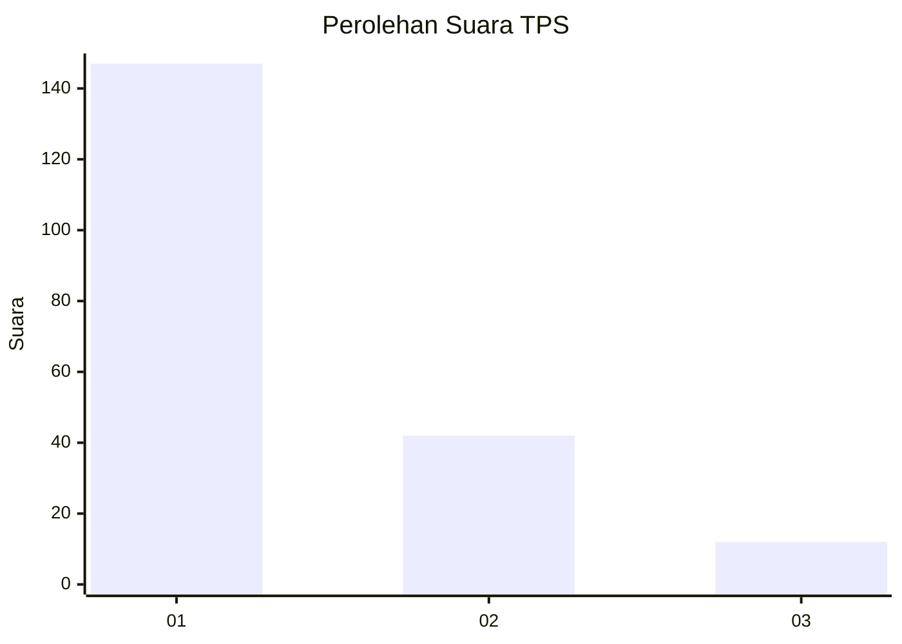
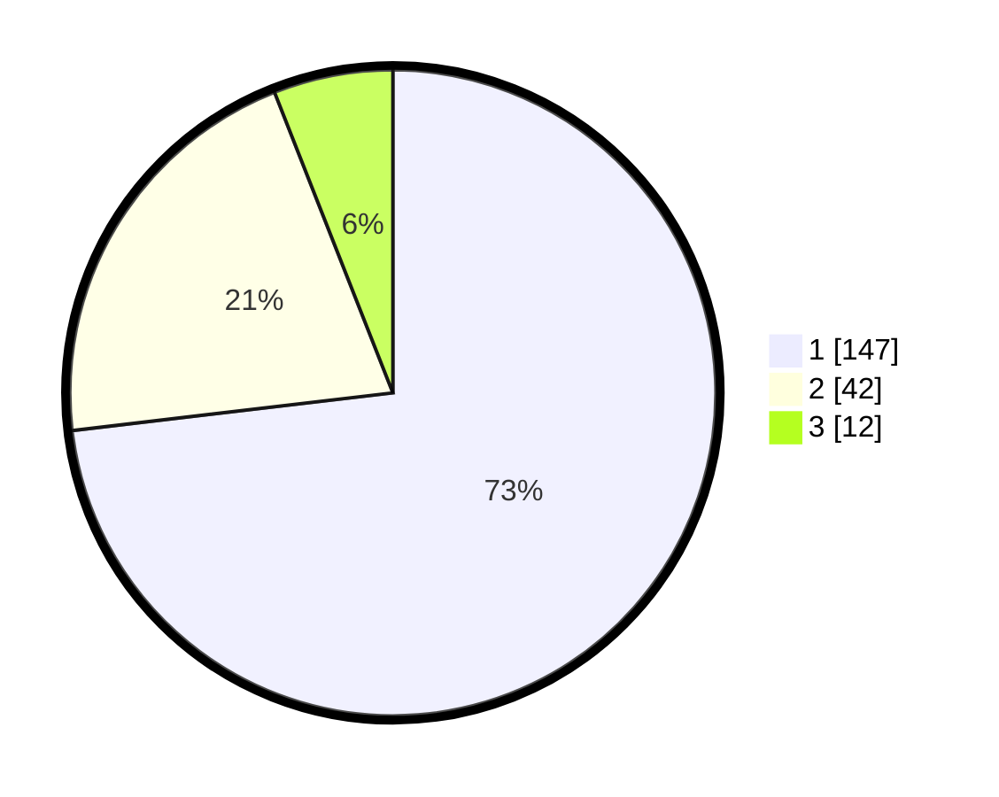

# Hasil

## Grafik

## Tabel

| No. | Nama Paslon    | Suara | Suara (raw) | Persentase |
|:--- |:-------------- | -----:| -----------:| ----------:|
| 1   | ANIES MUHAIMIN | 147   | [147][p-1]  | 73,13      |
| 2   | PRABOWO GIBRAN | 42    | [42][p-2]   | 20,90      |
| 3   | GANJAR MAHFUD  | 12    | [12][p-3]   | 5,97       |

[p-1]: https://github.com/gigit-pemilu/pemilu-2024-12-sumatera-utara/blob/main/pilpres/hitung-suara/sub/12-sumatera-utara/sub/13-mandailing-natal/sub/06-siabu/sub/1014-siabu/sub/009-tps/sub/paslon-1.txt
[p-2]: https://github.com/gigit-pemilu/pemilu-2024-12-sumatera-utara/blob/main/pilpres/hitung-suara/sub/12-sumatera-utara/sub/13-mandailing-natal/sub/06-siabu/sub/1014-siabu/sub/009-tps/sub/paslon-2.txt
[p-3]: https://github.com/gigit-pemilu/pemilu-2024-12-sumatera-utara/blob/main/pilpres/hitung-suara/sub/12-sumatera-utara/sub/13-mandailing-natal/sub/06-siabu/sub/1014-siabu/sub/009-tps/sub/paslon-3.txt

## Foto C Plano

https://sirekap-obj-formc.kpu.go.id/b0df/pemilu/ppwp/12/13/06/10/14/1213061014009-20240214-203643--1e299f15-cf6f-4abd-9c74-f1377bc04b79.jpg

https://sirekap-obj-formc.kpu.go.id/b0df/pemilu/ppwp/12/13/06/10/14/1213061014009-20240214-203658--1a2d77c7-25db-4871-9e9c-f3295fe178f0.jpg

https://sirekap-obj-formc.kpu.go.id/b0df/pemilu/ppwp/12/13/06/10/14/1213061014009-20240214-203712--4a58188c-de19-488e-a70c-59f472dd972f.jpg

## Metadata

| Key        | Value               |
| ---------- | ------------------- |
| Time Stamp | 2024-02-16 00:00:26 |

