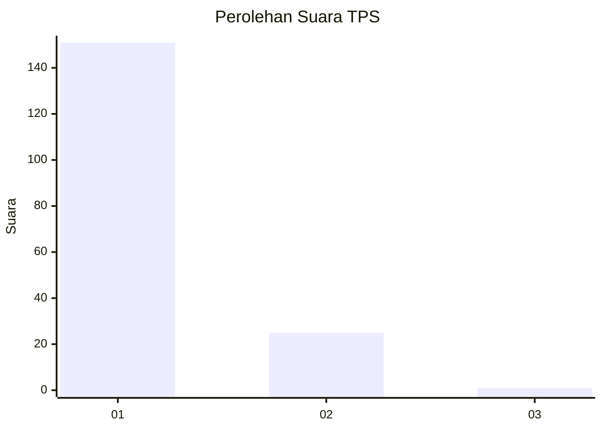
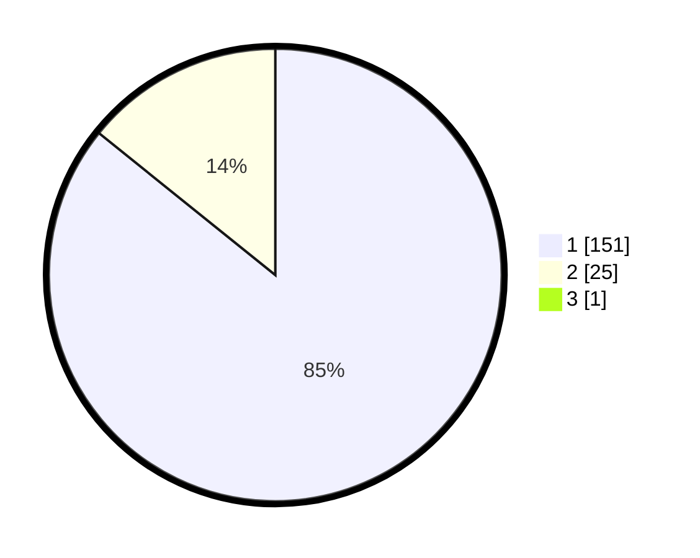

# Hasil

## Grafik

## Tabel

| No. | Nama Paslon    | Suara | Suara (raw) | Persentase |
|:--- |:-------------- | -----:| -----------:| ----------:|
| 1   | ANIES MUHAIMIN | 151   | [151][p-1]  | 85,31      |
| 2   | PRABOWO GIBRAN | 25    | [25][p-2]   | 14,12      |
| 3   | GANJAR MAHFUD  | 1     | [1][p-3]    | 0,56       |

[p-1]: https://github.com/gigit-pemilu/pemilu-2024-12-sumatera-utara/blob/main/pilpres/hitung-suara/sub/12-sumatera-utara/sub/13-mandailing-natal/sub/06-siabu/sub/2004-huta-puli/sub/001-tps/sub/paslon-1.txt
[p-2]: https://github.com/gigit-pemilu/pemilu-2024-12-sumatera-utara/blob/main/pilpres/hitung-suara/sub/12-sumatera-utara/sub/13-mandailing-natal/sub/06-siabu/sub/2004-huta-puli/sub/001-tps/sub/paslon-2.txt
[p-3]: https://github.com/gigit-pemilu/pemilu-2024-12-sumatera-utara/blob/main/pilpres/hitung-suara/sub/12-sumatera-utara/sub/13-mandailing-natal/sub/06-siabu/sub/2004-huta-puli/sub/001-tps/sub/paslon-3.txt

## Foto C Plano

https://sirekap-obj-formc.kpu.go.id/0e74/pemilu/ppwp/12/13/06/20/04/1213062004001-20240215-082515--f51c0cf5-c8bd-4ed5-a881-617e0b24f392.jpg

https://sirekap-obj-formc.kpu.go.id/0e74/pemilu/ppwp/12/13/06/20/04/1213062004001-20240215-082721--13568aba-93ad-47e5-a40c-006e3f00f574.jpg

https://sirekap-obj-formc.kpu.go.id/0e74/pemilu/ppwp/12/13/06/20/04/1213062004001-20240215-082828--98b20804-7feb-444b-8463-e2445ab5fd2d.jpg

## Metadata

| Key        | Value               |
| ---------- | ------------------- |
| Time Stamp | 2024-02-15 15:00:29 |

