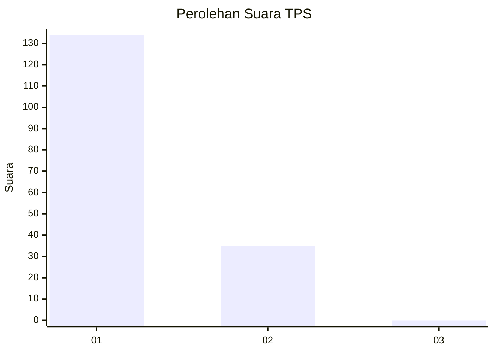
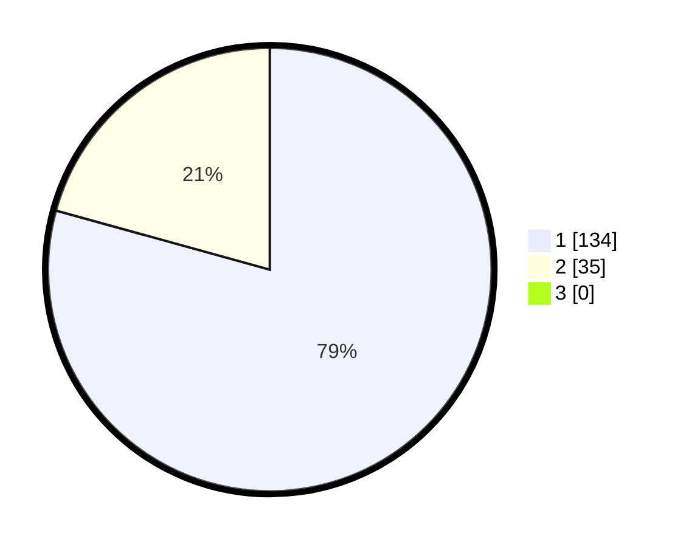

# Hasil

## Grafik

## Tabel

| No. | Nama Paslon    | Suara | Suara (raw) | Persentase |
|:--- |:-------------- | -----:| -----------:| ----------:|
| 1   | ANIES MUHAIMIN | 134   | [134][p-1]  | 79,29      |
| 2   | PRABOWO GIBRAN | 35    | [35][p-2]   | 20,71      |
| 3   | GANJAR MAHFUD  | 0     | [0][p-3]    | 0,00       |

[p-1]: https://github.com/gigit-pemilu/pemilu-2024/blob/main/pilpres/hitung-suara/sub/12-sumatera-utara/sub/13-mandailing-natal/sub/06-siabu/sub/2004-huta-puli/sub/002-tps/sub/paslon-1.txt
[p-2]: https://github.com/gigit-pemilu/pemilu-2024/blob/main/pilpres/hitung-suara/sub/12-sumatera-utara/sub/13-mandailing-natal/sub/06-siabu/sub/2004-huta-puli/sub/002-tps/sub/paslon-2.txt
[p-3]: https://github.com/gigit-pemilu/pemilu-2024/blob/main/pilpres/hitung-suara/sub/12-sumatera-utara/sub/13-mandailing-natal/sub/06-siabu/sub/2004-huta-puli/sub/002-tps/sub/paslon-3.txt

## Foto C Plano

https://sirekap-obj-formc.kpu.go.id/8437/pemilu/ppwp/12/13/06/20/04/1213062004002-20240215-111801--93e50697-9591-4b74-9aea-fe69579788a6.jpg

https://sirekap-obj-formc.kpu.go.id/8437/pemilu/ppwp/12/13/06/20/04/1213062004002-20240215-111923--1e93afc1-4bb8-4351-9e9b-ad0e5766bd28.jpg

https://sirekap-obj-formc.kpu.go.id/8437/pemilu/ppwp/12/13/06/20/04/1213062004002-20240215-084155--7ef3bfac-3e8e-4de9-95f5-f4561a9d029d.jpg

## Metadata

| Key        | Value               |
| ---------- | ------------------- |
| Time Stamp | 2024-02-17 01:22:58 |

