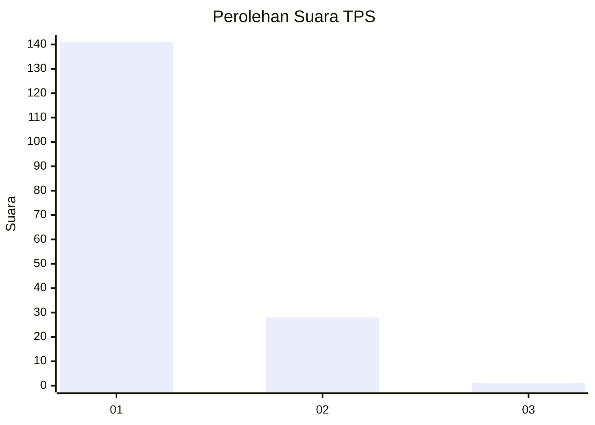
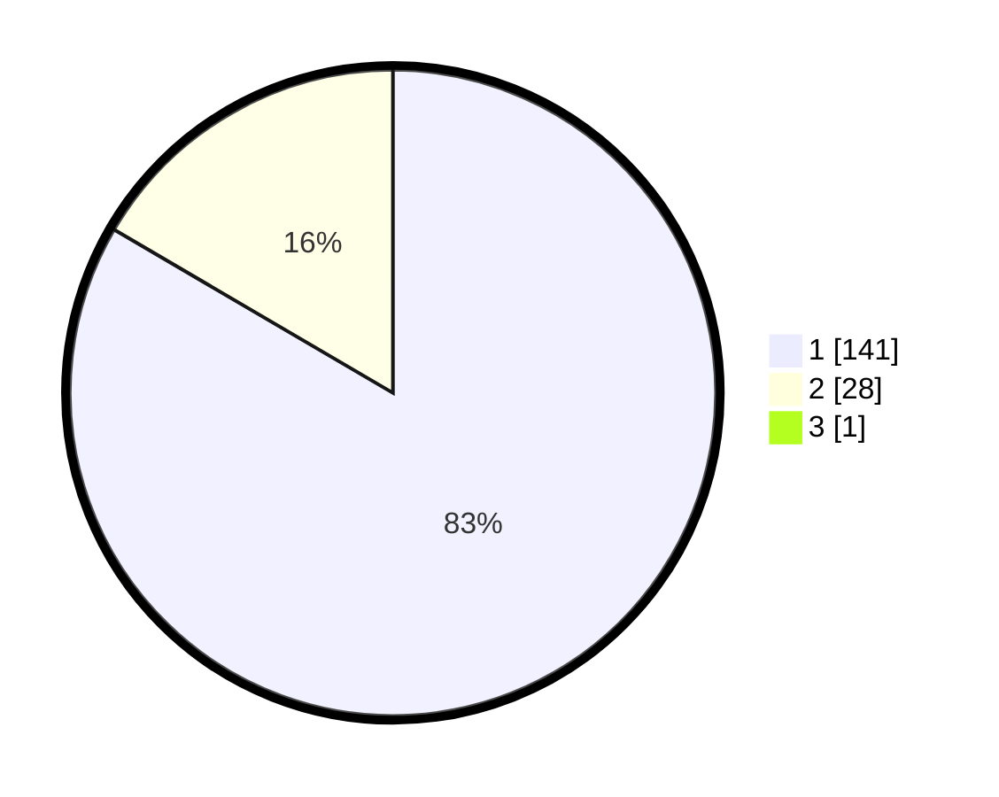

# Hasil

## Grafik

## Tabel

| No. | Nama Paslon    | Suara | Suara (raw) | Persentase |
|:--- |:-------------- | -----:| -----------:| ----------:|
| 1   | ANIES MUHAIMIN | 141   | [141][p-1]  | 82,94      |
| 2   | PRABOWO GIBRAN | 28    | [28][p-2]   | 16,47      |
| 3   | GANJAR MAHFUD  | 1     | [1][p-3]    | 0,59       |

[p-1]: https://github.com/gigit-pemilu/pemilu-2024/blob/main/pilpres/hitung-suara/sub/12-sumatera-utara/sub/13-mandailing-natal/sub/06-siabu/sub/2004-huta-puli/sub/003-tps/sub/paslon-1.txt
[p-2]: https://github.com/gigit-pemilu/pemilu-2024/blob/main/pilpres/hitung-suara/sub/12-sumatera-utara/sub/13-mandailing-natal/sub/06-siabu/sub/2004-huta-puli/sub/003-tps/sub/paslon-2.txt
[p-3]: https://github.com/gigit-pemilu/pemilu-2024/blob/main/pilpres/hitung-suara/sub/12-sumatera-utara/sub/13-mandailing-natal/sub/06-siabu/sub/2004-huta-puli/sub/003-tps/sub/paslon-3.txt

## Foto C Plano

https://sirekap-obj-formc.kpu.go.id/8c55/pemilu/ppwp/12/13/06/20/04/1213062004003-20240215-184507--21294ead-2b81-479f-ae22-4d91391c3db1.jpg

https://sirekap-obj-formc.kpu.go.id/8c55/pemilu/ppwp/12/13/06/20/04/1213062004003-20240215-173110--8fffb861-2418-41b3-9311-3986fe40dbdd.jpg

https://sirekap-obj-formc.kpu.go.id/8c55/pemilu/ppwp/12/13/06/20/04/1213062004003-20240215-184901--ddefdb29-88f5-4ad5-b8e4-f902f7a3979f.jpg

## Metadata

| Key        | Value               |
| ---------- | ------------------- |
| Time Stamp | 2024-02-16 00:00:26 |

