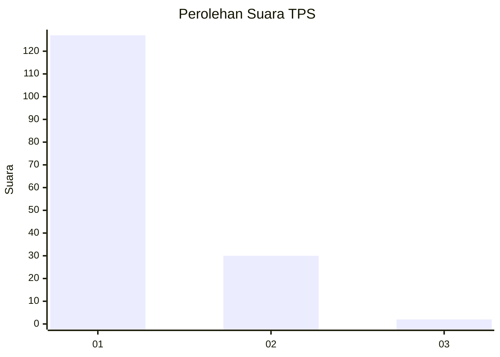
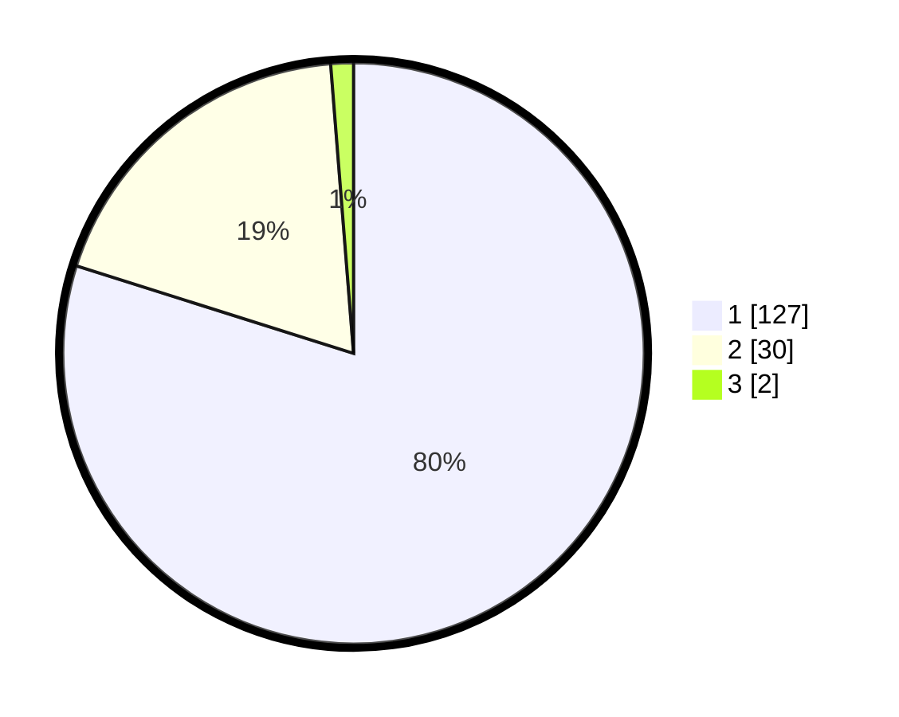

# Hasil

## Grafik

## Tabel

| No. | Nama Paslon    | Suara | Suara (raw) | Persentase |
|:--- |:-------------- | -----:| -----------:| ----------:|
| 1   | ANIES MUHAIMIN | 127   | [127][p-1]  | 79,87      |
| 2   | PRABOWO GIBRAN | 30    | [30][p-2]   | 18,87      |
| 3   | GANJAR MAHFUD  | 2     | [2][p-3]    | 1,26       |

[p-1]: https://github.com/gigit-pemilu/pemilu-2024/blob/main/pilpres/hitung-suara/sub/12-sumatera-utara/sub/13-mandailing-natal/sub/06-siabu/sub/2004-huta-puli/sub/004-tps/sub/paslon-1.txt
[p-2]: https://github.com/gigit-pemilu/pemilu-2024/blob/main/pilpres/hitung-suara/sub/12-sumatera-utara/sub/13-mandailing-natal/sub/06-siabu/sub/2004-huta-puli/sub/004-tps/sub/paslon-2.txt
[p-3]: https://github.com/gigit-pemilu/pemilu-2024/blob/main/pilpres/hitung-suara/sub/12-sumatera-utara/sub/13-mandailing-natal/sub/06-siabu/sub/2004-huta-puli/sub/004-tps/sub/paslon-3.txt

## Foto C Plano

https://sirekap-obj-formc.kpu.go.id/e599/pemilu/ppwp/12/13/06/20/04/1213062004004-20240215-192835--69816422-1043-430d-969a-979cc9fc6fcd.jpg

https://sirekap-obj-formc.kpu.go.id/e599/pemilu/ppwp/12/13/06/20/04/1213062004004-20240215-193604--449b2d1f-3697-45e2-a14c-9100a14d268b.jpg

https://sirekap-obj-formc.kpu.go.id/e599/pemilu/ppwp/12/13/06/20/04/1213062004004-20240215-193046--84cbaae5-d753-4071-9a7a-48b1e5ed93f7.jpg

## Metadata

| Key        | Value               |
| ---------- | ------------------- |
| Time Stamp | 2024-02-17 02:30:03 |

