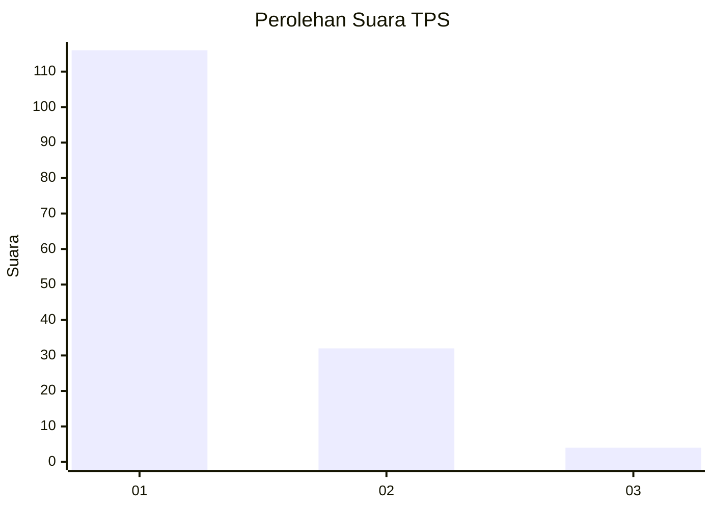
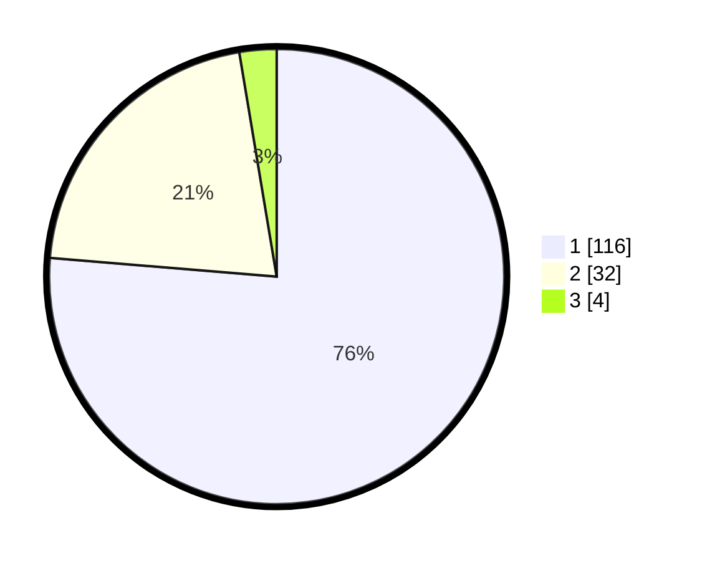

# Hasil

## Grafik

## Tabel

| No. | Nama Paslon    | Suara | Suara (raw) | Persentase |
|:--- |:-------------- | -----:| -----------:| ----------:|
| 1   | ANIES MUHAIMIN | 116   | [116][p-1]  | 76,32      |
| 2   | PRABOWO GIBRAN | 32    | [32][p-2]   | 21,05      |
| 3   | GANJAR MAHFUD  | 4     | [4][p-3]    | 2,63       |

[p-1]: https://github.com/gigit-pemilu/pemilu-2024/blob/main/pilpres/hitung-suara/sub/12-sumatera-utara/sub/13-mandailing-natal/sub/06-siabu/sub/2004-huta-puli/sub/005-tps/sub/paslon-1.txt
[p-2]: https://github.com/gigit-pemilu/pemilu-2024/blob/main/pilpres/hitung-suara/sub/12-sumatera-utara/sub/13-mandailing-natal/sub/06-siabu/sub/2004-huta-puli/sub/005-tps/sub/paslon-2.txt
[p-3]: https://github.com/gigit-pemilu/pemilu-2024/blob/main/pilpres/hitung-suara/sub/12-sumatera-utara/sub/13-mandailing-natal/sub/06-siabu/sub/2004-huta-puli/sub/005-tps/sub/paslon-3.txt

## Foto C Plano

https://sirekap-obj-formc.kpu.go.id/ccdd/pemilu/ppwp/12/13/06/20/04/1213062004005-20240216-161041--63bf76a4-bd33-469f-81ed-4eb0b8a61eb6.jpg

https://sirekap-obj-formc.kpu.go.id/ccdd/pemilu/ppwp/12/13/06/20/04/1213062004005-20240216-161301--0af674ca-f611-40f7-8ea7-d378ba4c5336.jpg

https://sirekap-obj-formc.kpu.go.id/ccdd/pemilu/ppwp/12/13/06/20/04/1213062004005-20240216-161427--1ecf7c7b-aa18-4ec1-aaf0-48fef1ff8cd9.jpg

## Metadata

| Key        | Value               |
| ---------- | ------------------- |
| Time Stamp | 2024-02-25 22:00:00 |

