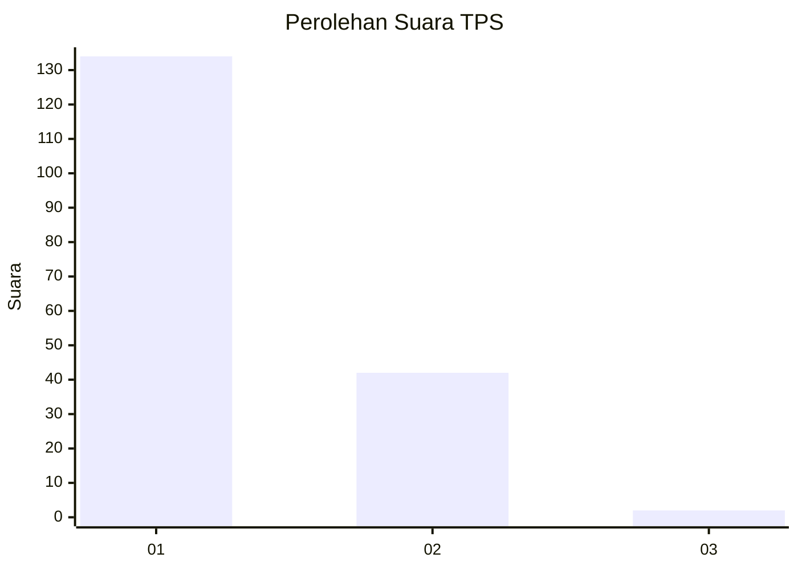
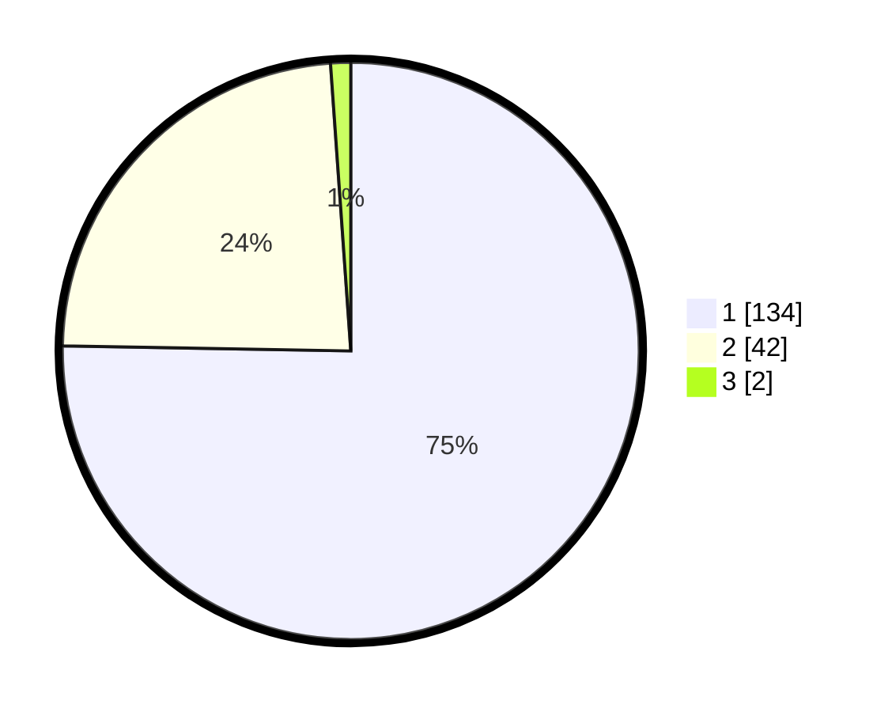

# Hasil

## Grafik

## Tabel

| No. | Nama Paslon    | Suara | Suara (raw) | Persentase |
|:--- |:-------------- | -----:| -----------:| ----------:|
| 1   | ANIES MUHAIMIN | 134   | [134][p-1]  | 75,28      |
| 2   | PRABOWO GIBRAN | 42    | [42][p-2]   | 23,60      |
| 3   | GANJAR MAHFUD  | 2     | [2][p-3]    | 1,12       |

[p-1]: https://github.com/gigit-pemilu/pemilu-2024/blob/main/pilpres/hitung-suara/sub/12-sumatera-utara/sub/13-mandailing-natal/sub/06-siabu/sub/2004-huta-puli/sub/008-tps/sub/paslon-1.txt
[p-2]: https://github.com/gigit-pemilu/pemilu-2024/blob/main/pilpres/hitung-suara/sub/12-sumatera-utara/sub/13-mandailing-natal/sub/06-siabu/sub/2004-huta-puli/sub/008-tps/sub/paslon-2.txt
[p-3]: https://github.com/gigit-pemilu/pemilu-2024/blob/main/pilpres/hitung-suara/sub/12-sumatera-utara/sub/13-mandailing-natal/sub/06-siabu/sub/2004-huta-puli/sub/008-tps/sub/paslon-3.txt

## Foto C Plano

https://sirekap-obj-formc.kpu.go.id/01f8/pemilu/ppwp/12/13/06/20/04/1213062004008-20240215-183923--5b0076bd-eb13-4bd5-97f1-d7a8b82c1db4.jpg

https://sirekap-obj-formc.kpu.go.id/01f8/pemilu/ppwp/12/13/06/20/04/1213062004008-20240215-192653--8a49a773-4bba-4188-a51a-78d5124977e2.jpg

https://sirekap-obj-formc.kpu.go.id/01f8/pemilu/ppwp/12/13/06/20/04/1213062004008-20240215-150011--647d3c03-07fd-4996-9c94-da49a137696b.jpg

## Metadata

| Key        | Value               |
| ---------- | ------------------- |
| Time Stamp | 2024-02-16 00:00:26 |

