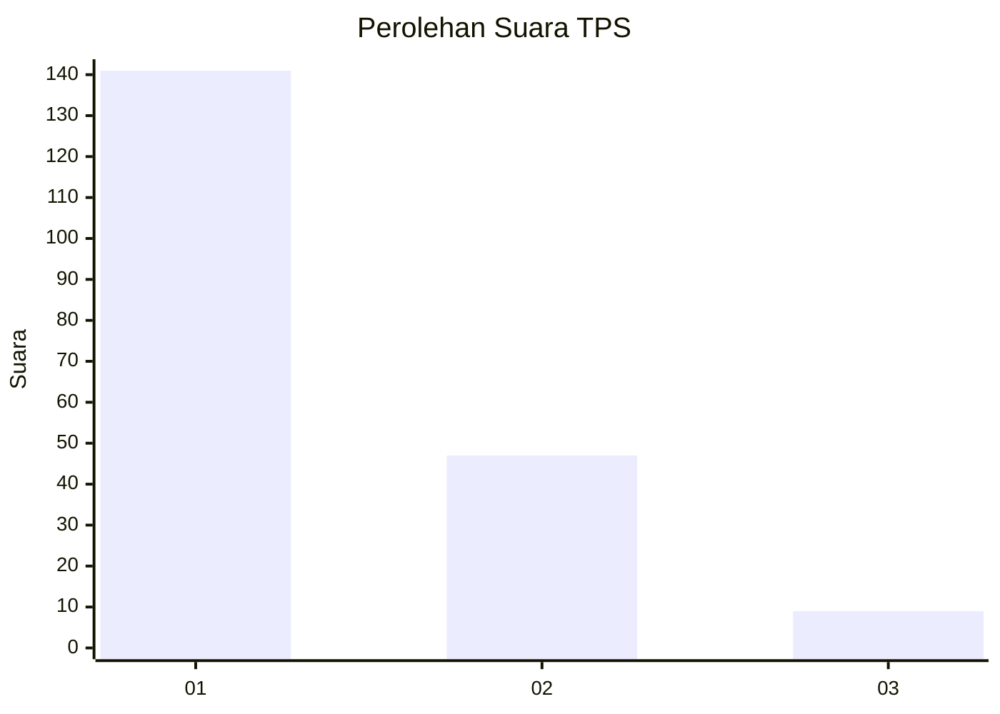
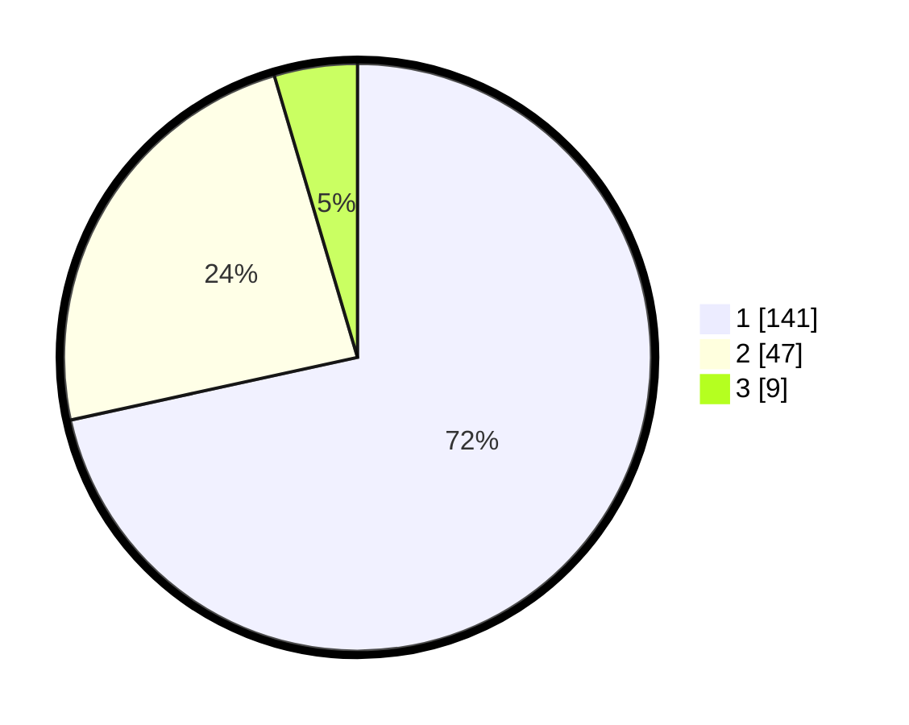

# Hasil

## Grafik

## Tabel

| No. | Nama Paslon    | Suara | Suara (raw) | Persentase |
|:--- |:-------------- | -----:| -----------:| ----------:|
| 1   | ANIES MUHAIMIN | 141   | [141][p-1]  | 71,57      |
| 2   | PRABOWO GIBRAN | 47    | [47][p-2]   | 23,86      |
| 3   | GANJAR MAHFUD  | 9     | [9][p-3]    | 4,57       |

[p-1]: https://github.com/gigit-pemilu/pemilu-2024/blob/main/pilpres/hitung-suara/sub/12-sumatera-utara/sub/13-mandailing-natal/sub/06-siabu/sub/2007-huraba-i/sub/002-tps/sub/paslon-1.txt
[p-2]: https://github.com/gigit-pemilu/pemilu-2024/blob/main/pilpres/hitung-suara/sub/12-sumatera-utara/sub/13-mandailing-natal/sub/06-siabu/sub/2007-huraba-i/sub/002-tps/sub/paslon-2.txt
[p-3]: https://github.com/gigit-pemilu/pemilu-2024/blob/main/pilpres/hitung-suara/sub/12-sumatera-utara/sub/13-mandailing-natal/sub/06-siabu/sub/2007-huraba-i/sub/002-tps/sub/paslon-3.txt

## Foto C Plano

https://sirekap-obj-formc.kpu.go.id/6f33/pemilu/ppwp/12/13/06/20/07/1213062007002-20240214-155821--9478cf0e-ae25-43b8-adcb-0a524034c6d1.jpg

https://sirekap-obj-formc.kpu.go.id/6f33/pemilu/ppwp/12/13/06/20/07/1213062007002-20240214-155514--dd19cd02-882e-4bf4-a388-ec48a12816ad.jpg

https://sirekap-obj-formc.kpu.go.id/6f33/pemilu/ppwp/12/13/06/20/07/1213062007002-20240214-190117--19285615-7a8b-4d29-a52e-b0f0e6be3217.jpg

## Metadata

| Key        | Value               |
| ---------- | ------------------- |
| Time Stamp | 2024-02-15 15:00:29 |

