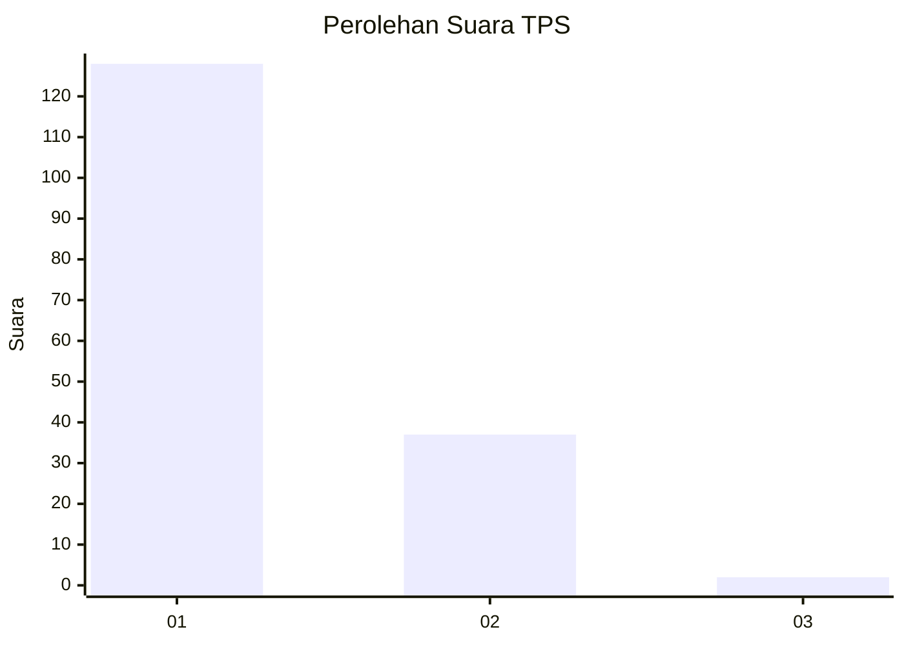
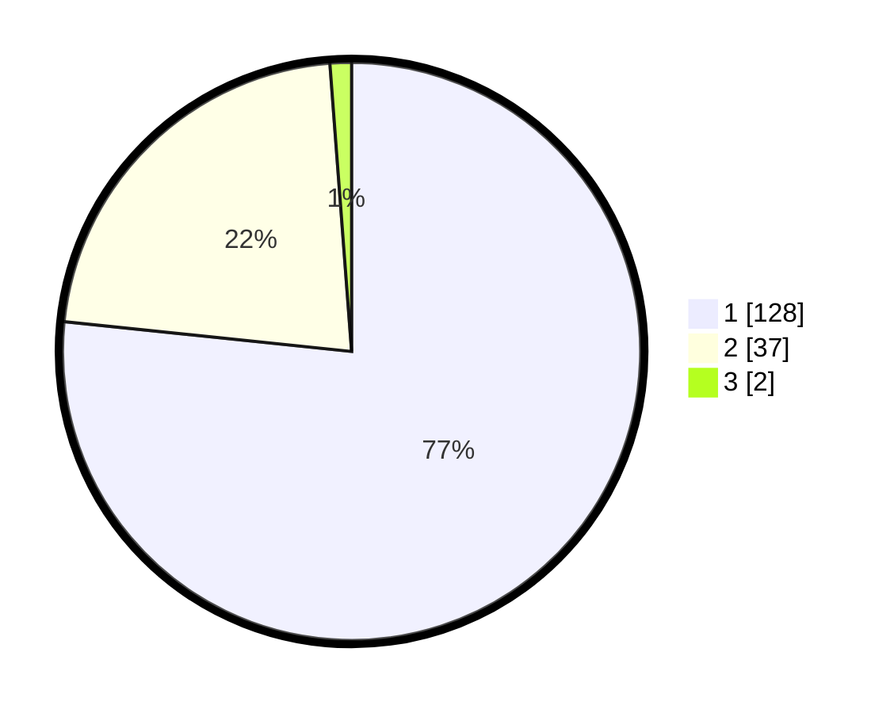

# Hasil

## Grafik

## Tabel

| No. | Nama Paslon    | Suara | Suara (raw) | Persentase |
|:--- |:-------------- | -----:| -----------:| ----------:|
| 1   | ANIES MUHAIMIN | 128   | [128][p-1]  | 76,65      |
| 2   | PRABOWO GIBRAN | 37    | [37][p-2]   | 22,16      |
| 3   | GANJAR MAHFUD  | 2     | [2][p-3]    | 1,20       |

[p-1]: https://github.com/gigit-pemilu/pemilu-2024/blob/main/pilpres/hitung-suara/sub/12-sumatera-utara/sub/13-mandailing-natal/sub/06-siabu/sub/2019-tangga-bosi-ii/sub/001-tps/sub/paslon-1.txt
[p-2]: https://github.com/gigit-pemilu/pemilu-2024/blob/main/pilpres/hitung-suara/sub/12-sumatera-utara/sub/13-mandailing-natal/sub/06-siabu/sub/2019-tangga-bosi-ii/sub/001-tps/sub/paslon-2.txt
[p-3]: https://github.com/gigit-pemilu/pemilu-2024/blob/main/pilpres/hitung-suara/sub/12-sumatera-utara/sub/13-mandailing-natal/sub/06-siabu/sub/2019-tangga-bosi-ii/sub/001-tps/sub/paslon-3.txt

## Foto C Plano

https://sirekap-obj-formc.kpu.go.id/9e60/pemilu/ppwp/12/13/06/20/19/1213062019001-20240214-212924--bd2b4f45-3530-42c9-b7cd-3b40d807f339.jpg

https://sirekap-obj-formc.kpu.go.id/9e60/pemilu/ppwp/12/13/06/20/19/1213062019001-20240214-212952--5fb0a932-3e95-44cc-8494-789fd11408ad.jpg

https://sirekap-obj-formc.kpu.go.id/9e60/pemilu/ppwp/12/13/06/20/19/1213062019001-20240214-213005--09b02bda-f355-4d4c-83a7-2a4f7ec462c1.jpg

## Metadata

| Key        | Value               |
| ---------- | ------------------- |
| Time Stamp | 2024-02-16 00:00:26 |

