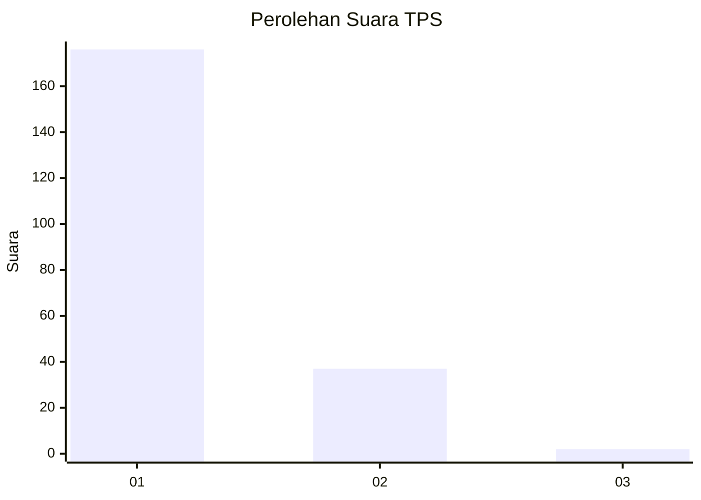
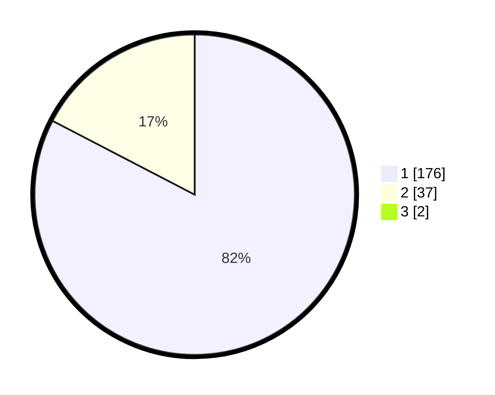

# Hasil

## Grafik

## Tabel

| No. | Nama Paslon    | Suara | Suara (raw) | Persentase |
|:--- |:-------------- | -----:| -----------:| ----------:|
| 1   | ANIES MUHAIMIN | 176   | [176][p-1]  | 81,86      |
| 2   | PRABOWO GIBRAN | 37    | [37][p-2]   | 17,21      |
| 3   | GANJAR MAHFUD  | 2     | [2][p-3]    | 0,93       |

[p-1]: https://github.com/gigit-pemilu/pemilu-2024-12-sumatera-utara/blob/main/pilpres/hitung-suara/sub/12-sumatera-utara/sub/13-mandailing-natal/sub/06-siabu/sub/2019-tangga-bosi-ii/sub/002-tps/sub/paslon-1.txt
[p-2]: https://github.com/gigit-pemilu/pemilu-2024-12-sumatera-utara/blob/main/pilpres/hitung-suara/sub/12-sumatera-utara/sub/13-mandailing-natal/sub/06-siabu/sub/2019-tangga-bosi-ii/sub/002-tps/sub/paslon-2.txt
[p-3]: https://github.com/gigit-pemilu/pemilu-2024-12-sumatera-utara/blob/main/pilpres/hitung-suara/sub/12-sumatera-utara/sub/13-mandailing-natal/sub/06-siabu/sub/2019-tangga-bosi-ii/sub/002-tps/sub/paslon-3.txt

## Foto C Plano

https://sirekap-obj-formc.kpu.go.id/c227/pemilu/ppwp/12/13/06/20/19/1213062019002-20240214-155805--d5a4f6b2-97f4-40e8-9abf-4eee2c52bf6f.jpg

https://sirekap-obj-formc.kpu.go.id/c227/pemilu/ppwp/12/13/06/20/19/1213062019002-20240214-160150--baa11711-7690-4dec-8bba-fcdca44a20af.jpg

https://sirekap-obj-formc.kpu.go.id/c227/pemilu/ppwp/12/13/06/20/19/1213062019002-20240214-160140--06f8186a-dd83-4571-ac47-7d672fec71b9.jpg

## Metadata

| Key        | Value               |
| ---------- | ------------------- |
| Time Stamp | 2024-02-14 21:46:01 |

