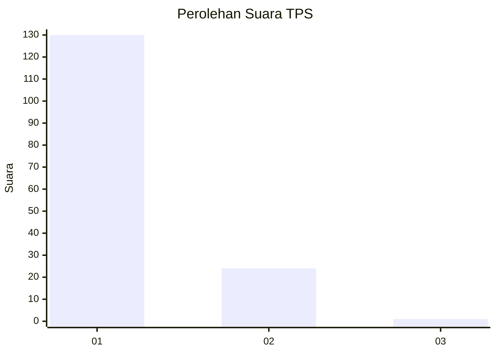
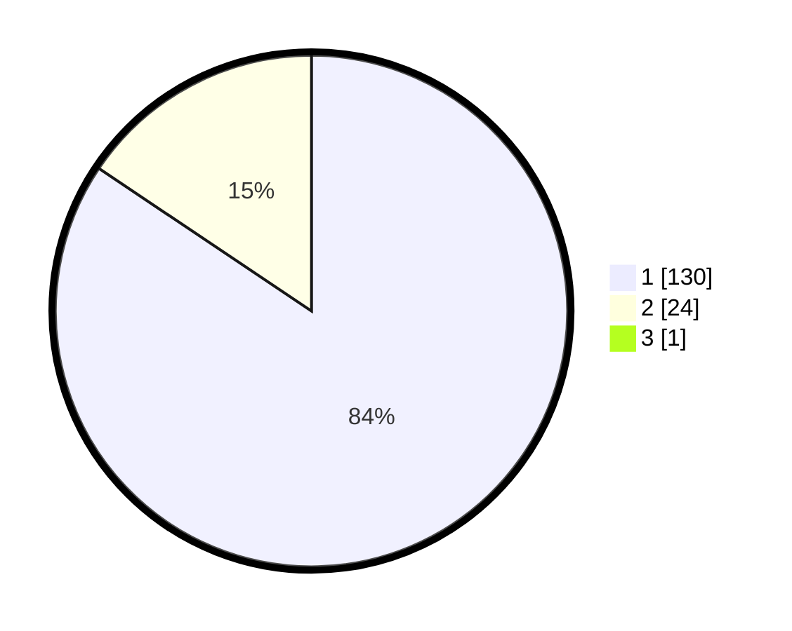

# Hasil

## Grafik

## Tabel

| No. | Nama Paslon    | Suara | Suara (raw) | Persentase |
|:--- |:-------------- | -----:| -----------:| ----------:|
| 1   | ANIES MUHAIMIN | 130   | [130][p-1]  | 83,87      |
| 2   | PRABOWO GIBRAN | 24    | [24][p-2]   | 15,48      |
| 3   | GANJAR MAHFUD  | 1     | [1][p-3]    | 0,65       |

[p-1]: https://github.com/gigit-pemilu/pemilu-2024/blob/main/pilpres/hitung-suara/sub/12-sumatera-utara/sub/13-mandailing-natal/sub/06-siabu/sub/2027-sihepeng-opat/sub/001-tps/sub/paslon-1.txt
[p-2]: https://github.com/gigit-pemilu/pemilu-2024/blob/main/pilpres/hitung-suara/sub/12-sumatera-utara/sub/13-mandailing-natal/sub/06-siabu/sub/2027-sihepeng-opat/sub/001-tps/sub/paslon-2.txt
[p-3]: https://github.com/gigit-pemilu/pemilu-2024/blob/main/pilpres/hitung-suara/sub/12-sumatera-utara/sub/13-mandailing-natal/sub/06-siabu/sub/2027-sihepeng-opat/sub/001-tps/sub/paslon-3.txt

## Foto C Plano

https://sirekap-obj-formc.kpu.go.id/397d/pemilu/ppwp/12/13/06/20/27/1213062027001-20240215-080626--3884a4e2-3f58-4e24-ae4f-733d5659fb0b.jpg

https://sirekap-obj-formc.kpu.go.id/397d/pemilu/ppwp/12/13/06/20/27/1213062027001-20240215-080929--4bf7989a-b09a-414d-8514-2ca661194cc7.jpg

https://sirekap-obj-formc.kpu.go.id/397d/pemilu/ppwp/12/13/06/20/27/1213062027001-20240215-081129--ff04809f-9c0f-4f08-9f50-49d43ea60d2d.jpg

## Metadata

| Key        | Value               |
| ---------- | ------------------- |
| Time Stamp | 2024-02-17 02:00:02 |

