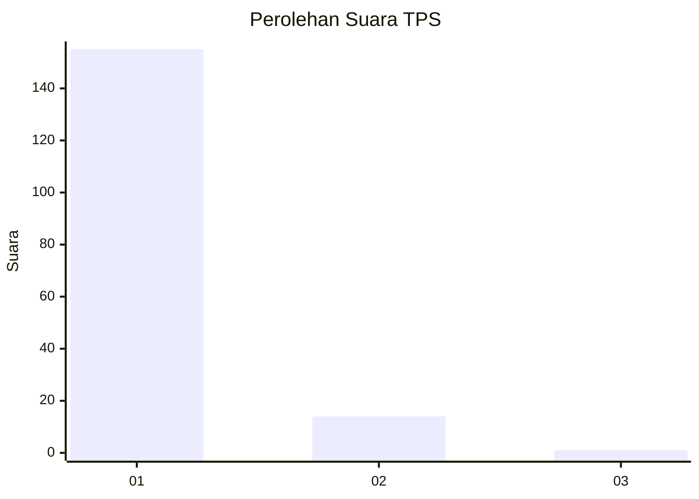
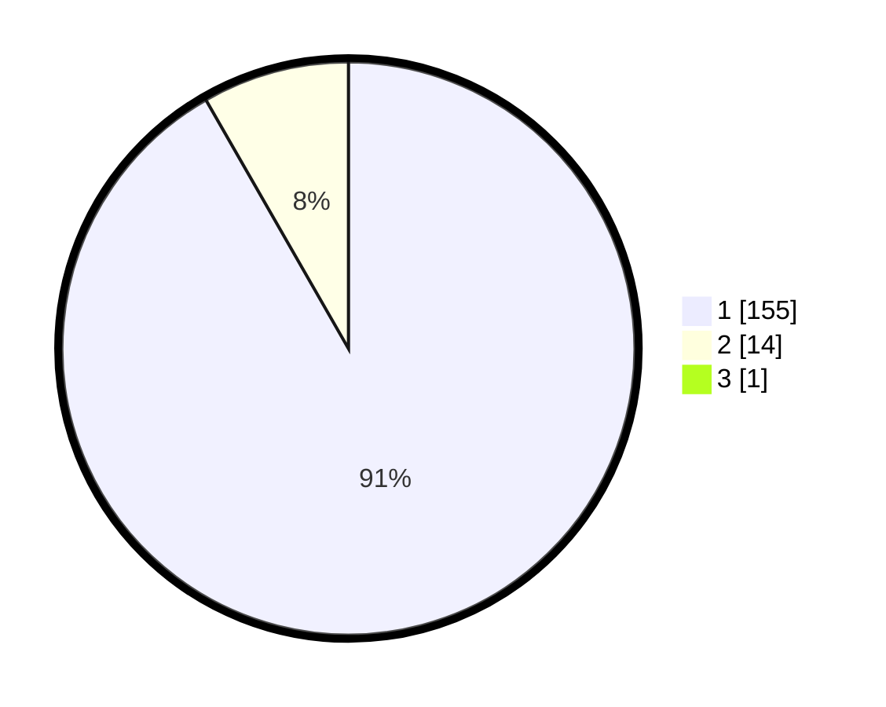

# Hasil

## Grafik

## Tabel

| No. | Nama Paslon    | Suara | Suara (raw) | Persentase |
|:--- |:-------------- | -----:| -----------:| ----------:|
| 1   | ANIES MUHAIMIN | 155   | [155][p-1]  | 91,18      |
| 2   | PRABOWO GIBRAN | 14    | [14][p-2]   | 8,24       |
| 3   | GANJAR MAHFUD  | 1     | [1][p-3]    | 0,59       |

[p-1]: https://github.com/gigit-pemilu/pemilu-2024/blob/main/pilpres/hitung-suara/sub/12-sumatera-utara/sub/13-mandailing-natal/sub/06-siabu/sub/2027-sihepeng-opat/sub/002-tps/sub/paslon-1.txt
[p-2]: https://github.com/gigit-pemilu/pemilu-2024/blob/main/pilpres/hitung-suara/sub/12-sumatera-utara/sub/13-mandailing-natal/sub/06-siabu/sub/2027-sihepeng-opat/sub/002-tps/sub/paslon-2.txt
[p-3]: https://github.com/gigit-pemilu/pemilu-2024/blob/main/pilpres/hitung-suara/sub/12-sumatera-utara/sub/13-mandailing-natal/sub/06-siabu/sub/2027-sihepeng-opat/sub/002-tps/sub/paslon-3.txt

## Foto C Plano

https://sirekap-obj-formc.kpu.go.id/6b87/pemilu/ppwp/12/13/06/20/27/1213062027002-20240214-155617--1148a57e-eae0-45f4-b6f2-2712a2043029.jpg

https://sirekap-obj-formc.kpu.go.id/6b87/pemilu/ppwp/12/13/06/20/27/1213062027002-20240214-213914--143e8ec4-171e-4e17-9cd8-29f7162e8817.jpg

https://sirekap-obj-formc.kpu.go.id/6b87/pemilu/ppwp/12/13/06/20/27/1213062027002-20240214-213936--27d2f36a-152e-46fc-9259-5fdd731f2154.jpg

## Metadata

| Key        | Value               |
| ---------- | ------------------- |
| Time Stamp | 2024-02-17 02:00:02 |

