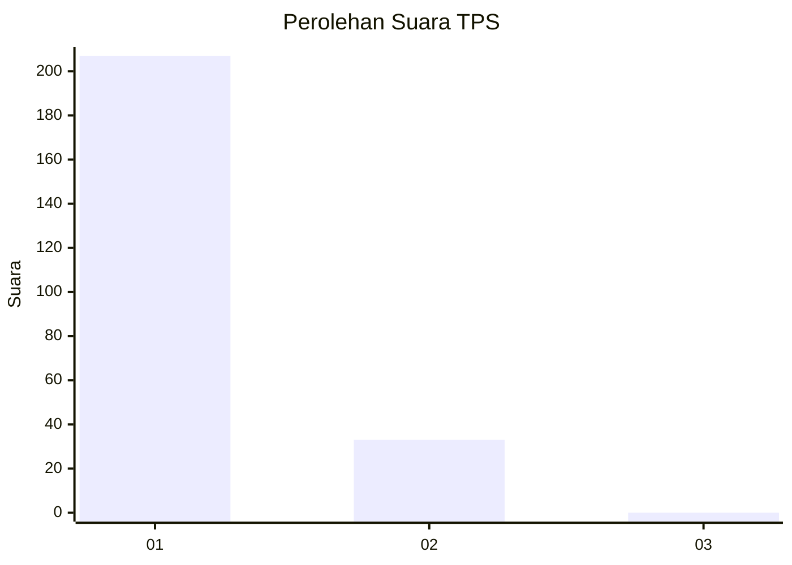
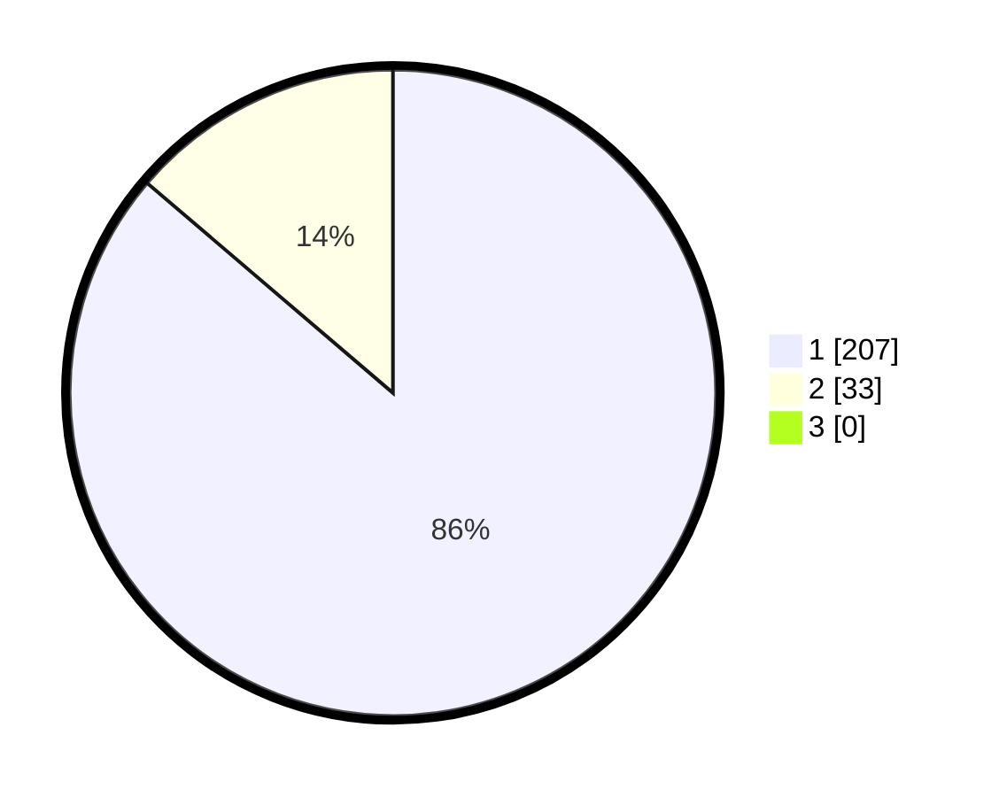

# Hasil

## Grafik

## Tabel

| No. | Nama Paslon    | Suara | Suara (raw) | Persentase |
|:--- |:-------------- | -----:| -----------:| ----------:|
| 1   | ANIES MUHAIMIN | 207   | [207][p-1]  | 86,25      |
| 2   | PRABOWO GIBRAN | 33    | [33][p-2]   | 13,75      |
| 3   | GANJAR MAHFUD  | 0     | [0][p-3]    | 0,00       |

[p-1]: https://github.com/gigit-pemilu/pemilu-2024/blob/main/pilpres/hitung-suara/sub/12-sumatera-utara/sub/13-mandailing-natal/sub/06-siabu/sub/2028-sihepeng-lima/sub/002-tps/sub/paslon-1.txt
[p-2]: https://github.com/gigit-pemilu/pemilu-2024/blob/main/pilpres/hitung-suara/sub/12-sumatera-utara/sub/13-mandailing-natal/sub/06-siabu/sub/2028-sihepeng-lima/sub/002-tps/sub/paslon-2.txt
[p-3]: https://github.com/gigit-pemilu/pemilu-2024/blob/main/pilpres/hitung-suara/sub/12-sumatera-utara/sub/13-mandailing-natal/sub/06-siabu/sub/2028-sihepeng-lima/sub/002-tps/sub/paslon-3.txt

## Foto C Plano

https://sirekap-obj-formc.kpu.go.id/cc47/pemilu/ppwp/12/13/06/20/28/1213062028002-20240215-085412--a5e93c3e-b0d0-4644-8104-7299f453e1bf.jpg

https://sirekap-obj-formc.kpu.go.id/cc47/pemilu/ppwp/12/13/06/20/28/1213062028002-20240215-085724--84000834-d718-43f3-be79-dbb1f766c7b1.jpg

https://sirekap-obj-formc.kpu.go.id/cc47/pemilu/ppwp/12/13/06/20/28/1213062028002-20240215-085957--35d82761-6a35-491b-958d-699662a79676.jpg

## Metadata

| Key        | Value               |
| ---------- | ------------------- |
| Time Stamp | 2024-02-17 02:00:02 |

