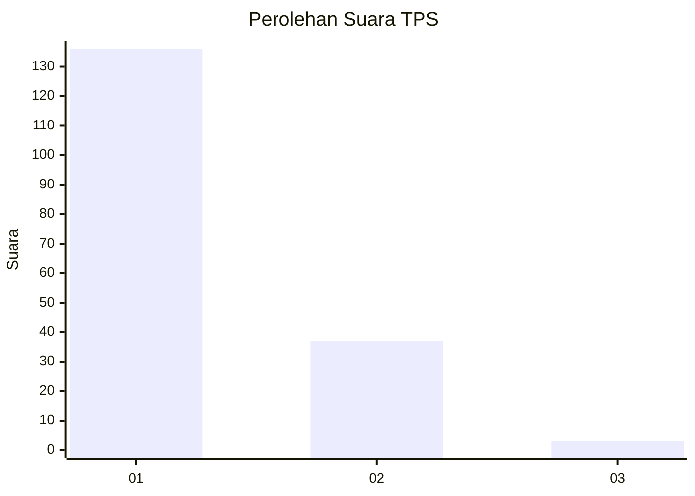
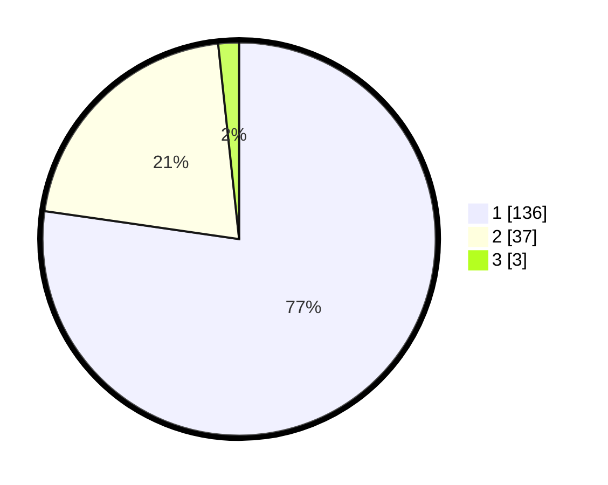

# Hasil

## Grafik

## Tabel

| No. | Nama Paslon    | Suara | Suara (raw) | Persentase |
|:--- |:-------------- | -----:| -----------:| ----------:|
| 1   | ANIES MUHAIMIN | 136   | [136][p-1]  | 77,27      |
| 2   | PRABOWO GIBRAN | 37    | [37][p-2]   | 21,02      |
| 3   | GANJAR MAHFUD  | 3     | [3][p-3]    | 1,70       |

[p-1]: https://github.com/gigit-pemilu/pemilu-2024-12-sumatera-utara/blob/main/pilpres/hitung-suara/sub/12-sumatera-utara/sub/13-mandailing-natal/sub/07-bukit-malintang/sub/2003-huta-bangun/sub/001-tps/sub/paslon-1.txt
[p-2]: https://github.com/gigit-pemilu/pemilu-2024-12-sumatera-utara/blob/main/pilpres/hitung-suara/sub/12-sumatera-utara/sub/13-mandailing-natal/sub/07-bukit-malintang/sub/2003-huta-bangun/sub/001-tps/sub/paslon-2.txt
[p-3]: https://github.com/gigit-pemilu/pemilu-2024-12-sumatera-utara/blob/main/pilpres/hitung-suara/sub/12-sumatera-utara/sub/13-mandailing-natal/sub/07-bukit-malintang/sub/2003-huta-bangun/sub/001-tps/sub/paslon-3.txt

## Foto C Plano

https://sirekap-obj-formc.kpu.go.id/2560/pemilu/ppwp/12/13/07/20/03/1213072003001-20240215-023222--38cae169-1290-4d8e-808f-0aee0c1870cf.jpg

https://sirekap-obj-formc.kpu.go.id/2560/pemilu/ppwp/12/13/07/20/03/1213072003001-20240215-021414--b23433fe-92c7-4376-83a5-8d3ad7ac30d7.jpg

https://sirekap-obj-formc.kpu.go.id/2560/pemilu/ppwp/12/13/07/20/03/1213072003001-20240215-022420--cbeeec1c-0490-44a7-82f7-7004c9f4768a.jpg

## Metadata

| Key        | Value               |
| ---------- | ------------------- |
| Time Stamp | 2024-02-16 16:25:10 |

