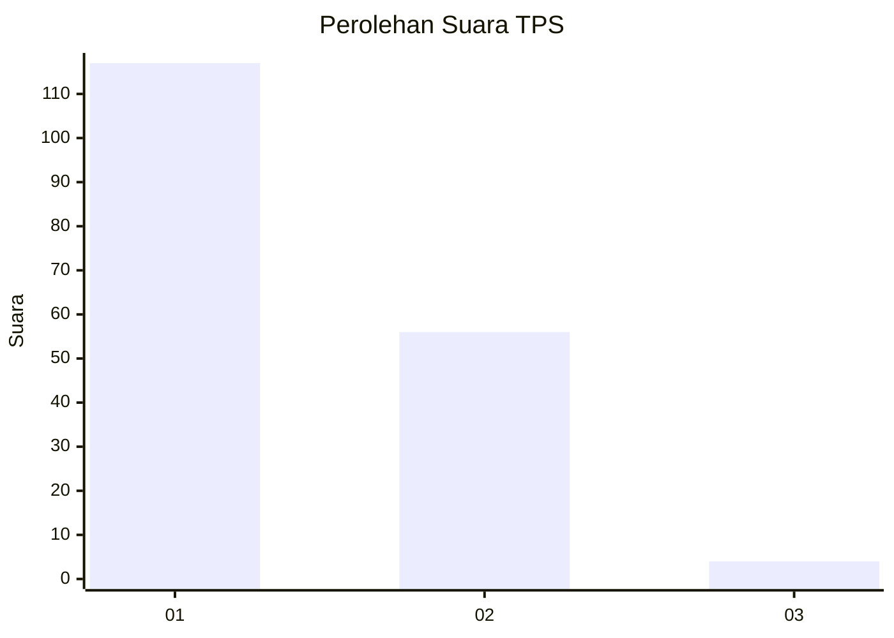
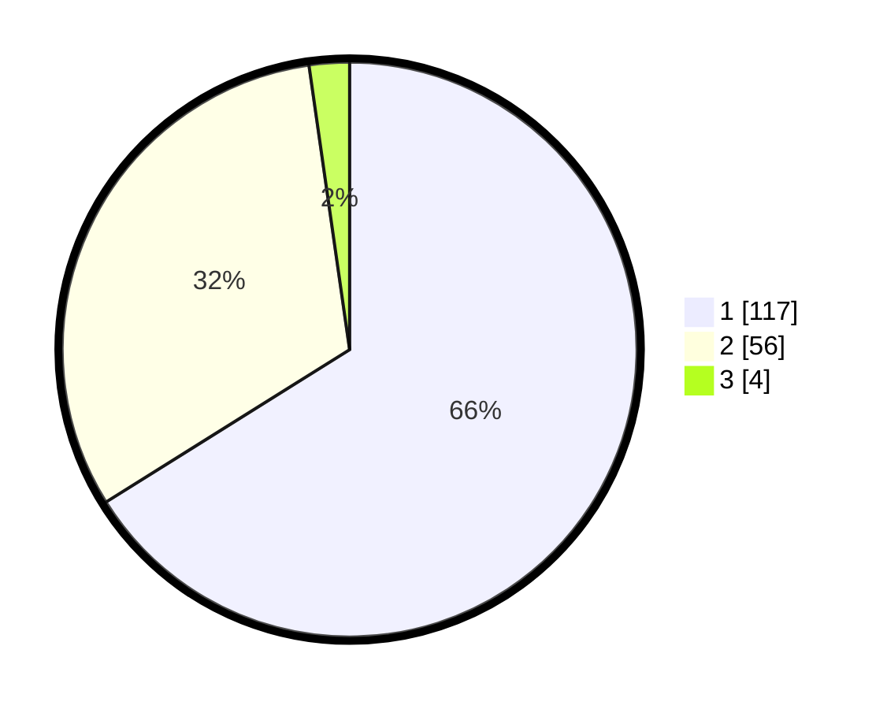

# Hasil

## Grafik

## Tabel

| No. | Nama Paslon    | Suara | Suara (raw) | Persentase |
|:--- |:-------------- | -----:| -----------:| ----------:|
| 1   | ANIES MUHAIMIN | 117   | [117][p-1]  | 66,10      |
| 2   | PRABOWO GIBRAN | 56    | [56][p-2]   | 31,64      |
| 3   | GANJAR MAHFUD  | 4     | [4][p-3]    | 2,26       |

[p-1]: https://github.com/gigit-pemilu/pemilu-2024/blob/main/pilpres/hitung-suara/sub/12-sumatera-utara/sub/13-mandailing-natal/sub/07-bukit-malintang/sub/2007-malintang-julu/sub/008-tps/sub/paslon-1.txt
[p-2]: https://github.com/gigit-pemilu/pemilu-2024/blob/main/pilpres/hitung-suara/sub/12-sumatera-utara/sub/13-mandailing-natal/sub/07-bukit-malintang/sub/2007-malintang-julu/sub/008-tps/sub/paslon-2.txt
[p-3]: https://github.com/gigit-pemilu/pemilu-2024/blob/main/pilpres/hitung-suara/sub/12-sumatera-utara/sub/13-mandailing-natal/sub/07-bukit-malintang/sub/2007-malintang-julu/sub/008-tps/sub/paslon-3.txt

## Foto C Plano

https://sirekap-obj-formc.kpu.go.id/9c95/pemilu/ppwp/12/13/07/20/07/1213072007008-20240215-093602--24a44f45-f6cf-42e3-92c4-63565370e61d.jpg

https://sirekap-obj-formc.kpu.go.id/9c95/pemilu/ppwp/12/13/07/20/07/1213072007008-20240215-093727--8a19ff1e-fa36-483b-8309-cc744a8121be.jpg

https://sirekap-obj-formc.kpu.go.id/9c95/pemilu/ppwp/12/13/07/20/07/1213072007008-20240215-094136--4c5016b7-a390-4fdc-a9b3-5a95c2d6c272.jpg

## Metadata

| Key        | Value               |
| ---------- | ------------------- |
| Time Stamp | 2024-02-15 23:29:50 |

