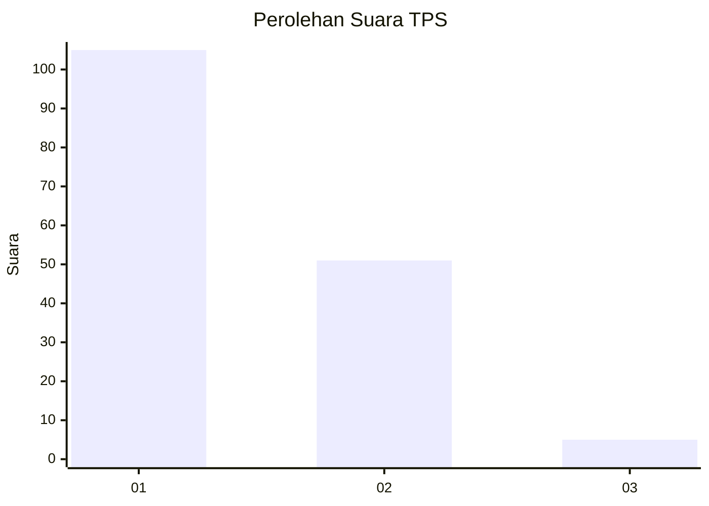
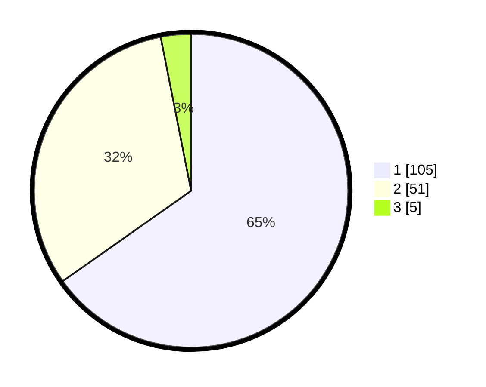

# Hasil

## Grafik

## Tabel

| No. | Nama Paslon    | Suara | Suara (raw) | Persentase |
|:--- |:-------------- | -----:| -----------:| ----------:|
| 1   | ANIES MUHAIMIN | 105   | [105][p-1]  | 65,22      |
| 2   | PRABOWO GIBRAN | 51    | [51][p-2]   | 31,68      |
| 3   | GANJAR MAHFUD  | 5     | [5][p-3]    | 3,11       |

[p-1]: https://github.com/gigit-pemilu/pemilu-2024-12-sumatera-utara/blob/main/pilpres/hitung-suara/sub/12-sumatera-utara/sub/13-mandailing-natal/sub/07-bukit-malintang/sub/2008-pasar-baru-malintang/sub/002-tps/sub/paslon-1.txt
[p-2]: https://github.com/gigit-pemilu/pemilu-2024-12-sumatera-utara/blob/main/pilpres/hitung-suara/sub/12-sumatera-utara/sub/13-mandailing-natal/sub/07-bukit-malintang/sub/2008-pasar-baru-malintang/sub/002-tps/sub/paslon-2.txt
[p-3]: https://github.com/gigit-pemilu/pemilu-2024-12-sumatera-utara/blob/main/pilpres/hitung-suara/sub/12-sumatera-utara/sub/13-mandailing-natal/sub/07-bukit-malintang/sub/2008-pasar-baru-malintang/sub/002-tps/sub/paslon-3.txt

## Foto C Plano

https://sirekap-obj-formc.kpu.go.id/d5d0/pemilu/ppwp/12/13/07/20/08/1213072008002-20240215-212030--fdabc6b6-d192-4b4d-ade8-ba0192e2f522.jpg

https://sirekap-obj-formc.kpu.go.id/d5d0/pemilu/ppwp/12/13/07/20/08/1213072008002-20240215-212446--7da73805-2a2e-468e-a85c-153ab9644258.jpg

https://sirekap-obj-formc.kpu.go.id/d5d0/pemilu/ppwp/12/13/07/20/08/1213072008002-20240215-212735--a1b53080-5eb6-41cd-80fc-43fac2942ba1.jpg

## Metadata

| Key        | Value               |
| ---------- | ------------------- |
| Time Stamp | 2024-02-15 23:29:50 |

