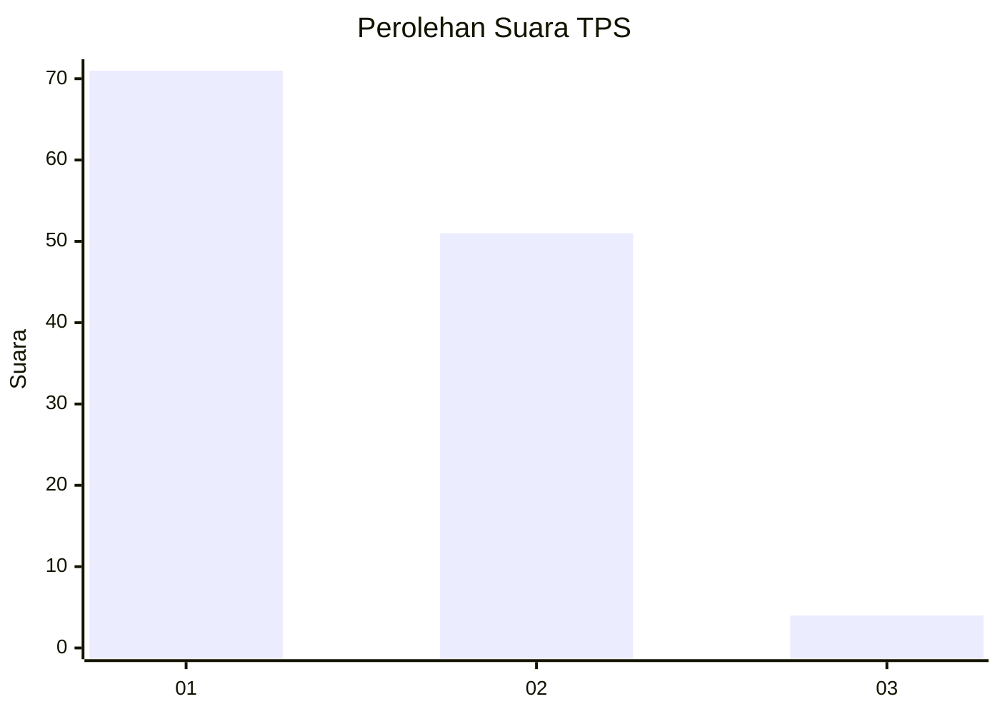
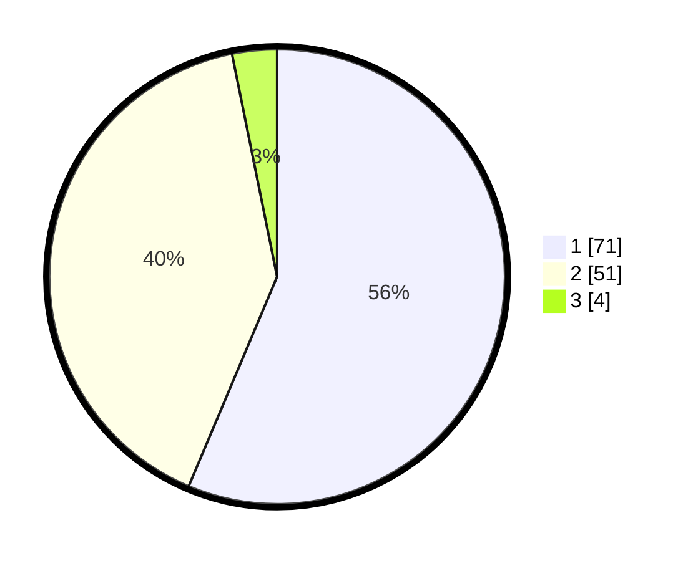

# Hasil

## Grafik

## Tabel

| No. | Nama Paslon    | Suara | Suara (raw) | Persentase |
|:--- |:-------------- | -----:| -----------:| ----------:|
| 1   | ANIES MUHAIMIN | 71    | [71][p-1]   | 56,35      |
| 2   | PRABOWO GIBRAN | 51    | [51][p-2]   | 40,48      |
| 3   | GANJAR MAHFUD  | 4     | [4][p-3]    | 3,17       |

[p-1]: https://github.com/gigit-pemilu/pemilu-2024-12-sumatera-utara/blob/main/pilpres/hitung-suara/sub/12-sumatera-utara/sub/13-mandailing-natal/sub/07-bukit-malintang/sub/2013-lambou-darul-ihsan/sub/001-tps/sub/paslon-1.txt
[p-2]: https://github.com/gigit-pemilu/pemilu-2024-12-sumatera-utara/blob/main/pilpres/hitung-suara/sub/12-sumatera-utara/sub/13-mandailing-natal/sub/07-bukit-malintang/sub/2013-lambou-darul-ihsan/sub/001-tps/sub/paslon-2.txt
[p-3]: https://github.com/gigit-pemilu/pemilu-2024-12-sumatera-utara/blob/main/pilpres/hitung-suara/sub/12-sumatera-utara/sub/13-mandailing-natal/sub/07-bukit-malintang/sub/2013-lambou-darul-ihsan/sub/001-tps/sub/paslon-3.txt

## Foto C Plano

https://sirekap-obj-formc.kpu.go.id/b4cc/pemilu/ppwp/12/13/07/20/13/1213072013001-20240215-044228--ea53aad9-96cc-467a-9c58-cc810d7deb12.jpg

https://sirekap-obj-formc.kpu.go.id/b4cc/pemilu/ppwp/12/13/07/20/13/1213072013001-20240215-044505--d1476f0c-3a92-47e3-ab69-5c8fdec50fe3.jpg

https://sirekap-obj-formc.kpu.go.id/b4cc/pemilu/ppwp/12/13/07/20/13/1213072013001-20240215-043715--37dd9199-136b-48c9-9db4-2c938d4f8dc4.jpg

## Metadata

| Key        | Value               |
| ---------- | ------------------- |
| Time Stamp | 2024-02-17 01:30:00 |

