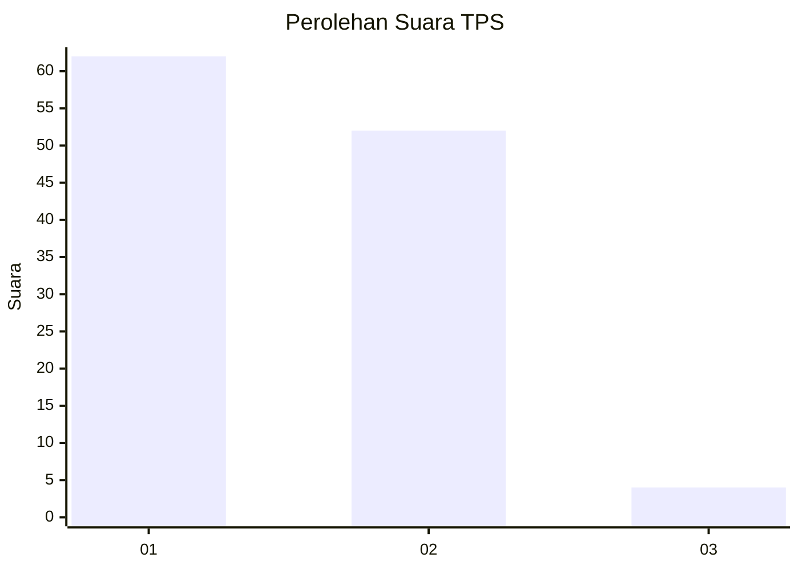
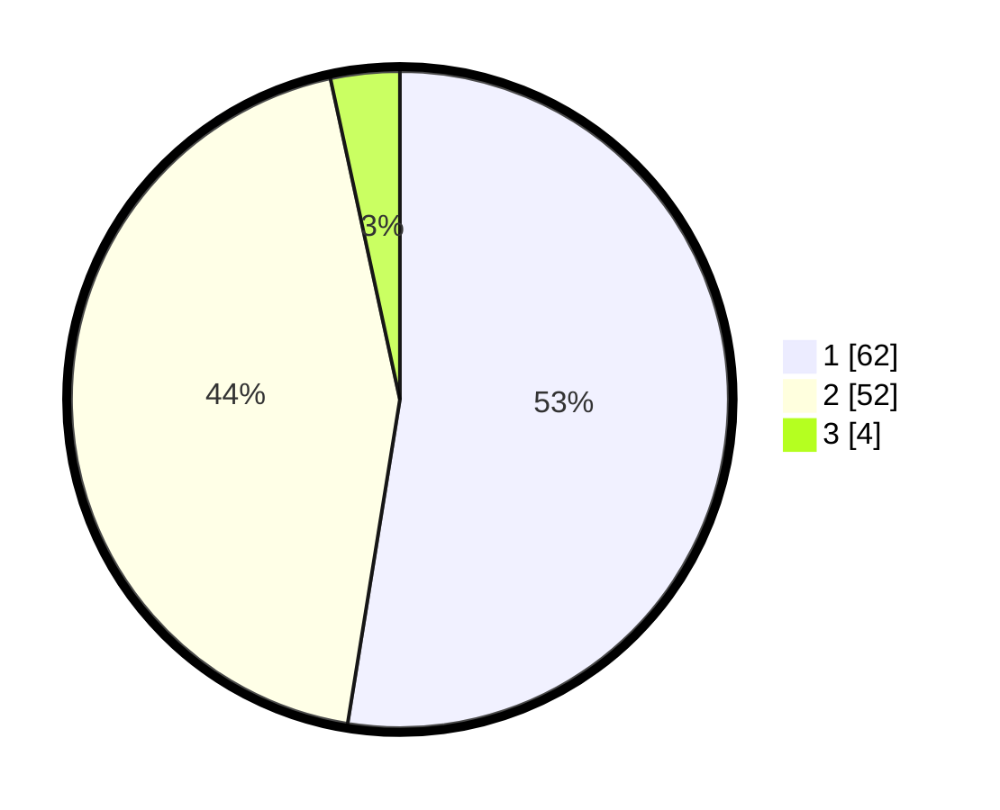

# Hasil

## Grafik

## Tabel

| No. | Nama Paslon    | Suara | Suara (raw) | Persentase |
|:--- |:-------------- | -----:| -----------:| ----------:|
| 1   | ANIES MUHAIMIN | 62    | [62][p-1]   | 52,54      |
| 2   | PRABOWO GIBRAN | 52    | [52][p-2]   | 44,07      |
| 3   | GANJAR MAHFUD  | 4     | [4][p-3]    | 3,39       |

[p-1]: https://github.com/gigit-pemilu/pemilu-2024-12-sumatera-utara/blob/main/pilpres/hitung-suara/sub/12-sumatera-utara/sub/13-mandailing-natal/sub/07-bukit-malintang/sub/2013-lambou-darul-ihsan/sub/002-tps/sub/paslon-1.txt
[p-2]: https://github.com/gigit-pemilu/pemilu-2024-12-sumatera-utara/blob/main/pilpres/hitung-suara/sub/12-sumatera-utara/sub/13-mandailing-natal/sub/07-bukit-malintang/sub/2013-lambou-darul-ihsan/sub/002-tps/sub/paslon-2.txt
[p-3]: https://github.com/gigit-pemilu/pemilu-2024-12-sumatera-utara/blob/main/pilpres/hitung-suara/sub/12-sumatera-utara/sub/13-mandailing-natal/sub/07-bukit-malintang/sub/2013-lambou-darul-ihsan/sub/002-tps/sub/paslon-3.txt

## Foto C Plano

https://sirekap-obj-formc.kpu.go.id/b3a7/pemilu/ppwp/12/13/07/20/13/1213072013002-20240214-210512--88666b1a-1aeb-4f17-a915-e291f5d705e1.jpg

https://sirekap-obj-formc.kpu.go.id/b3a7/pemilu/ppwp/12/13/07/20/13/1213072013002-20240214-210654--76abd825-cbf4-4b78-bc9c-f165fa8b66ca.jpg

https://sirekap-obj-formc.kpu.go.id/b3a7/pemilu/ppwp/12/13/07/20/13/1213072013002-20240214-210745--f2d80782-8df4-475c-a1a0-4adf6d3b34d7.jpg

## Metadata

| Key        | Value               |
| ---------- | ------------------- |
| Time Stamp | 2024-02-15 22:40:13 |

