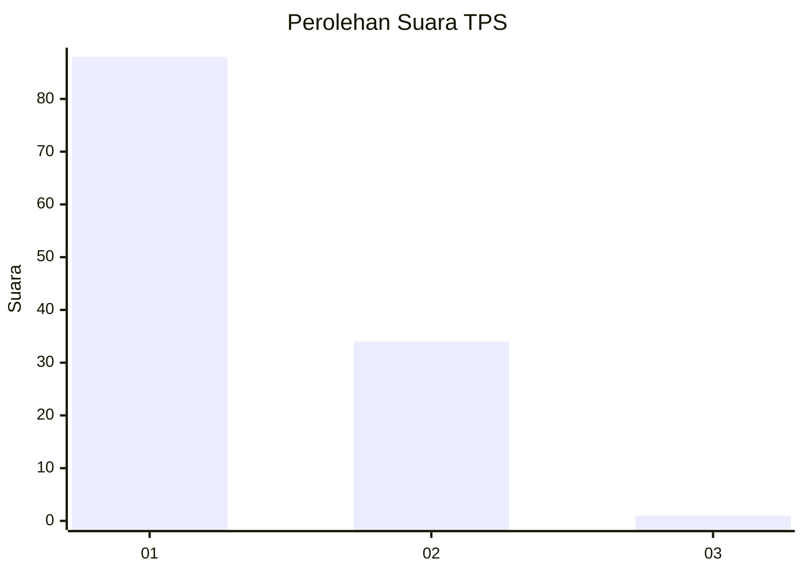
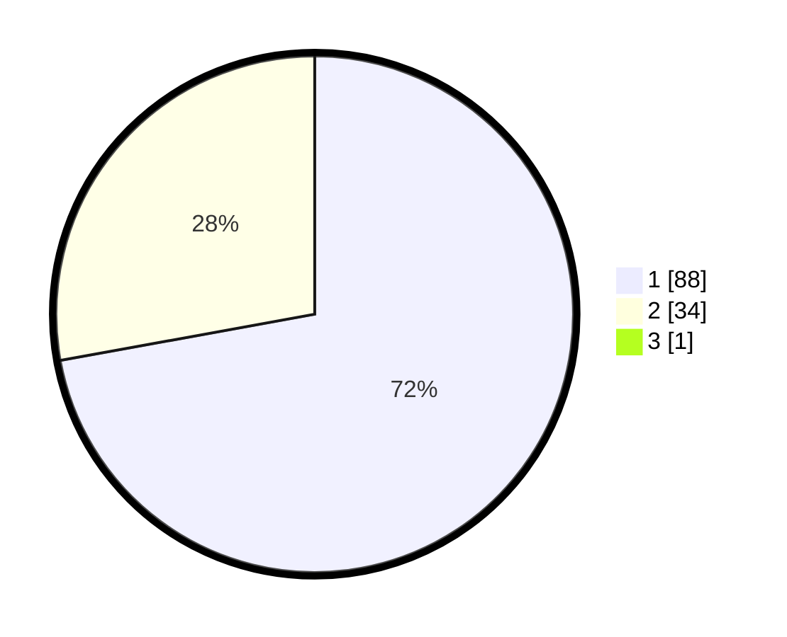

# Hasil

## Grafik

## Tabel

| No. | Nama Paslon    | Suara | Suara (raw) | Persentase |
|:--- |:-------------- | -----:| -----------:| ----------:|
| 1   | ANIES MUHAIMIN | 88    | [88][p-1]   | 71,54      |
| 2   | PRABOWO GIBRAN | 34    | [34][p-2]   | 27,64      |
| 3   | GANJAR MAHFUD  | 1     | [1][p-3]    | 0,81       |

[p-1]: https://github.com/gigit-pemilu/pemilu-2024/blob/main/pilpres/hitung-suara/sub/12-sumatera-utara/sub/13-mandailing-natal/sub/07-bukit-malintang/sub/2015-bange-nauli/sub/002-tps/sub/paslon-1.txt
[p-2]: https://github.com/gigit-pemilu/pemilu-2024/blob/main/pilpres/hitung-suara/sub/12-sumatera-utara/sub/13-mandailing-natal/sub/07-bukit-malintang/sub/2015-bange-nauli/sub/002-tps/sub/paslon-2.txt
[p-3]: https://github.com/gigit-pemilu/pemilu-2024/blob/main/pilpres/hitung-suara/sub/12-sumatera-utara/sub/13-mandailing-natal/sub/07-bukit-malintang/sub/2015-bange-nauli/sub/002-tps/sub/paslon-3.txt

## Foto C Plano

https://sirekap-obj-formc.kpu.go.id/f48d/pemilu/ppwp/12/13/07/20/15/1213072015002-20240217-120256--72b2a4f6-4904-4983-878f-1467f1e13cfe.jpg

https://sirekap-obj-formc.kpu.go.id/f48d/pemilu/ppwp/12/13/07/20/15/1213072015002-20240215-062159--82c97db4-161c-4d64-8aeb-6939bcb7a0f7.jpg

https://sirekap-obj-formc.kpu.go.id/f48d/pemilu/ppwp/12/13/07/20/15/1213072015002-20240215-062325--461bc76b-3db5-4066-9f12-57738a52f434.jpg

## Metadata

| Key        | Value               |
| ---------- | ------------------- |
| Time Stamp | 2024-02-17 13:37:34 |

