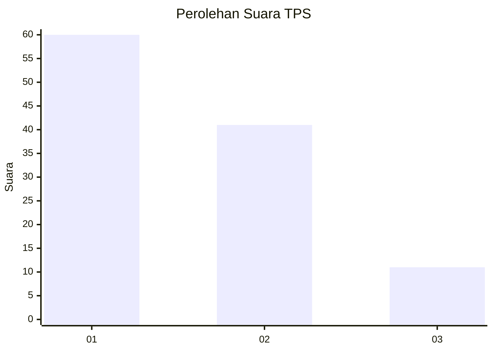
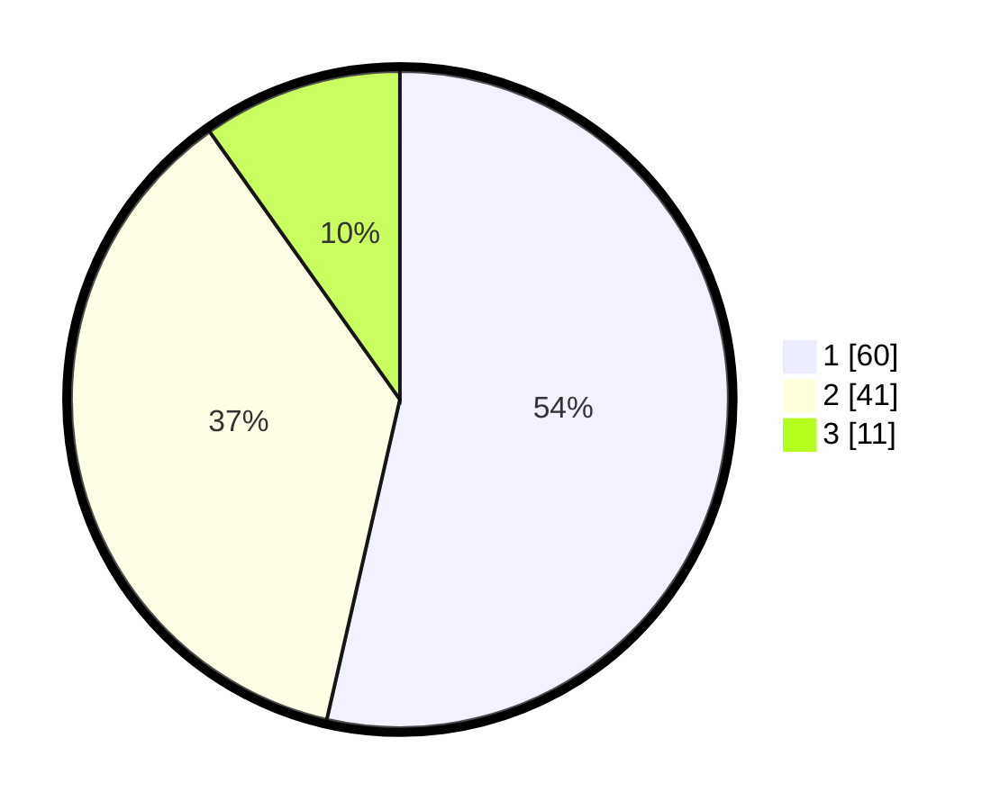

# Hasil

## Grafik

## Tabel

| No. | Nama Paslon    | Suara | Suara (raw) | Persentase |
|:--- |:-------------- | -----:| -----------:| ----------:|
| 1   | ANIES MUHAIMIN | 60    | [60][p-1]   | 53,57      |
| 2   | PRABOWO GIBRAN | 41    | [41][p-2]   | 36,61      |
| 3   | GANJAR MAHFUD  | 11    | [11][p-3]   | 9,82       |

[p-1]: https://github.com/gigit-pemilu/pemilu-2024-12-sumatera-utara/blob/main/pilpres/hitung-suara/sub/12-sumatera-utara/sub/13-mandailing-natal/sub/07-bukit-malintang/sub/2016-malintang/sub/003-tps/sub/paslon-1.txt
[p-2]: https://github.com/gigit-pemilu/pemilu-2024-12-sumatera-utara/blob/main/pilpres/hitung-suara/sub/12-sumatera-utara/sub/13-mandailing-natal/sub/07-bukit-malintang/sub/2016-malintang/sub/003-tps/sub/paslon-2.txt
[p-3]: https://github.com/gigit-pemilu/pemilu-2024-12-sumatera-utara/blob/main/pilpres/hitung-suara/sub/12-sumatera-utara/sub/13-mandailing-natal/sub/07-bukit-malintang/sub/2016-malintang/sub/003-tps/sub/paslon-3.txt

## Foto C Plano

https://sirekap-obj-formc.kpu.go.id/d4f9/pemilu/ppwp/12/13/07/20/16/1213072016003-20240215-050046--dad3cf27-6566-4f0f-8bbd-97012dc63a29.jpg

https://sirekap-obj-formc.kpu.go.id/d4f9/pemilu/ppwp/12/13/07/20/16/1213072016003-20240215-050502--c87abee3-1012-4726-a9ed-1cf819a9f3a0.jpg

https://sirekap-obj-formc.kpu.go.id/d4f9/pemilu/ppwp/12/13/07/20/16/1213072016003-20240215-050614--d18f924f-a2da-4157-9f70-f1e444601d63.jpg

## Metadata

| Key        | Value               |
| ---------- | ------------------- |
| Time Stamp | 2024-02-17 01:30:00 |

