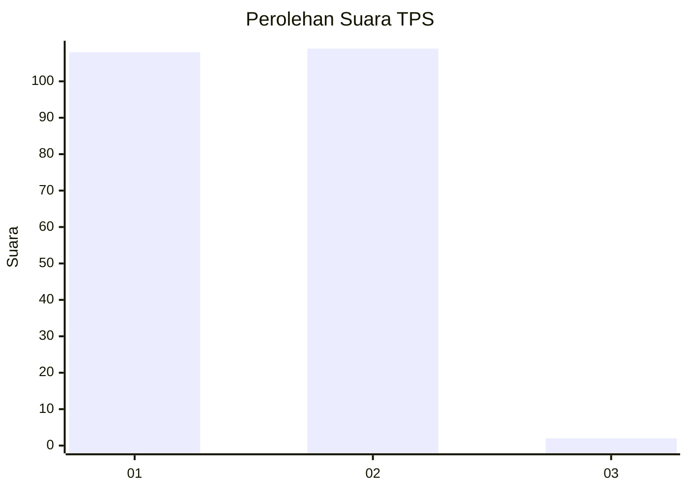
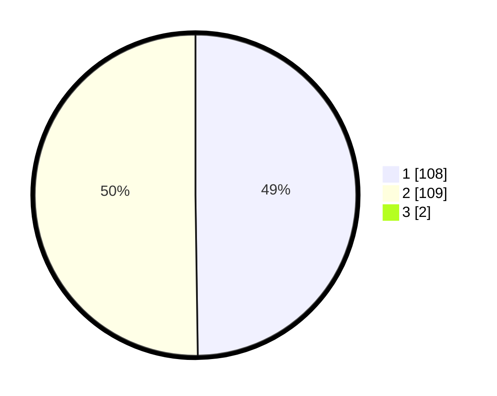

# Hasil

## Grafik

## Tabel

| No. | Nama Paslon    | Suara | Suara (raw) | Persentase |
|:--- |:-------------- | -----:| -----------:| ----------:|
| 1   | ANIES MUHAIMIN | 108   | [108][p-1]  | 49,32      |
| 2   | PRABOWO GIBRAN | 109   | [109][p-2]  | 49,77      |
| 3   | GANJAR MAHFUD  | 2     | [2][p-3]    | 0,91       |

[p-1]: https://github.com/gigit-pemilu/pemilu-2024/blob/main/pilpres/hitung-suara/sub/12-sumatera-utara/sub/13-mandailing-natal/sub/08-kotanopan/sub/1032-tamiang/sub/003-tps/sub/paslon-1.txt
[p-2]: https://github.com/gigit-pemilu/pemilu-2024/blob/main/pilpres/hitung-suara/sub/12-sumatera-utara/sub/13-mandailing-natal/sub/08-kotanopan/sub/1032-tamiang/sub/003-tps/sub/paslon-2.txt
[p-3]: https://github.com/gigit-pemilu/pemilu-2024/blob/main/pilpres/hitung-suara/sub/12-sumatera-utara/sub/13-mandailing-natal/sub/08-kotanopan/sub/1032-tamiang/sub/003-tps/sub/paslon-3.txt

## Foto C Plano

https://sirekap-obj-formc.kpu.go.id/0e7c/pemilu/ppwp/12/13/08/10/32/1213081032003-20240215-002349--776c5aa7-3e6b-4a22-8f79-5247aedfe52a.jpg

https://sirekap-obj-formc.kpu.go.id/0e7c/pemilu/ppwp/12/13/08/10/32/1213081032003-20240215-002542--cf013213-dc8a-4682-8a07-b7f17c861e5c.jpg

https://sirekap-obj-formc.kpu.go.id/0e7c/pemilu/ppwp/12/13/08/10/32/1213081032003-20240215-002848--01b76fbf-09ed-47cc-b118-df739cad1bb8.jpg

## Metadata

| Key        | Value               |
| ---------- | ------------------- |
| Time Stamp | 2024-02-16 00:30:27 |

