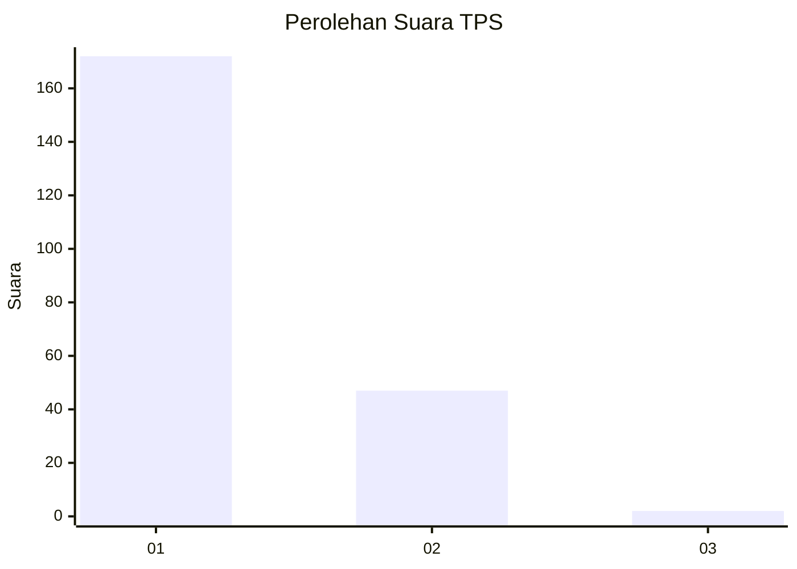
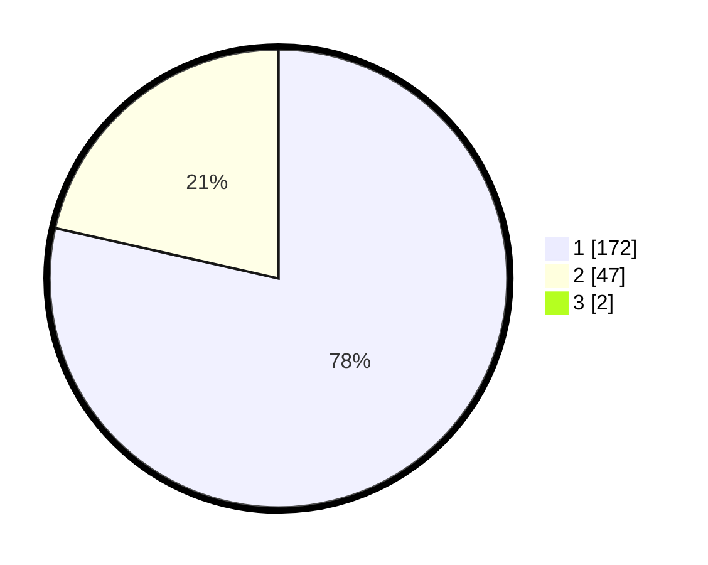

# Hasil

## Grafik

## Tabel

| No. | Nama Paslon    | Suara | Suara (raw) | Persentase |
|:--- |:-------------- | -----:| -----------:| ----------:|
| 1   | ANIES MUHAIMIN | 172   | [172][p-1]  | 77,83      |
| 2   | PRABOWO GIBRAN | 47    | [47][p-2]   | 21,27      |
| 3   | GANJAR MAHFUD  | 2     | [2][p-3]    | 0,90       |

[p-1]: https://github.com/gigit-pemilu/pemilu-2024-12-sumatera-utara/blob/main/pilpres/hitung-suara/sub/12-sumatera-utara/sub/13-mandailing-natal/sub/08-kotanopan/sub/2021-patialo/sub/001-tps/sub/paslon-1.txt
[p-2]: https://github.com/gigit-pemilu/pemilu-2024-12-sumatera-utara/blob/main/pilpres/hitung-suara/sub/12-sumatera-utara/sub/13-mandailing-natal/sub/08-kotanopan/sub/2021-patialo/sub/001-tps/sub/paslon-2.txt
[p-3]: https://github.com/gigit-pemilu/pemilu-2024-12-sumatera-utara/blob/main/pilpres/hitung-suara/sub/12-sumatera-utara/sub/13-mandailing-natal/sub/08-kotanopan/sub/2021-patialo/sub/001-tps/sub/paslon-3.txt

## Foto C Plano

https://sirekap-obj-formc.kpu.go.id/eba1/pemilu/ppwp/12/13/08/20/21/1213082021001-20240219-174500--c7259630-8884-4372-84a4-d409fa1a6ef7.jpg

https://sirekap-obj-formc.kpu.go.id/eba1/pemilu/ppwp/12/13/08/20/21/1213082021001-20240219-174033--f1e65ac8-70c8-44df-8011-7199f2a9ab6e.jpg

https://sirekap-obj-formc.kpu.go.id/eba1/pemilu/ppwp/12/13/08/20/21/1213082021001-20240219-174627--7a025ba0-5f74-46f0-ba27-cc0af004ee3a.jpg

## Metadata

| Key        | Value               |
| ---------- | ------------------- |
| Time Stamp | 2024-02-25 14:00:00 |

