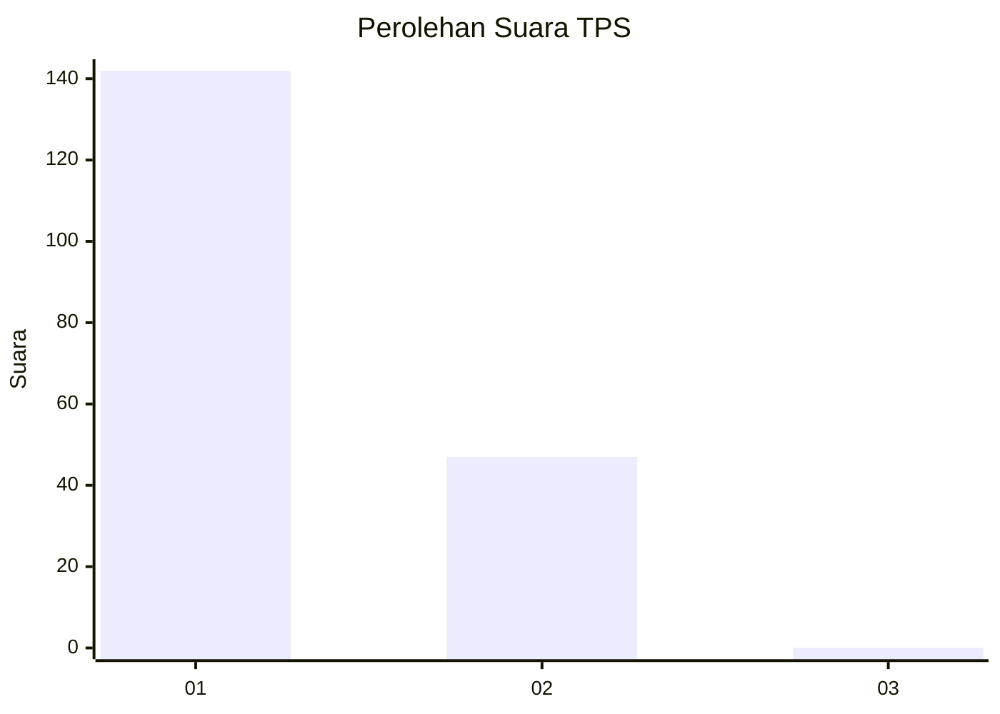
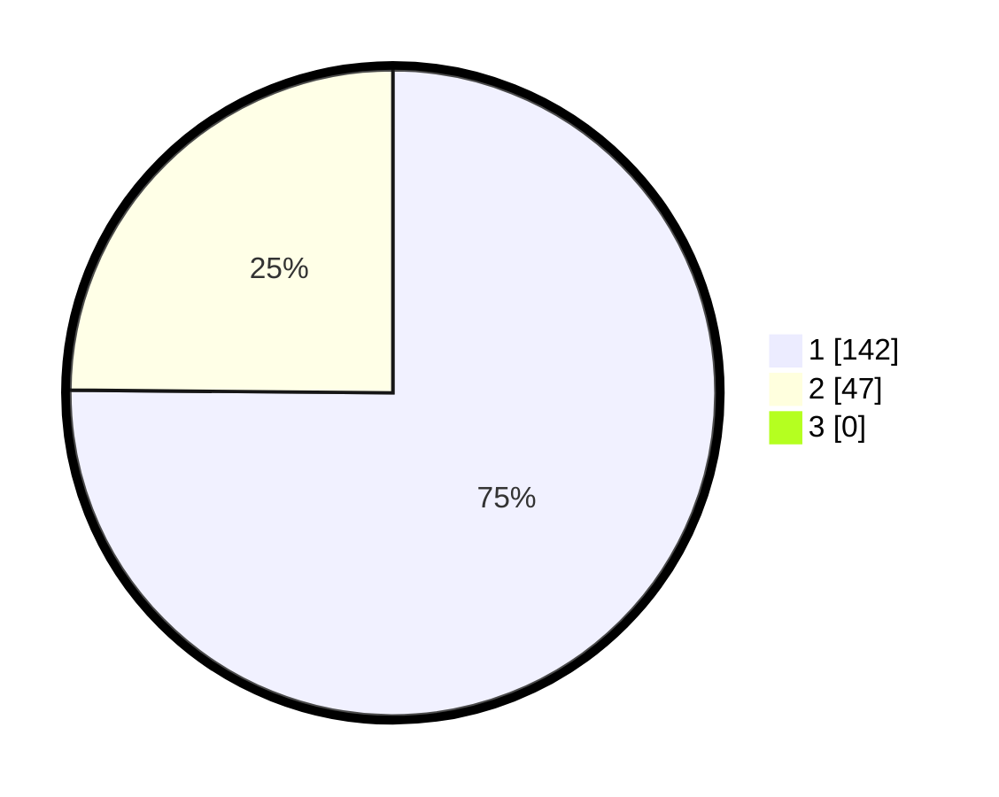

# Hasil

## Grafik

## Tabel

| No. | Nama Paslon    | Suara | Suara (raw) | Persentase |
|:--- |:-------------- | -----:| -----------:| ----------:|
| 1   | ANIES MUHAIMIN | 142   | [142][p-1]  | 75,13      |
| 2   | PRABOWO GIBRAN | 47    | [47][p-2]   | 24,87      |
| 3   | GANJAR MAHFUD  | 0     | [0][p-3]    | 0,00       |

[p-1]: https://github.com/gigit-pemilu/pemilu-2024/blob/main/pilpres/hitung-suara/sub/12-sumatera-utara/sub/13-mandailing-natal/sub/08-kotanopan/sub/2022-saba-dolok/sub/002-tps/sub/paslon-1.txt
[p-2]: https://github.com/gigit-pemilu/pemilu-2024/blob/main/pilpres/hitung-suara/sub/12-sumatera-utara/sub/13-mandailing-natal/sub/08-kotanopan/sub/2022-saba-dolok/sub/002-tps/sub/paslon-2.txt
[p-3]: https://github.com/gigit-pemilu/pemilu-2024/blob/main/pilpres/hitung-suara/sub/12-sumatera-utara/sub/13-mandailing-natal/sub/08-kotanopan/sub/2022-saba-dolok/sub/002-tps/sub/paslon-3.txt

## Foto C Plano

https://sirekap-obj-formc.kpu.go.id/2a66/pemilu/ppwp/12/13/08/20/22/1213082022002-20240221-160333--8d1253df-ca23-40d8-96f9-65bbb8a89907.jpg

https://sirekap-obj-formc.kpu.go.id/2a66/pemilu/ppwp/12/13/08/20/22/1213082022002-20240221-160436--130876ad-8888-49a8-bee7-fc69f99eee93.jpg

https://sirekap-obj-formc.kpu.go.id/2a66/pemilu/ppwp/12/13/08/20/22/1213082022002-20240221-160544--93b3250e-82fc-4cde-8411-ee27f901bdd9.jpg

## Metadata

| Key        | Value               |
| ---------- | ------------------- |
| Time Stamp | 2024-02-25 21:00:00 |

