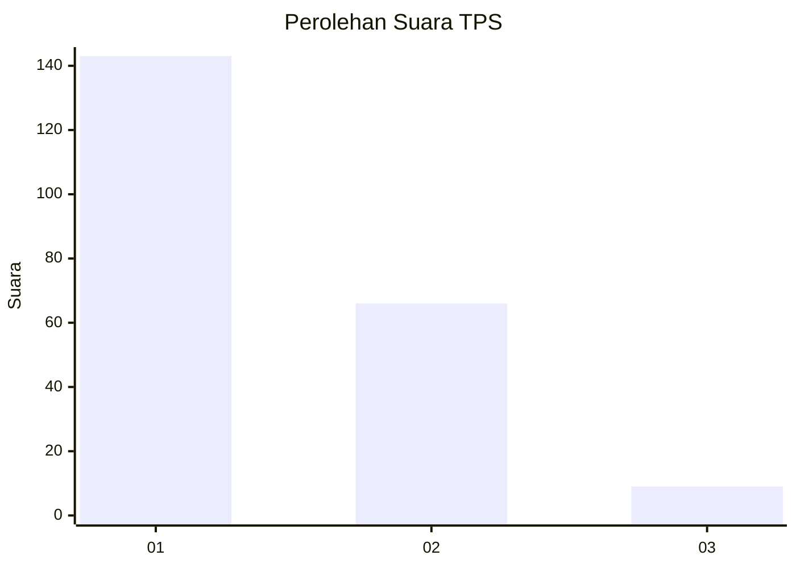
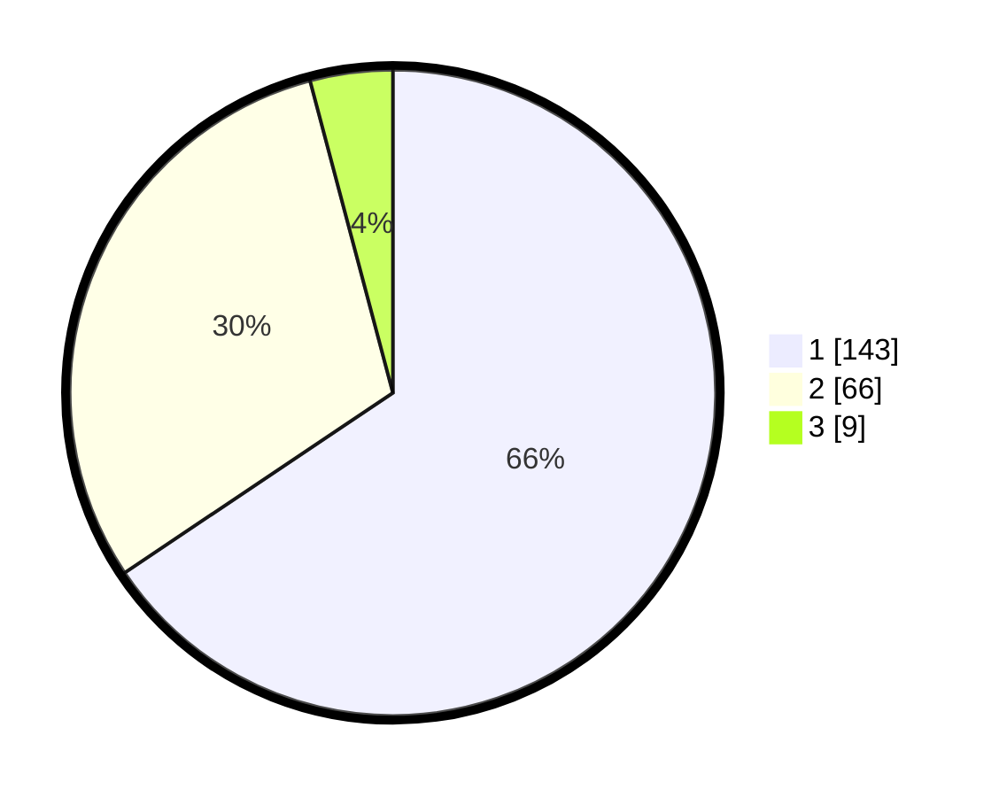

# Hasil

## Grafik

## Tabel

| No. | Nama Paslon    | Suara | Suara (raw) | Persentase |
|:--- |:-------------- | -----:| -----------:| ----------:|
| 1   | ANIES MUHAIMIN | 143   | [143][p-1]  | 65,60      |
| 2   | PRABOWO GIBRAN | 66    | [66][p-2]   | 30,28      |
| 3   | GANJAR MAHFUD  | 9     | [9][p-3]    | 4,13       |

[p-1]: https://github.com/gigit-pemilu/pemilu-2024/blob/main/pilpres/hitung-suara/sub/12-sumatera-utara/sub/13-mandailing-natal/sub/08-kotanopan/sub/2022-saba-dolok/sub/003-tps/sub/paslon-1.txt
[p-2]: https://github.com/gigit-pemilu/pemilu-2024/blob/main/pilpres/hitung-suara/sub/12-sumatera-utara/sub/13-mandailing-natal/sub/08-kotanopan/sub/2022-saba-dolok/sub/003-tps/sub/paslon-2.txt
[p-3]: https://github.com/gigit-pemilu/pemilu-2024/blob/main/pilpres/hitung-suara/sub/12-sumatera-utara/sub/13-mandailing-natal/sub/08-kotanopan/sub/2022-saba-dolok/sub/003-tps/sub/paslon-3.txt

## Foto C Plano

https://sirekap-obj-formc.kpu.go.id/40af/pemilu/ppwp/12/13/08/20/22/1213082022003-20240215-064716--750d07b9-f49a-4ea0-bfe2-5b1b2a0e2ac3.jpg

https://sirekap-obj-formc.kpu.go.id/40af/pemilu/ppwp/12/13/08/20/22/1213082022003-20240215-064932--7cb8100f-a808-4816-8446-4f2dcbb7f74d.jpg

https://sirekap-obj-formc.kpu.go.id/40af/pemilu/ppwp/12/13/08/20/22/1213082022003-20240215-065114--dd711118-adc4-4909-ab98-0b6b01251a6d.jpg

## Metadata

| Key        | Value               |
| ---------- | ------------------- |
| Time Stamp | 2024-02-16 00:30:27 |

