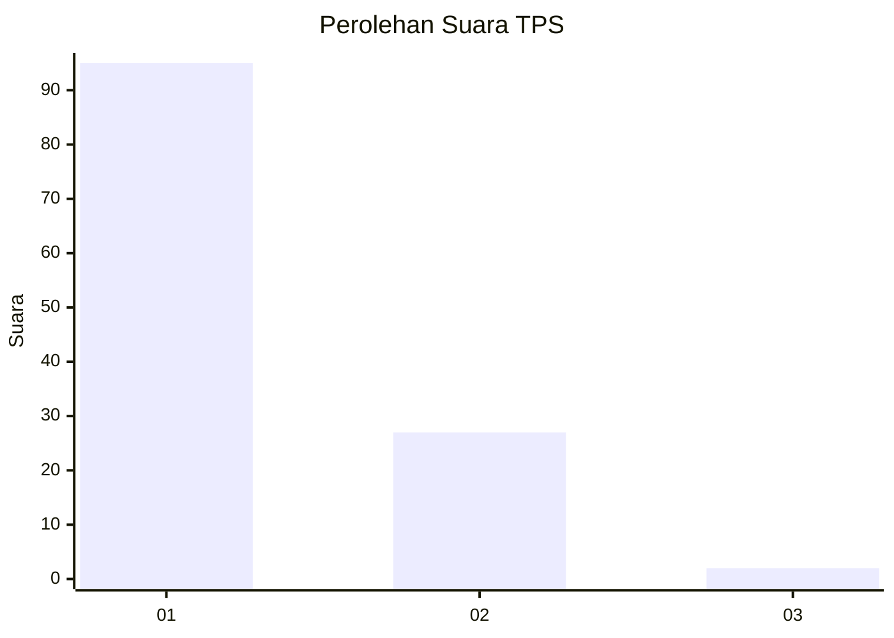
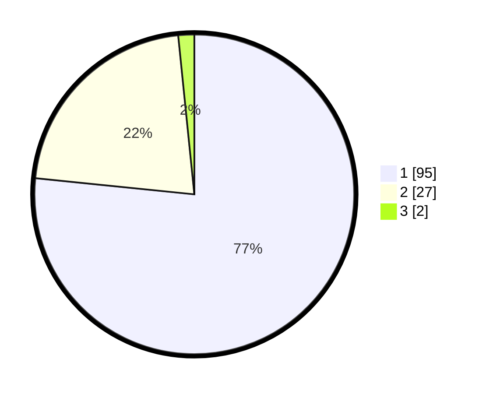

# Hasil

## Grafik

## Tabel

| No. | Nama Paslon    | Suara | Suara (raw) | Persentase |
|:--- |:-------------- | -----:| -----------:| ----------:|
| 1   | ANIES MUHAIMIN | 95    | [95][p-1]   | 76,61      |
| 2   | PRABOWO GIBRAN | 27    | [27][p-2]   | 21,77      |
| 3   | GANJAR MAHFUD  | 2     | [2][p-3]    | 1,61       |

[p-1]: https://github.com/gigit-pemilu/pemilu-2024-12-sumatera-utara/blob/main/pilpres/hitung-suara/sub/12-sumatera-utara/sub/13-mandailing-natal/sub/08-kotanopan/sub/2024-singengu-julu/sub/002-tps/sub/paslon-1.txt
[p-2]: https://github.com/gigit-pemilu/pemilu-2024-12-sumatera-utara/blob/main/pilpres/hitung-suara/sub/12-sumatera-utara/sub/13-mandailing-natal/sub/08-kotanopan/sub/2024-singengu-julu/sub/002-tps/sub/paslon-2.txt
[p-3]: https://github.com/gigit-pemilu/pemilu-2024-12-sumatera-utara/blob/main/pilpres/hitung-suara/sub/12-sumatera-utara/sub/13-mandailing-natal/sub/08-kotanopan/sub/2024-singengu-julu/sub/002-tps/sub/paslon-3.txt

## Foto C Plano

https://sirekap-obj-formc.kpu.go.id/9759/pemilu/ppwp/12/13/08/20/24/1213082024002-20240215-025432--2794313d-e3ac-4fe3-ae44-70e29f955af2.jpg

https://sirekap-obj-formc.kpu.go.id/9759/pemilu/ppwp/12/13/08/20/24/1213082024002-20240214-235023--0e635347-222d-42a6-8a13-d4dfd6355bfb.jpg

https://sirekap-obj-formc.kpu.go.id/9759/pemilu/ppwp/12/13/08/20/24/1213082024002-20240215-025648--161b0244-6832-4a25-8dce-554f6af73607.jpg

## Metadata

| Key        | Value               |
| ---------- | ------------------- |
| Time Stamp | 2024-02-16 00:30:27 |

