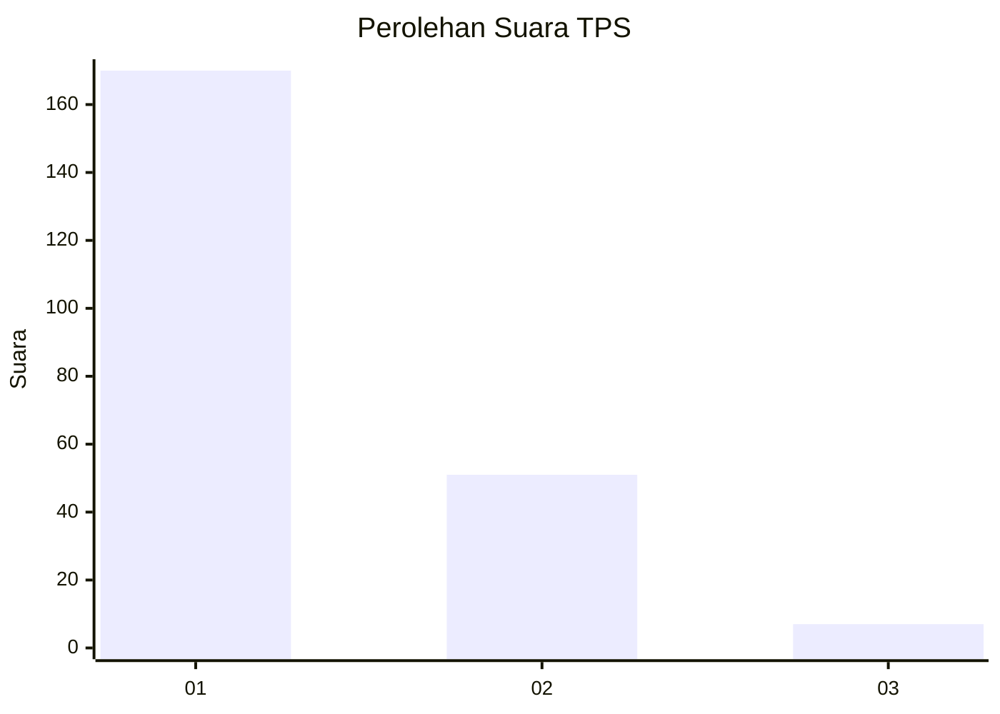
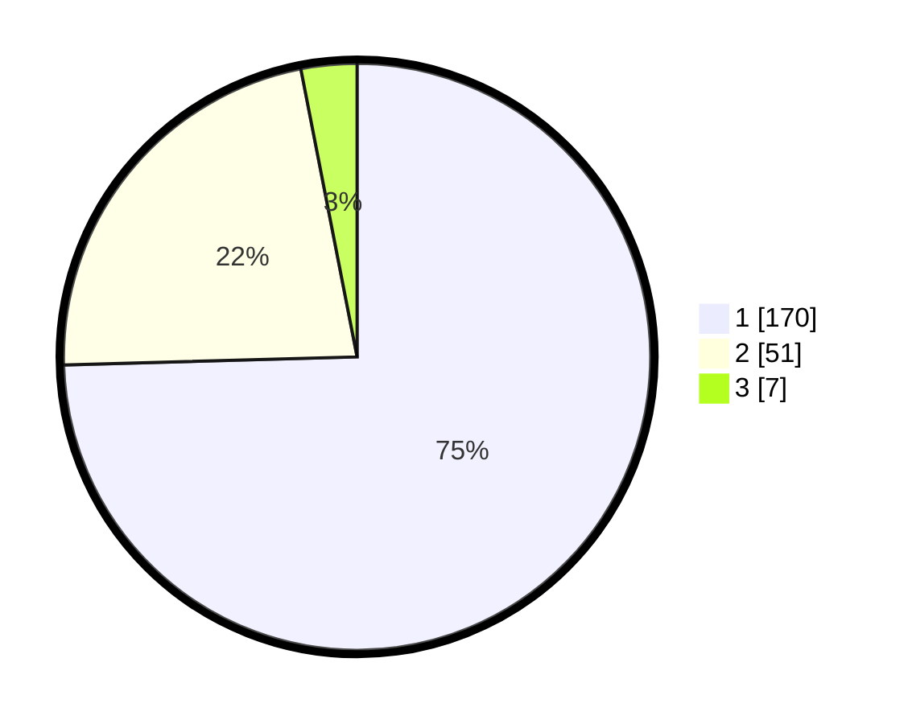

# Hasil

## Grafik

## Tabel

| No. | Nama Paslon    | Suara | Suara (raw) | Persentase |
|:--- |:-------------- | -----:| -----------:| ----------:|
| 1   | ANIES MUHAIMIN | 170   | [170][p-1]  | 74,56      |
| 2   | PRABOWO GIBRAN | 51    | [51][p-2]   | 22,37      |
| 3   | GANJAR MAHFUD  | 7     | [7][p-3]    | 3,07       |

[p-1]: https://github.com/gigit-pemilu/pemilu-2024-12-sumatera-utara/blob/main/pilpres/hitung-suara/sub/12-sumatera-utara/sub/13-mandailing-natal/sub/10-tambangan/sub/2026-tambangan-jae/sub/001-tps/sub/paslon-1.txt
[p-2]: https://github.com/gigit-pemilu/pemilu-2024-12-sumatera-utara/blob/main/pilpres/hitung-suara/sub/12-sumatera-utara/sub/13-mandailing-natal/sub/10-tambangan/sub/2026-tambangan-jae/sub/001-tps/sub/paslon-2.txt
[p-3]: https://github.com/gigit-pemilu/pemilu-2024-12-sumatera-utara/blob/main/pilpres/hitung-suara/sub/12-sumatera-utara/sub/13-mandailing-natal/sub/10-tambangan/sub/2026-tambangan-jae/sub/001-tps/sub/paslon-3.txt

## Foto C Plano

https://sirekap-obj-formc.kpu.go.id/c799/pemilu/ppwp/12/13/10/20/26/1213102026001-20240220-123026--236946a0-84d0-4043-bb03-ca1ba1a689ce.jpg

https://sirekap-obj-formc.kpu.go.id/c799/pemilu/ppwp/12/13/10/20/26/1213102026001-20240220-123803--1ca912c1-a9fe-4f47-8e95-0b5b8e0a334e.jpg

https://sirekap-obj-formc.kpu.go.id/c799/pemilu/ppwp/12/13/10/20/26/1213102026001-20240220-123634--663af6b4-e845-4567-b212-c70b64cc1496.jpg

## Metadata

| Key        | Value               |
| ---------- | ------------------- |
| Time Stamp | 2024-02-25 12:00:00 |

