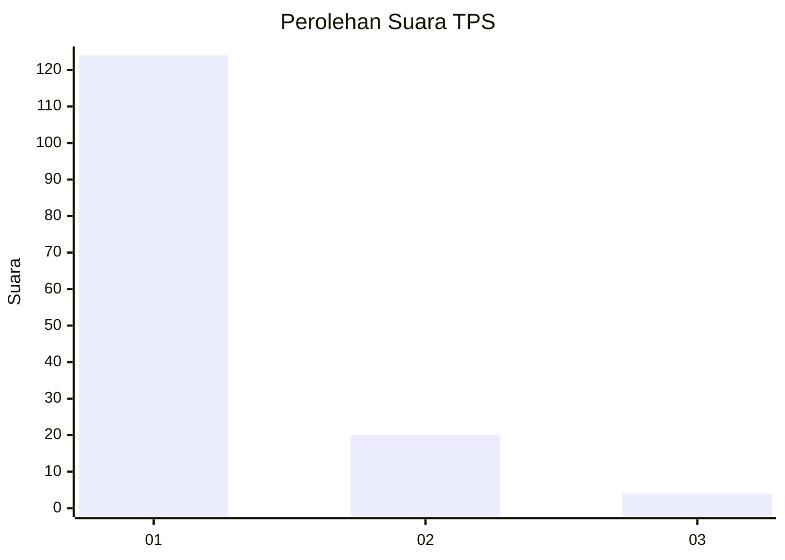
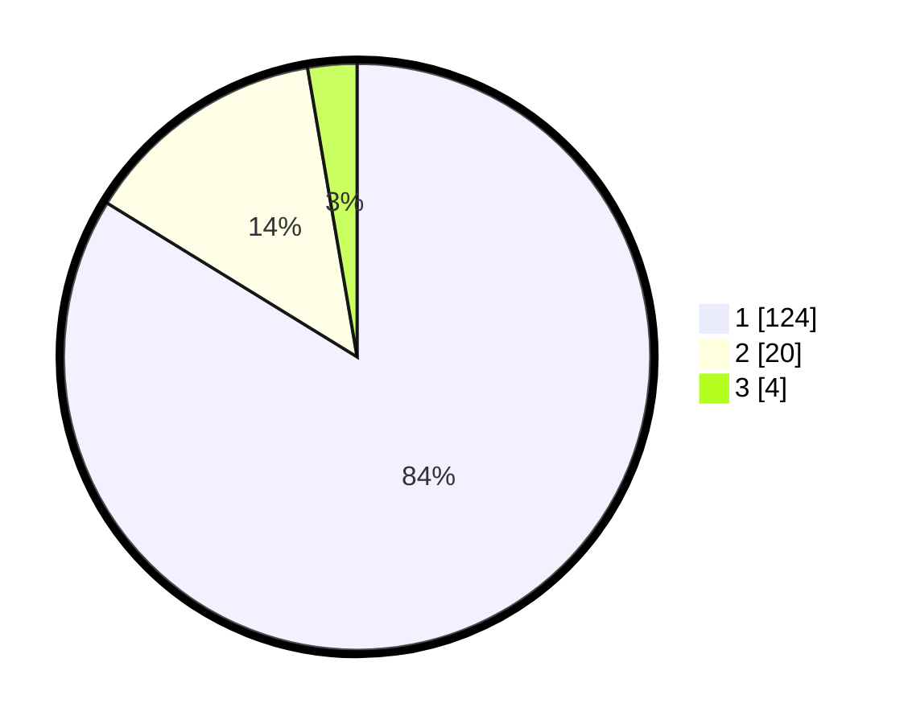

# Hasil

## Grafik

## Tabel

| No. | Nama Paslon    | Suara | Suara (raw) | Persentase |
|:--- |:-------------- | -----:| -----------:| ----------:|
| 1   | ANIES MUHAIMIN | 124   | [124][p-1]  | 83,78      |
| 2   | PRABOWO GIBRAN | 20    | [20][p-2]   | 13,51      |
| 3   | GANJAR MAHFUD  | 4     | [4][p-3]    | 2,70       |

[p-1]: https://github.com/gigit-pemilu/pemilu-2024-12-sumatera-utara/blob/main/pilpres/hitung-suara/sub/12-sumatera-utara/sub/13-mandailing-natal/sub/10-tambangan/sub/2028-tambangan-tonga/sub/002-tps/sub/paslon-1.txt
[p-2]: https://github.com/gigit-pemilu/pemilu-2024-12-sumatera-utara/blob/main/pilpres/hitung-suara/sub/12-sumatera-utara/sub/13-mandailing-natal/sub/10-tambangan/sub/2028-tambangan-tonga/sub/002-tps/sub/paslon-2.txt
[p-3]: https://github.com/gigit-pemilu/pemilu-2024-12-sumatera-utara/blob/main/pilpres/hitung-suara/sub/12-sumatera-utara/sub/13-mandailing-natal/sub/10-tambangan/sub/2028-tambangan-tonga/sub/002-tps/sub/paslon-3.txt

## Foto C Plano

https://sirekap-obj-formc.kpu.go.id/1c85/pemilu/ppwp/12/13/10/20/28/1213102028002-20240220-174139--f80cfe26-3f92-42c9-be9a-38f00ada7154.jpg

https://sirekap-obj-formc.kpu.go.id/1c85/pemilu/ppwp/12/13/10/20/28/1213102028002-20240220-174300--76dd9a77-8fb5-4cbf-b3ad-7742aa975a58.jpg

https://sirekap-obj-formc.kpu.go.id/1c85/pemilu/ppwp/12/13/10/20/28/1213102028002-20240220-181335--8f5df2d7-7d54-49ea-abfa-18a01c13d6b2.jpg

## Metadata

| Key        | Value               |
| ---------- | ------------------- |
| Time Stamp | 2024-02-20 19:00:00 |

