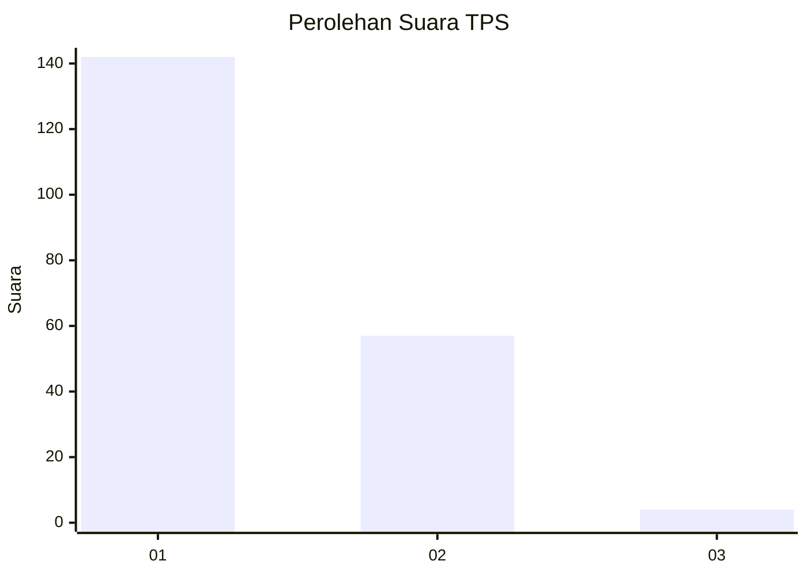
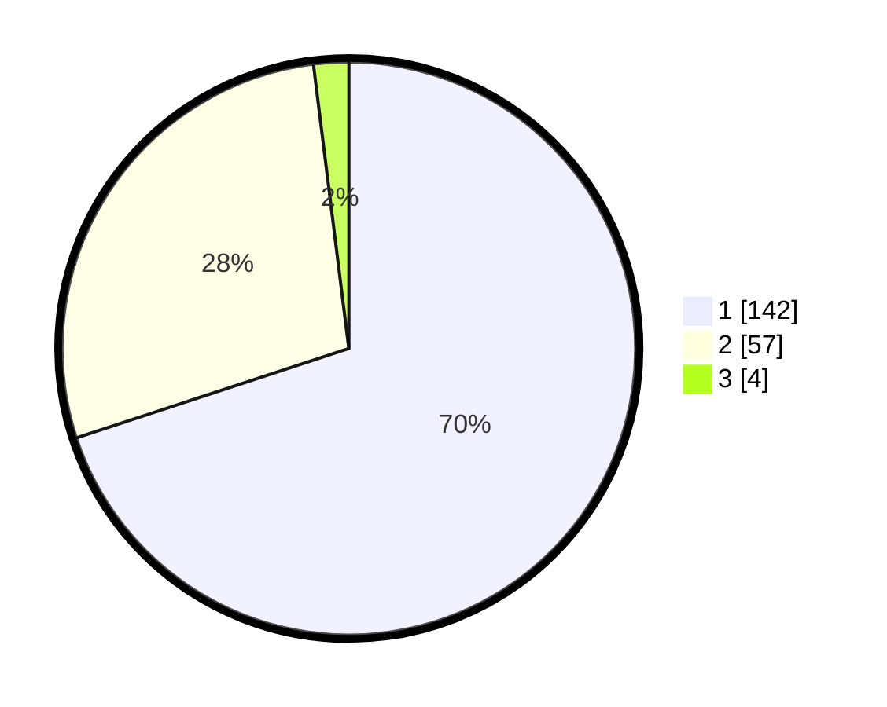

# Hasil

## Grafik

## Tabel

| No. | Nama Paslon    | Suara | Suara (raw) | Persentase |
|:--- |:-------------- | -----:| -----------:| ----------:|
| 1   | ANIES MUHAIMIN | 142   | [142][p-1]  | 69,95      |
| 2   | PRABOWO GIBRAN | 57    | [57][p-2]   | 28,08      |
| 3   | GANJAR MAHFUD  | 4     | [4][p-3]    | 1,97       |

[p-1]: https://github.com/gigit-pemilu/pemilu-2024/blob/main/pilpres/hitung-suara/sub/12-sumatera-utara/sub/13-mandailing-natal/sub/11-ulu-pungkut/sub/1003-huta-godang/sub/001-tps/sub/paslon-1.txt
[p-2]: https://github.com/gigit-pemilu/pemilu-2024/blob/main/pilpres/hitung-suara/sub/12-sumatera-utara/sub/13-mandailing-natal/sub/11-ulu-pungkut/sub/1003-huta-godang/sub/001-tps/sub/paslon-2.txt
[p-3]: https://github.com/gigit-pemilu/pemilu-2024/blob/main/pilpres/hitung-suara/sub/12-sumatera-utara/sub/13-mandailing-natal/sub/11-ulu-pungkut/sub/1003-huta-godang/sub/001-tps/sub/paslon-3.txt

## Foto C Plano

https://sirekap-obj-formc.kpu.go.id/09c7/pemilu/ppwp/12/13/11/10/03/1213111003001-20240215-124509--3363e488-519f-4ae9-939b-286948ce714b.jpg

https://sirekap-obj-formc.kpu.go.id/09c7/pemilu/ppwp/12/13/11/10/03/1213111003001-20240215-124636--9bcc291c-e3b7-49b3-9f30-76c40857129c.jpg

https://sirekap-obj-formc.kpu.go.id/09c7/pemilu/ppwp/12/13/11/10/03/1213111003001-20240215-124821--95574681-95fc-45b9-a0d6-68c7366429aa.jpg

## Metadata

| Key        | Value               |
| ---------- | ------------------- |
| Time Stamp | 2024-02-16 00:30:27 |

