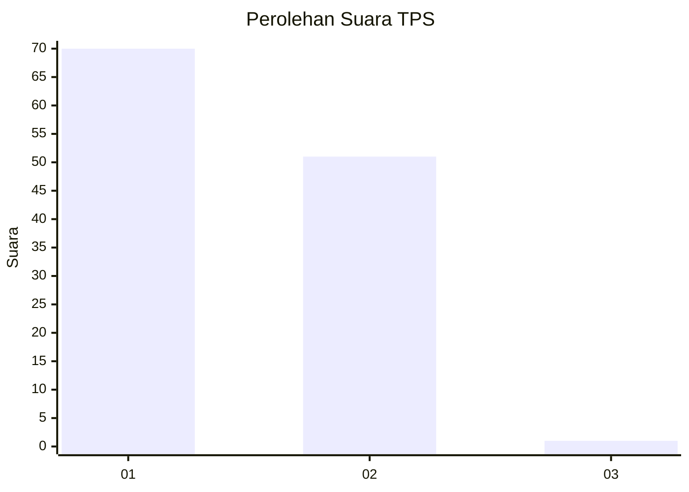
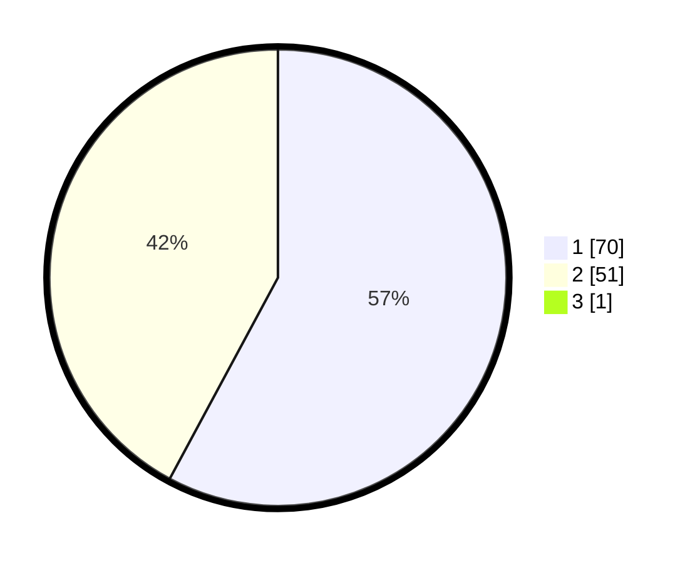

# Hasil

## Grafik

## Tabel

| No. | Nama Paslon    | Suara | Suara (raw) | Persentase |
|:--- |:-------------- | -----:| -----------:| ----------:|
| 1   | ANIES MUHAIMIN | 70    | [70][p-1]   | 57,38      |
| 2   | PRABOWO GIBRAN | 51    | [51][p-2]   | 41,80      |
| 3   | GANJAR MAHFUD  | 1     | [1][p-3]    | 0,82       |

[p-1]: https://github.com/gigit-pemilu/pemilu-2024/blob/main/pilpres/hitung-suara/sub/12-sumatera-utara/sub/13-mandailing-natal/sub/11-ulu-pungkut/sub/2001-alahan-kae/sub/001-tps/sub/paslon-1.txt
[p-2]: https://github.com/gigit-pemilu/pemilu-2024/blob/main/pilpres/hitung-suara/sub/12-sumatera-utara/sub/13-mandailing-natal/sub/11-ulu-pungkut/sub/2001-alahan-kae/sub/001-tps/sub/paslon-2.txt
[p-3]: https://github.com/gigit-pemilu/pemilu-2024/blob/main/pilpres/hitung-suara/sub/12-sumatera-utara/sub/13-mandailing-natal/sub/11-ulu-pungkut/sub/2001-alahan-kae/sub/001-tps/sub/paslon-3.txt

## Foto C Plano

https://sirekap-obj-formc.kpu.go.id/2a25/pemilu/ppwp/12/13/11/20/01/1213112001001-20240214-141842--9beee4cc-2c4b-42ea-a7e4-70a8a8fc96ef.jpg

https://sirekap-obj-formc.kpu.go.id/2a25/pemilu/ppwp/12/13/11/20/01/1213112001001-20240214-141941--891d33ad-82ec-4640-b659-59c9e1b5ca94.jpg

## Metadata

| Key        | Value               |
| ---------- | ------------------- |
| Time Stamp | 2024-02-24 22:31:28 |

