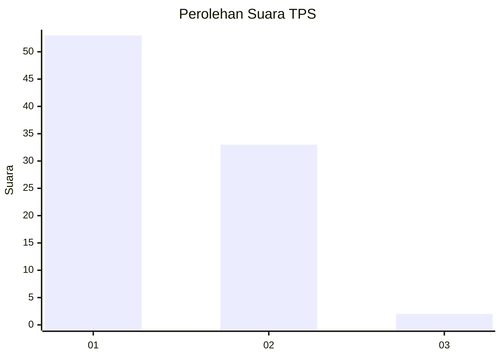
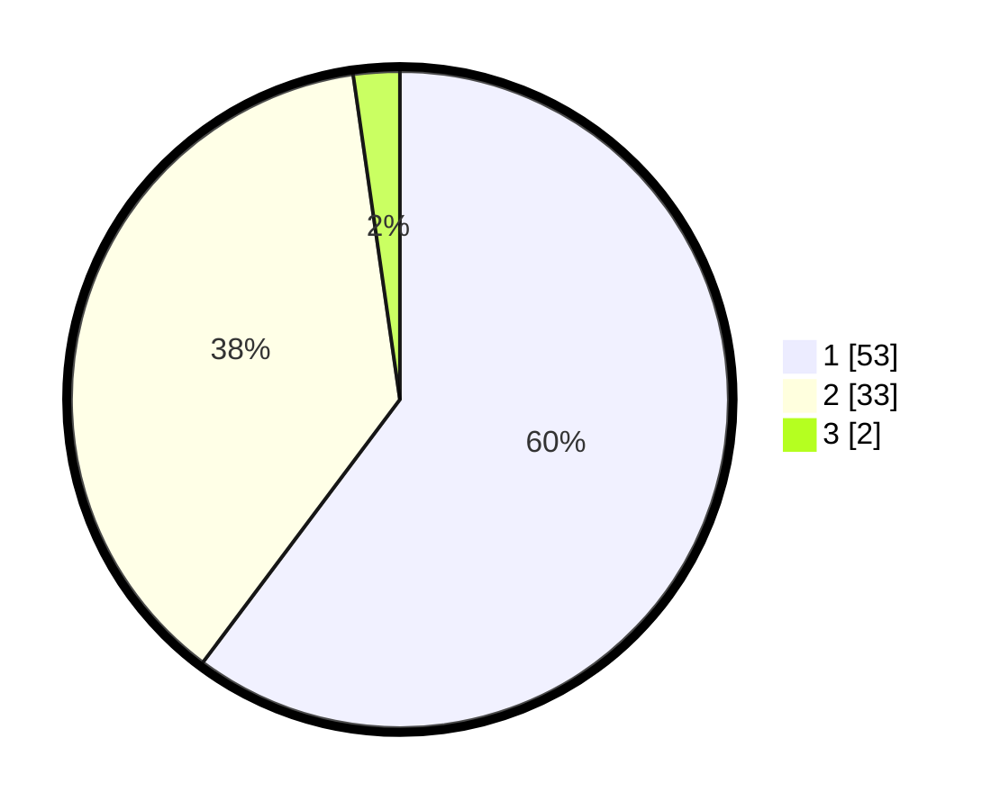

# Hasil

## Grafik

## Tabel

| No. | Nama Paslon    | Suara | Suara (raw) | Persentase |
|:--- |:-------------- | -----:| -----------:| ----------:|
| 1   | ANIES MUHAIMIN | 53    | [53][p-1]   | 60,23      |
| 2   | PRABOWO GIBRAN | 33    | [33][p-2]   | 37,50      |
| 3   | GANJAR MAHFUD  | 2     | [2][p-3]    | 2,27       |

[p-1]: https://github.com/gigit-pemilu/pemilu-2024/blob/main/pilpres/hitung-suara/sub/12-sumatera-utara/sub/13-mandailing-natal/sub/11-ulu-pungkut/sub/2002-habincaran/sub/001-tps/sub/paslon-1.txt
[p-2]: https://github.com/gigit-pemilu/pemilu-2024/blob/main/pilpres/hitung-suara/sub/12-sumatera-utara/sub/13-mandailing-natal/sub/11-ulu-pungkut/sub/2002-habincaran/sub/001-tps/sub/paslon-2.txt
[p-3]: https://github.com/gigit-pemilu/pemilu-2024/blob/main/pilpres/hitung-suara/sub/12-sumatera-utara/sub/13-mandailing-natal/sub/11-ulu-pungkut/sub/2002-habincaran/sub/001-tps/sub/paslon-3.txt

## Foto C Plano

https://sirekap-obj-formc.kpu.go.id/7b41/pemilu/ppwp/12/13/11/20/02/1213112002001-20240216-105136--510026fc-820b-479f-bc8f-f3d929c4638b.jpg

https://sirekap-obj-formc.kpu.go.id/7b41/pemilu/ppwp/12/13/11/20/02/1213112002001-20240216-105202--000c381a-6feb-4c23-aa03-f28793a7bc52.jpg

https://sirekap-obj-formc.kpu.go.id/7b41/pemilu/ppwp/12/13/11/20/02/1213112002001-20240216-105357--1fa5c45a-c423-4dcd-8970-d85f084bf2e2.jpg

## Metadata

| Key        | Value               |
| ---------- | ------------------- |
| Time Stamp | 2024-02-16 16:25:10 |

