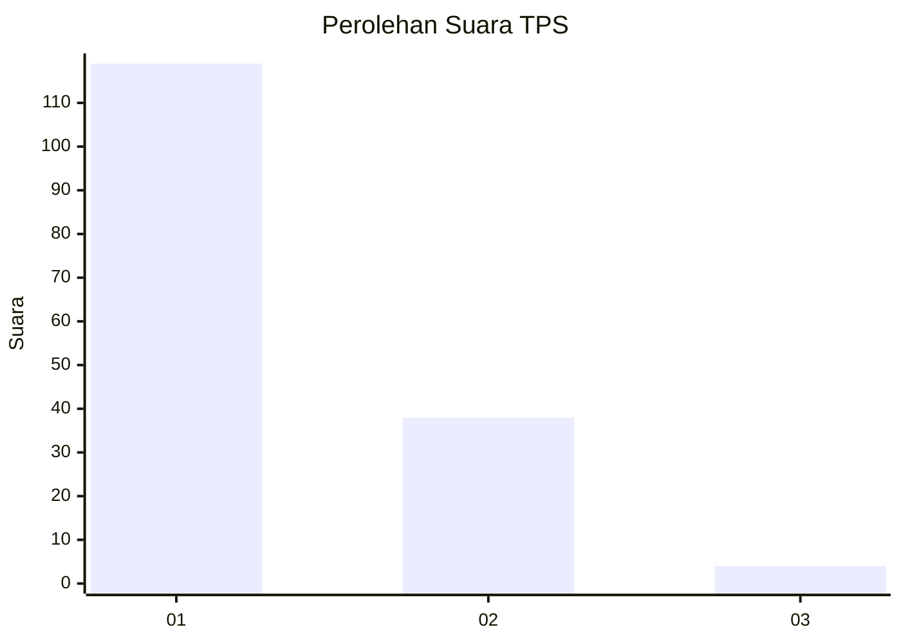
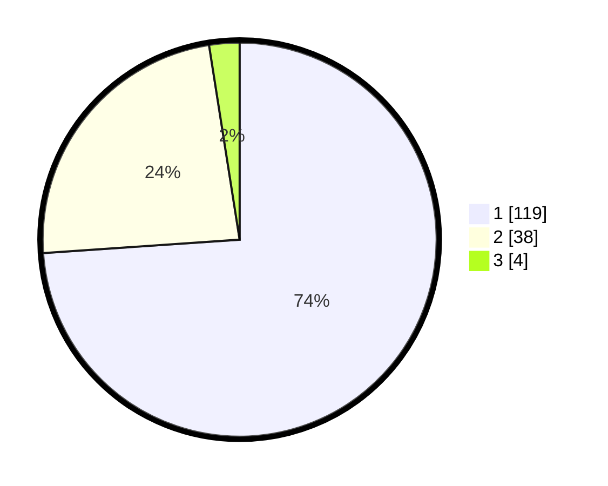

# Hasil

## Grafik

## Tabel

| No. | Nama Paslon    | Suara | Suara (raw) | Persentase |
|:--- |:-------------- | -----:| -----------:| ----------:|
| 1   | ANIES MUHAIMIN | 119   | [119][p-1]  | 73,91      |
| 2   | PRABOWO GIBRAN | 38    | [38][p-2]   | 23,60      |
| 3   | GANJAR MAHFUD  | 4     | [4][p-3]    | 2,48       |

[p-1]: https://github.com/gigit-pemilu/pemilu-2024-12-sumatera-utara/blob/main/pilpres/hitung-suara/sub/12-sumatera-utara/sub/13-mandailing-natal/sub/11-ulu-pungkut/sub/2013-tolang/sub/002-tps/sub/paslon-1.txt
[p-2]: https://github.com/gigit-pemilu/pemilu-2024-12-sumatera-utara/blob/main/pilpres/hitung-suara/sub/12-sumatera-utara/sub/13-mandailing-natal/sub/11-ulu-pungkut/sub/2013-tolang/sub/002-tps/sub/paslon-2.txt
[p-3]: https://github.com/gigit-pemilu/pemilu-2024-12-sumatera-utara/blob/main/pilpres/hitung-suara/sub/12-sumatera-utara/sub/13-mandailing-natal/sub/11-ulu-pungkut/sub/2013-tolang/sub/002-tps/sub/paslon-3.txt

## Foto C Plano

https://sirekap-obj-formc.kpu.go.id/1904/pemilu/ppwp/12/13/11/20/13/1213112013002-20240219-160951--c8d6a1b1-5197-43fc-951e-b39769f792fc.jpg

https://sirekap-obj-formc.kpu.go.id/1904/pemilu/ppwp/12/13/11/20/13/1213112013002-20240219-161209--e7be1b03-3413-42d4-8a4b-63800ae8da64.jpg

https://sirekap-obj-formc.kpu.go.id/1904/pemilu/ppwp/12/13/11/20/13/1213112013002-20240219-161454--5466f7e0-1e47-4b5d-954c-099fa53b0ec4.jpg

## Metadata

| Key        | Value               |
| ---------- | ------------------- |
| Time Stamp | 2024-02-24 22:31:28 |

