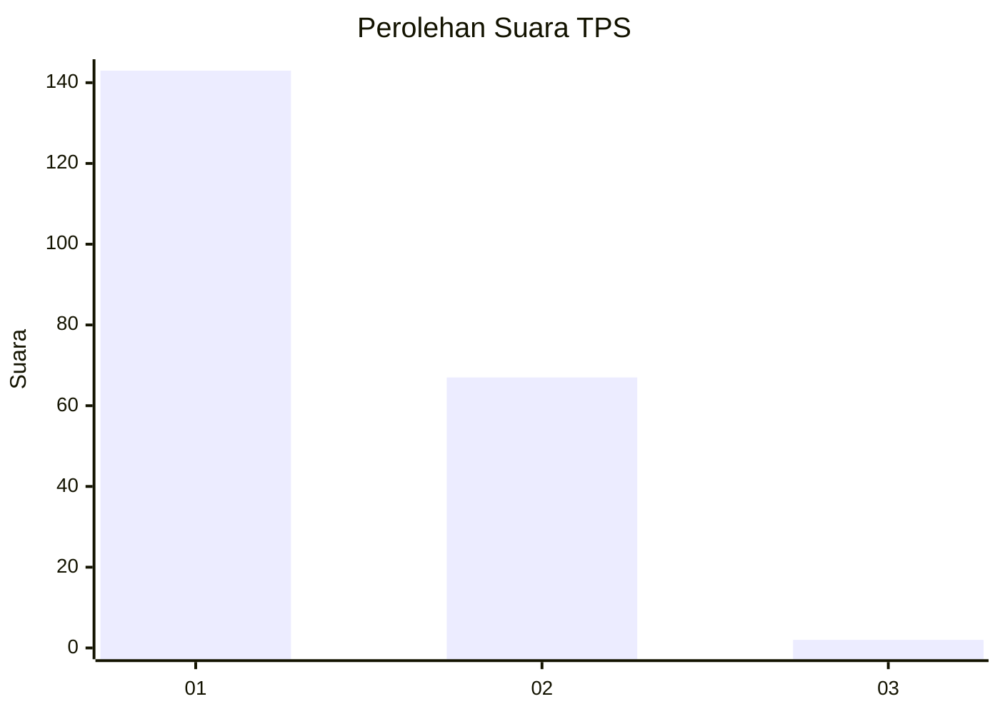
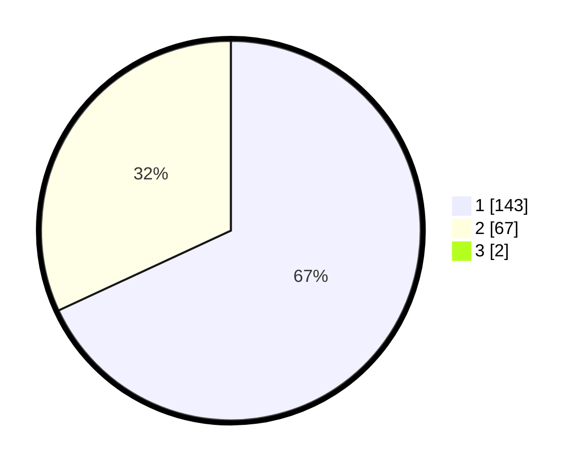

# Hasil

## Grafik

## Tabel

| No. | Nama Paslon    | Suara | Suara (raw) | Persentase |
|:--- |:-------------- | -----:| -----------:| ----------:|
| 1   | ANIES MUHAIMIN | 143   | [143][p-1]  | 67,45      |
| 2   | PRABOWO GIBRAN | 67    | [67][p-2]   | 31,60      |
| 3   | GANJAR MAHFUD  | 2     | [2][p-3]    | 0,94       |

[p-1]: https://github.com/gigit-pemilu/pemilu-2024-12-sumatera-utara/blob/main/pilpres/hitung-suara/sub/12-sumatera-utara/sub/13-mandailing-natal/sub/12-muara-sipongi/sub/1019-pasar-muara-sipongi/sub/003-tps/sub/paslon-1.txt
[p-2]: https://github.com/gigit-pemilu/pemilu-2024-12-sumatera-utara/blob/main/pilpres/hitung-suara/sub/12-sumatera-utara/sub/13-mandailing-natal/sub/12-muara-sipongi/sub/1019-pasar-muara-sipongi/sub/003-tps/sub/paslon-2.txt
[p-3]: https://github.com/gigit-pemilu/pemilu-2024-12-sumatera-utara/blob/main/pilpres/hitung-suara/sub/12-sumatera-utara/sub/13-mandailing-natal/sub/12-muara-sipongi/sub/1019-pasar-muara-sipongi/sub/003-tps/sub/paslon-3.txt

## Foto C Plano

https://sirekap-obj-formc.kpu.go.id/1f90/pemilu/ppwp/12/13/12/10/19/1213121019003-20240214-203608--c0761bec-95ed-4149-bf0a-17f3e954a249.jpg

https://sirekap-obj-formc.kpu.go.id/1f90/pemilu/ppwp/12/13/12/10/19/1213121019003-20240214-204036--0f866920-64a5-4c79-b91d-b60baa502d1e.jpg

https://sirekap-obj-formc.kpu.go.id/1f90/pemilu/ppwp/12/13/12/10/19/1213121019003-20240214-204307--9f29e084-b260-41d7-93fc-c72f9a713f69.jpg

## Metadata

| Key        | Value               |
| ---------- | ------------------- |
| Time Stamp | 2024-02-15 23:29:50 |

