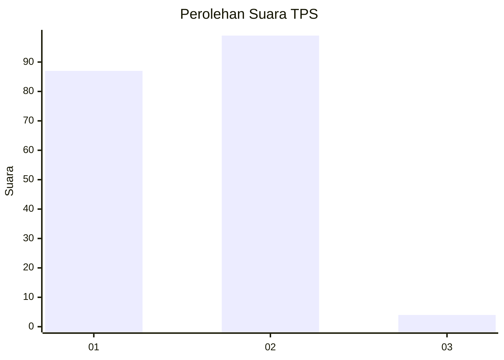
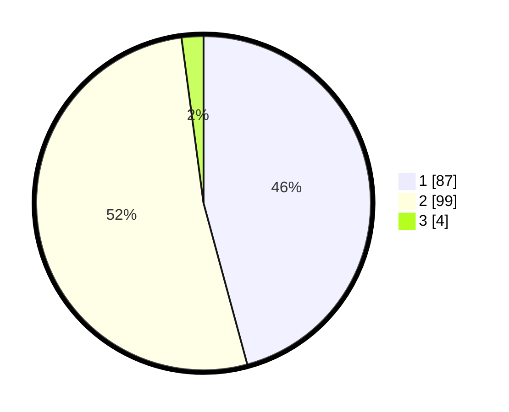

# Hasil

## Grafik

## Tabel

| No. | Nama Paslon    | Suara | Suara (raw) | Persentase |
|:--- |:-------------- | -----:| -----------:| ----------:|
| 1   | ANIES MUHAIMIN | 87    | [87][p-1]   | 45,79      |
| 2   | PRABOWO GIBRAN | 99    | [99][p-2]   | 52,11      |
| 3   | GANJAR MAHFUD  | 4     | [4][p-3]    | 2,11       |

[p-1]: https://github.com/gigit-pemilu/pemilu-2024-12-sumatera-utara/blob/main/pilpres/hitung-suara/sub/12-sumatera-utara/sub/13-mandailing-natal/sub/12-muara-sipongi/sub/2013-sibinail/sub/002-tps/sub/paslon-1.txt
[p-2]: https://github.com/gigit-pemilu/pemilu-2024-12-sumatera-utara/blob/main/pilpres/hitung-suara/sub/12-sumatera-utara/sub/13-mandailing-natal/sub/12-muara-sipongi/sub/2013-sibinail/sub/002-tps/sub/paslon-2.txt
[p-3]: https://github.com/gigit-pemilu/pemilu-2024-12-sumatera-utara/blob/main/pilpres/hitung-suara/sub/12-sumatera-utara/sub/13-mandailing-natal/sub/12-muara-sipongi/sub/2013-sibinail/sub/002-tps/sub/paslon-3.txt

## Foto C Plano

https://sirekap-obj-formc.kpu.go.id/2d0f/pemilu/ppwp/12/13/12/20/13/1213122013002-20240214-224207--e90c1804-90a0-4f6f-8636-c8401c8a4d2e.jpg

https://sirekap-obj-formc.kpu.go.id/2d0f/pemilu/ppwp/12/13/12/20/13/1213122013002-20240214-224834--28de3ac5-1fa8-495c-8730-257168495d45.jpg

https://sirekap-obj-formc.kpu.go.id/2d0f/pemilu/ppwp/12/13/12/20/13/1213122013002-20240214-225145--6735cba2-ee9a-4516-b7f4-958494a9d4a4.jpg

## Metadata

| Key        | Value               |
| ---------- | ------------------- |
| Time Stamp | 2024-02-16 00:00:26 |

