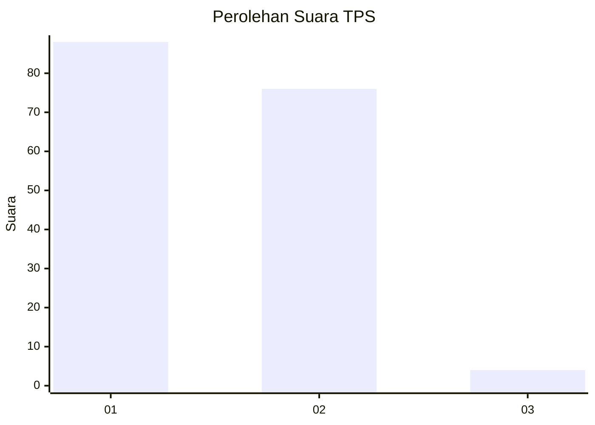
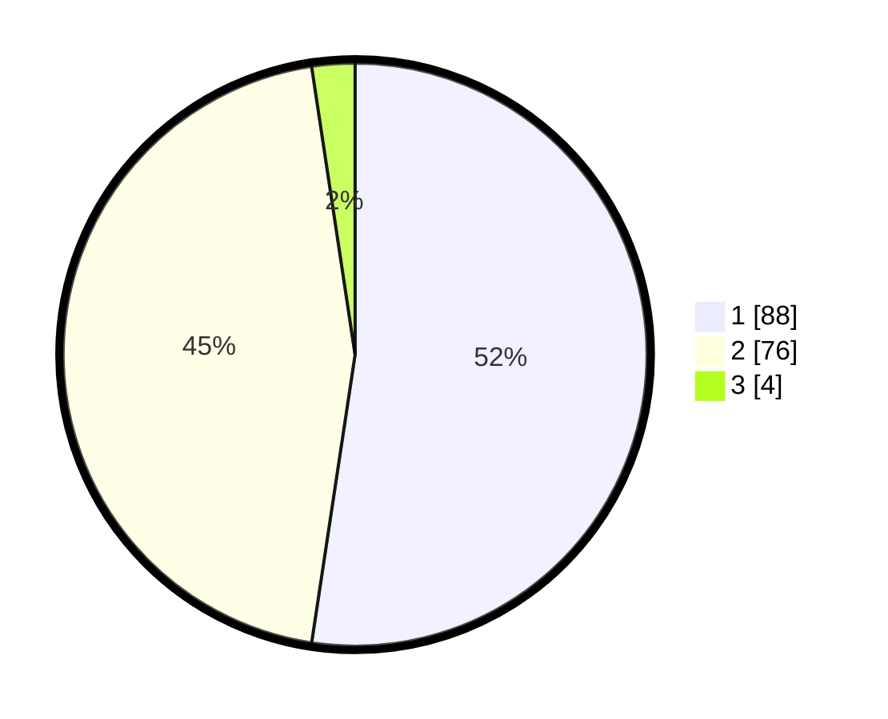

# Hasil

## Grafik

## Tabel

| No. | Nama Paslon    | Suara | Suara (raw) | Persentase |
|:--- |:-------------- | -----:| -----------:| ----------:|
| 1   | ANIES MUHAIMIN | 88    | [88][p-1]   | 52,38      |
| 2   | PRABOWO GIBRAN | 76    | [76][p-2]   | 45,24      |
| 3   | GANJAR MAHFUD  | 4     | [4][p-3]    | 2,38       |

[p-1]: https://github.com/gigit-pemilu/pemilu-2024/blob/main/pilpres/hitung-suara/sub/12-sumatera-utara/sub/13-mandailing-natal/sub/12-muara-sipongi/sub/2021-muara-kumpulan/sub/003-tps/sub/paslon-1.txt
[p-2]: https://github.com/gigit-pemilu/pemilu-2024/blob/main/pilpres/hitung-suara/sub/12-sumatera-utara/sub/13-mandailing-natal/sub/12-muara-sipongi/sub/2021-muara-kumpulan/sub/003-tps/sub/paslon-2.txt
[p-3]: https://github.com/gigit-pemilu/pemilu-2024/blob/main/pilpres/hitung-suara/sub/12-sumatera-utara/sub/13-mandailing-natal/sub/12-muara-sipongi/sub/2021-muara-kumpulan/sub/003-tps/sub/paslon-3.txt

## Foto C Plano

https://sirekap-obj-formc.kpu.go.id/6234/pemilu/ppwp/12/13/12/20/21/1213122021003-20240215-145734--94c93d23-361b-4b9d-9197-2b09b8b02a67.jpg

https://sirekap-obj-formc.kpu.go.id/6234/pemilu/ppwp/12/13/12/20/21/1213122021003-20240215-150237--3cb2a251-a56e-489b-8380-6be1b64eaeff.jpg

https://sirekap-obj-formc.kpu.go.id/6234/pemilu/ppwp/12/13/12/20/21/1213122021003-20240215-150820--dab12a93-bdad-403c-92bc-bbfbc890eaae.jpg

## Metadata

| Key        | Value               |
| ---------- | ------------------- |
| Time Stamp | 2024-02-15 23:29:50 |

